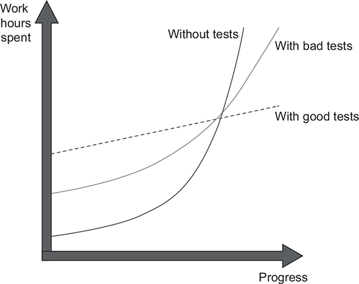
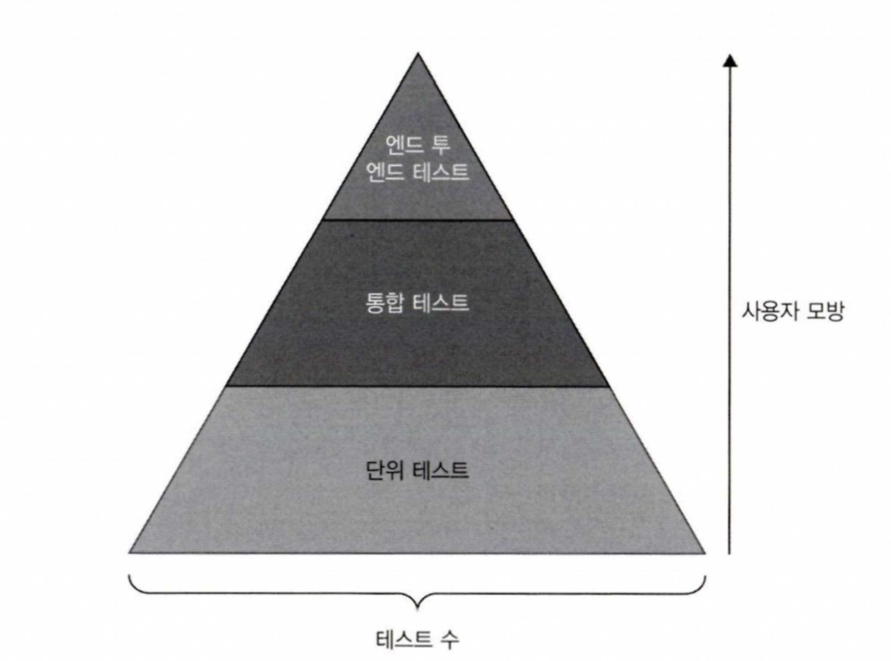

## 단위 테스트, Vladimir Khorikov

### 1. 단위테스트의 목표

- 단위테스트의 목표는 소프트웨어의 지속적인 성장을 가능하게 하는 것
- 유지보수가 지속될수록 코드는 점점 나빠지는 경향이 있다. 즉, 엔트로피가 증가한다. 이를 꼼꼼한 단위 테스트의 작성으로 극복할 수 있다.
- 하지만 핵심은 '좋은' 단위 테스트를 작성하는 것이다. 나쁜 단위 테스트는 오히려 소프트웨어 유지비용을 증가시킬수도 있다.
- 커버리지 지표는 좋은 부정 지표이며, 나쁜 긍정 지표이다. 커버리지 수치가 높다고 하여 테스트 스위트의 품질이 좋다고 할 수 없다.
- 특정 커버리지 수치를 목표로하면 본질에서 멀어질 수 있으므로 좋은 방법이 아니다.
- #### 성공적인 테스트 스위트는 다음과 같은 특성을 가졌다.
  - 개발 주기에 통합되어 있다.
  - 코드베이스 중 가장 중요한 부분만을 대상으로 한다.
  - 최소한의 유지비로 최대의 가치를 이끌어낸다.
- #### 단위 테스트의 목표를 달성하기 위한 유일한 방법은 아래와 같다.
  - 좋은 테스트와 좋지 않은 테스트를 구별하는 방법을 배운다.
  - 테스트를 리팩터링해서 더 가치 있게 만든다.
  
### 2. 단위테스트란 무엇인가
- 단위테스트는 아래와 같은 세가지의 정의로 나타낼 수 있다.
  - 단일 동작 단위를 검증하고
  - 빠르게 수행하고
  - 다른 테스트와 별도로 처리한다.
- 다른 테스트와 별도로 처리한다라는 테스트 격리 관점의 차이로, 고전파와 런던파로 나뉘었다.

- #### 런던파(aka. Mockist)
  - 런던파는 테스트 대상 단위를 분리해야한다고 주장한다. 테스트는 메서드의 클래스와 1:1관계를 가지며, 메서드 수행에 의존하는 불변 값객체를 제외한 모든 것들을 테스트 대역(Test double)으로 대체해야한다.
- #### 고전파(aka. Classist)
  - 고전파는 단위가 아닌 단위 테스트 메서드를 서로 분리해야한다고 주장한다. 테스트의 관점을 코드 단위가 아닌 동작의 단위로 보기 때문에, 하나의 동작에 의존하는 클래스가 있다면 그것 또한 같이 수행되는 게 하나의 단위 테스트를 수행하는 것이라는 관점이다.
- 런던파는 더나은 입자성(작은 조각으로 분리됨), 복잡한 의존관계를 가진 클래스에 대한 테스트의 용이성, 테스트 수행 실패시 디버깅의 용이성 등의 장점을 갖는다.
- 하지만 테스트의 중점이 동작보다 코드에 집중되어 있어, 핵심보다 지엽적인 부분에 집착하여 과잉 명세를 유발하는 문제가 있으며, 복잡한 의존성 자체가 설계상의 문제이지만 모든걸 mock으로 해결해버리면 이 문제를 제대로 파악하지 못하게 된다는 문제가 있다.
- 통합테스트는 단위테스트의 기준 중 하나 이상을 충족하지 못하는 테스트다. e2e테스트는 통합테스트의 일부이지만 보다 더 많은 의존성을 테스트하고, 사용자 관점의 테스트이다.

### 3. 단위 테스트 구조
- 모든 단위테스트는 AAA 패턴(또는 BDD)을 따라야 한다. 테스트 내에 실행구절이나 검증구절이 여러개 있다면 테스트가 올바로 격리되지 못했다는 뜻이다.
- 실행구절이 한 줄 이상이면 SUT(System Under Test)에 문제가 있다는 뜻이다. 이를 사용하는 클라이언트가 한가지 실행을 빼먹어 데이터에 이상이 생기는 불변 위반을 일으킬 수 있다. 캡슐화를 통해 이를 보완하자.
- SUT의 변수이름을 sut로 지정해 테스트에서 구별하자.
- 테스트 데이터를 생성하는 픽스처 코드는 팩토리 메서드로 빼도록 하자. 재사용성을 높이면서도 결합도가 낮고 가독성도 향상시킨다.
- 테스트 메서드명은 너무 엄격한 명명 정책을 시행하지 말고 비개발자들도 누구나 읽을 수 있게 지정하자.
- 매개변수화된 테스트(Parameterized Test)로 유사한 테스트를 통합하자. 다만 비즈니스가 복잡하다면 성공과 실패케이스는 구분하는 게 좋다.

### 4. 좋은 단위 테스트의 4대 요소
- 좋은 단위 테스트에는 네가지 특성이 있다.
  - 회귀 방지
  - 리팩터링 내성
  - 빠른 피드백
  - 유지 보수성
- #### 회귀방지
  - 테스트가 얼마나 버그의 존재를 잘 나타내는지에 대한 척도. 테스트가 코드를 더 많이 실행할수록 회귀방지는 높아진다.
- #### 리팩터링 내성
  - 테스트가 거짓 양성*을 나타내지 않고 코드 리팩터링을 유지할 수 있는 정도를 의미한다.
  - 단위 테스트가 SUT의 최종 결과가 아닌 세부 구현에 집중하면 리팩터링 내성이 낮아짐.
  - 거짓 양성
    - 테스트가 실패했다고 나타내지만 기능은 의도한대로 동작하는 허위 경보를 일으키는 증상
    - 테스트가 SUT의 결과가 아닌 내부 구현에 집중하면 리팩토링시 내부 구현이 틀어져 발생하는 현상
    - 허위 경보에 익숙해지면 경보에 소홀해지고 진짜 경보를 놓칠 수 있으므로 매우 위험하다.
- #### 빠른 피드백
  - 테스트가 얼마나 빨리 수행되는지에 대한 척도이다.
- #### 유지 보수성
  - 테스트 이해 난이도와 직결된다. 테스트가 작을수록 읽기 쉽다.
  - 테스트 실행 난이도와도 직결된다. 외부 의존성이 적을수록 실행이 쉽다.
- 회귀방지, 리팩터링 내성, 빠른 피드백 세가지를 모두 완벽하게 달성할 수는 없다. 각각의 성질이 상충되기 때문
- 하지만 리팩터링 내성은 타협할 수 없기 때문에, 리팩터링 내성을 반드시 지키고 나머지 두가지를 적절히 타협하여야 한다.   
   
  
- 테스트 피라미드는 단위 테스트, 통합 테스트, e2e 테스트의 일정 비율을 일컫는다. 나열 순서대로 테스트 수가 많고, 사용자 경험과 멀다. 또한 나열 순서대로 빠른 피드백이 우수하고, 회귀 방지가 떨어진다.
- 테스트를 작성할 때는 어떤 테스트이건 간에 블랙박스 테스트 기법을 사용하라. 화이트 박스 테스트는 내부 구현과 강하게 결합하여 리팩토링 내성을 잃게 한다.
- 화이트박스 테스트는 테스트 수행 도구보다 분석 도구에서 의미가 있다. 테스트커버리지 도구로 라인 커버리지와 분기 커버리지를 확인만 하고 미흡한 테스트를 블랙박스 테스트 기법으로 추가하자.

### 5. 목과 테스트 취약성
- 테스트 대역은 비제품 가짜 의존성의 모든 유형을 설명하는 포괄적인 용어다. 테스트 대역은 아래와 같이 분류된다.
  - 목
    - 목
    - 스파이
  - 스텁
    - 스텁
    - 더미
    - 페이크
- 목은 외부로 나가는 상호작용을 검사하고 모방하는 데 도움이 된다. 상태를 변경하는 메서드이며 리턴값이 void인 메서드가 이에 해당한다.
- 스텁은 내부로 들어오는 상호작용을 모방하는 데 도움이 된다. 예를 들어 특정 데이터를 가져오는 메서드가 포함되며, 상태의 변경이 없어야한다. 즉, 멱등성이 있는 메서드를 의미한다. 
- 테스트에서 스텁과의 상호작용을 검사하는 것은 구현 세부사항에 관여하는 것이므로 테스트 취약성이 증가한다.
- CQS(Command Query Separation)에 따르면, 모든 메서드가 명령 또는 조회 중 하나여야 하지만 둘 다는 안 된다. 명령을 대체하는 대역은 목이며 조회를 대체하는 대역은 스텁이다.
- 모든 제품 코드는 식별할 수 있는 API(public)인지 비공개 API(private)인지와, 식별할 수 있는 동작인지 구현 세부사항인지라는 두가지 차원으로 구분된다.
- 식별할 수 있는 동작의 여부는 아래와 같은 항목에 해당한다.
  - 클라이언트가 목표를 달성하는 데 도움이 되는 연산을 노출한다. 연산이란 계산을 수행하거나 사이드 이펙트를 초래하는 메서드다.
  - 클라이언트가 목표를 달성하는 데 도움이 되는 상태를 노출한다. 상태는 시스템의 현재 상태(field)다.
- 잘 설계된 API는 다음과 같이 이 속성들이 분리되어 있다.
  - 공개 API with 식별할 수 있는 동작
  - 비공개 API with 구현 세부 사항
- 클라이언트에 구현 세부사항을 노출하면 코드의 불변성을 위반할 수 있기 때문에(ex. 특정 메서드 호출을 누락) 캡슐화를 통해 불변성을 지켜야 한다.
- #### 육각형 아키텍처(Hexagonal Architecture)
  
  - 육각형 아키텍처는 상호작용하는 애플리케이션의 집합이고, 각 애플리케이션을 육각형으로 표시한다. 각 육각형은 도메인과 애플리케이션 서비스라는 두가지 계층으로 구성된다.
  - 육각형 아키텍처는 다음과 같은 세가지 관점을 강조한다
    - 도메인과 애플리케이션 서비스 계층간의 영향 분리. 도메인 계층은 비즈니스 로직을 책임져야 하고, 애플리케이션 서비스는 도메인 계층과 외부 애플리케이션 간의 작업을 조정해야 한다.
    - 애플리케이션 서비스 계층에서 도메인 계층으로의 단반향 의존성 흐름. 도메인 계층 내 클래스는 서로에게만 의존해야 하고, 애플리케이션 서비스 클래스에 의존해서는 안 된다.
    - 외부 애플리케이션은 애플리케이션 서비스 계층이 유지하는 공통 인터페이스를 통해 연결된다. 아무도 도메인 계층에 직접 액세스할 수 없다.
  - 애플리케이션에는 시스템 간 통신과 시스템 내부 통신이라는 두 가지 통신유형이 있다. 시스템 내부 통신은 애플리케이션 내 클래스간의 통신이다. 시스템 간 통신은 애플리케이션이 외부 애플리케이션과 통신할 때를 말한다.
  - 시스템 내 통신은 구현 세부 사항이고, 시스템 간 통신은 식별할 수 있는 동작이다. 단, 애플리케이션을 통해서만 접근 가능한 시스템간 통신은 구현 세부사항에 해당한다.
  - 시스템 내 통신은 통신에 목을 사용하면 취약한 테스트로 이어진다. 시스템 간 통신과 해당 통신의 사이드 이펙트가 외부 환경에서 보일 때만 목을 사용하는 것이 타당하다.

### 6. 단위 테스트 스타일

- #### 단위 테스트의 세가지 스타일
  - 출력 기반 테스트 : SUT에 입력을 주고 반환되는 출력값을 확인하는 테스트
  - 상태 기반 테스트 : SUT에 작업을 수행시키고 완료 이후 변경된 상태를 확인하는 테스트
  - 통신 기반 테스트 : 목을 사용해 SUT와 협력자 간의 통신을 검증하는 테스트
- 고전파와 런던파 모두 출력 기반 테스트를 사용하지만, 나머지 스타일에 대해서 고전파는 상태 기반 테스트, 런던파는 통신 기반 테스트를 선호한다.
- 출력 기반 테스트가 가장 테스트 품질이 좋다. 구현 세부사항에 결합되지 않아 리팩터링 내성이 좋다.
- 상태 기반 테스트는 비공개 상태를 노출하지 않도록 주의해야 한다. 또한 출력 기반 테스트보다 테스트 크기가 큰 편이라 유지보수가 쉽지 않다. 헬퍼 메서드와 값 객체를 통해 이 문제를 완화할 수 있지만 제거할 수는 없다.
- 통신 기반 테스트는 외부 환경에 사이드 이펙트가 보이는 통신만 확인해야 한다. 이 방식은 출력 및 상태 기반 테스트와 비교해 유지보수성이 좋지 않다. 목은 코드를 길어지게 만들어 가독성을 떨어뜨린다.
- #### 함수형 프로그래밍(Functional Programming)
  - 함수형 프로그래밍은 수학적 함수로 이루어진 프로그래밍이다.
  - 수학적 함수란 숨은 입출력이 없는 함수다. 수학적 함수는 명시적이므로 테스트 용이성을 높인다. 예외 처리 또한 포함해서는 안 된다.
  - 함수형 프로그래밍의 목표는 비즈니스 로직과 사이드 이펙트를 분리하는 것이다.
  - 함수형 아키텍처는 비즈니스 로직을 함수형 코어와 가변 셸이라는 두가지 범주로 분할한다. 사이드 이펙트는 가변 셸에서 처리하고, 함수형 코어는 순수 함수 방식으로만 작성한다.
- #### 함수형 아키텍처와 육각형 아키텍처
  - 함수형 아키텍처와 육각형 아키텍처는 비슷한 구조를 띄지만, 사이드 이펙트의 처리 부분에서 차이를 보인다. 함수형은 모든 사이드 이펙트를 도메인 밖으로 밀어내는 반면, 육각형은 도메인 계층에만 한정돼 있는 한 사이드이펙트도 허용한다.
  - 함수형 아키텍처와 육각형 아키텍처는 성능과 유지보수성 사이의 절충이며, 함수형은 유지보수성 향상을 위해 성능을 희생한다.
  - 시스템의 복잡도와 중요성을 고려하여 아키텍처를 선택해야한다. 코드베이스가 단순하거나 그렇게 중요하지 않으면, 함수형 아키텍처에 들이는 노력은 별 효과가 없다.

### 7. 가치 있는 단위 테스트를 위한 리팩터링
- 코드 복잡도는 코드에서 의사결정 지점 수에 따라 명시적으로(코드) 그리고 암시적으로(코드 내의 라이브러리) 정의된다.
- 도메인 유의성은 프로젝트의 문제 도메인에 대해 코드가 얼마나 중요한지를 보여준다.
- 복잡한 코드와 도메인 유의성을 갖는 코드는 회귀방지가 뛰어나기 때문에 단위 테스트에서 가장 이롭다.
- 협력자가 많은 코드를 다루는 단위 테스트는 유지비가 많이 든다. 이러한 테스트는 협력자를 예상 상태로 만들고 나서 상태나 상호작용을 확인하고자 공간을 많이 필요로 한다.
- 모든 제품 코드는 복잡도, 도메인 유의성, 협력자 수에 따라 아래 네가지 유형의 코드로 분류할 수 있다.
  - 도메인 모델 및 알고리즘 : 단위 테스트에서 노력대비 효과가 가장좋다.
  - 간단한 코드 : 복잡도와 도메인 유의성이 낮고 협력자가 거의 없어 테스트할 가치가 없다.
  - 컨트롤러 : 복잡도와 도메인 유의성이 낮고 협력자가 많으므로 통합 테스트를 통해 간단히 테스트해야 한다.
  - 지나치게 복잡한 코드 : 복잡도와 도메인 유의성이 높고 협력자가 많은 코드로, 컨트롤러와 복잡한 코드로 분할해야 한다.
- 코드가 중요하거나 복잡할수록 협력자가 적어야 한다.
- 험블 객체 패턴은 해당 코드에서 비즈니스 로직을 별도의 클래스로 추출해 복잡한 코드를 테스트 하는 데에 도움이 된다. 험블 객체 패턴을 적용하면 추출한 함수 외의 코드는 비즈니스 로직을 둘러싼 얇은 험블 래퍼, 즉 컨트롤러가 된다.
- 헥사고날 아키텍처와 함수형 아키텍처는 험블 객체 패턴을 구현하고 있다.
- 전제 조건은 도메인 유의성이 있는 경우에만 테스트 한다.
- 비즈니스 로직과 오케스트레이션을 분리할 때는 다음과 같이 세가지 중요한 특성이 있다.
  - 도메인 모델 테스트의 유의성 : 도메인 클래스 내 협력자 수와 유형에 대한 함수
  - 컨트롤러 단순성 : 컨트롤러에 의사 결정 지점이 있는지에 따라 다름
  - 성능 : 프로세스 외부 의존성에 대한 호출 수로 정의
- 이 세가지 특성을 모두 같이 가질 수는 없고 최대 두가지의 특성을 갖는다.
  - 외부에 대한 모든 읽기와 쓰기를 비즈니스 연산 가장자리로 밀어내기
    - 컨트롤러를 단순하게 유지하고 도메인 모델 테스트 유의성을 지키지만, 성능이 저하된다.
  - 도메인 모델에 프로세스 외부 의존성을 주입하기
    - 성능을 유지하고 컨트롤러를 단순하게 하지만, 도메인 모델의 테스트 유의성이 떨어진다.
  - 의사 결정 프로세스 단계를 더 세분화 하기
    - 성능과 도메인 모델 테스트 유의성을 지키지만, 컨트롤러의 단순함을 포기한다.
- 이 중 의사 결정 프로세스 단계를 세분화 하는 게 가장 효과적인 절충이다. 이 작업에는 아래의 두 패턴이 도움이 된다.
  - CanExecute/Execute 패턴
    - execute() 함수 내에서 로직의 실행 조건으로 canExecute() 함수를 활용한다. 컨트롤러에서는 execute()만 호출하면 되므로 컨트롤러 의사결정을 근본적으로 제거한다.
  - 도메인 이벤트
    - 도메인 모델의 중요한 변경사항을 추적하고 해당 변경 사항을 프로세스 외부 의존성에 대한 호출로 변환한다. ORM의 변경감지 기능과 유사하다. 이 방법으로 컨트롤러의 추적에 대한 책임을 없앨 수 있다.

### 8. 통합 테스트를 하는 이유
- #### 통합 테스트?
  - 단위 테스트가 아닌 테스트는 모두 통합 테스트이다.
  - 통합 테스트는 컨트롤러를 다루고, 단위 테스트는 알고리즘과 도메인 모델을 다룬다.
  - 통합 테스트는 회귀 방지와 리팩터링 내성이 우수하고, 단위 테스트는 유지 보수성과 피드백 속도가 우수하다.
- 단위 테스트로 테스트 할 수 있는 것을 먼저 다 테스트 한 뒤, 단위 테스트만으로는 테스트가 힘든 흐름이나 예외에 대해 통합 테스트를 작성하라.
- #### 관리 의존성과 비관리 의존성
  - 관리 의존성은 애플리케이션을 통해서만 접근할 수 있는 프로세스 외부 의존성이다. ex.데이터베이스
  - 비관리 의존성은 다른 애플리케이션이 접근할 수 있는 프로세스 외부 의존성이다. ex.SMTP, 메시지 버스
  - 관리 의존성과의 통신은 구현 세부사항이고, 비관리 의존성과의 통신은 식별할 수 있는 동작이다.
  - 통합 테스트에서 관리 의존성은 실제 인스턴스를 사용하고, 비관리 의존성은 목으로 대체하라.
  - 여러 애플리케이션에서 접근하는 DB와 같은 케이스는 관리 의존성이면서 동시에 비관리 의존성이다. 이런 경우 식별 가능한 동작을 파악하여 목으로 대체하고, 나머지는 최종 상태 검증을 하라.
  - 통합 테스트는 관리 의존성과 작동하는 모든 계층을 거쳐야 한다. 데이터베이스를 예로 들면, 입력 매개변수로 사용한 데이터와 별개로 해당 데이터베이스의 상태를 확인하는 것을 의미한다.
- 구현체가 하나뿐인 인터페이스는 추상화가 아니다. 이러한 방식은 YAGNI 위반이다.
- 하나 뿐인 인터페이스를 사용하는 경우는 목 사용을 위한 경우 뿐이다. 비관리 의존성에만 사용하고, 관리 의존성은 구체 클래스를 사용하라.
- 도메인 모델을 코드베이스에 명시적이고 잘 알려진 위치에 둬라. 도메인 클래스와 컨트롤러 사이의 경계가 명확하면 단위 테스트와 통합 테스트를 좀 더 쉽게 구분할 수 있다.
- 간접 계층이 너무 많으면 코드를 추론하기 어려워진다. 간접 계층을 가능한 한 적게 하라. 도메인 모델, 애플리케이션 서비스 계층(컨트롤러), 인프라 계층 이 세가지로 구성하는 것이 좋다.
- 순환 의존성이 있으면 코드를 이해하기 어려워진다. 값 객체를 도입해 순환을 없애고, 호출부에 주는 결과를 값 객체로 반환해라.
- #### 로깅 테스트
  - 로깅은 비즈니스 상태 파악을 위한 지원 로깅과 개발자의 디버깅을 위한 진단 로깅이 있다.
  - 지원 로깅은 비즈니스 요구사항이므로 테스트를 해야한다. 테스트 할 때는 Logger를 의존하는 DomainLogger클래스를 도입하여 외부 의존성으로 작동하는 기능처럼 테스트하라.
  - 진단 로깅은 테스트할 필요가 없다.
  - 진단 로깅은 너무 많이 사용하면 코드가 복잡해질 뿐더러 로깅에 잡음이 많이 섞인다. 이상적인 케이스는 처리되지 않은 예외에 대해서만 사용하는 것이다.
  - 로거를 포함한 모든 의존성은 생성자 또는 메서드 인수를 통해 명시적으로 주입하라.

### 9. 목 처리에 대한 모범 사례
- 시스템 끝에서 비관리 의존성과의 상호 작용을 검증하라. 컨트롤러와 비관리 의존성 사이의 타입 사슬에서 마지막 고리를 목으로 처리하라. 이로써 회귀방지와 리팩터링 내성이 향상될 수 있다.
  
  - ###### IMessageBus는 시스템 내에 있고 IBus가 끝에 있으므로 IBus를 테스트 해야한다.
- 스파이는 직접 작성한 목이다. 시스템 끝에 있는 클래스에 대해서는 스파이가 목보다 낫다. 스파이에 검증 코드를 넣어 재사용성을 높이고 테스트 가독성도 높일 수 있다.
- 검증문을 제품 코드에 의존하지 말라. 테스트에서 별도의 리터럴과 상수 집합을 사용하고, 필요하면 리터럴과 상수를 복제하라. 테스트는 제품 코드와 독립적으로 검사점을 제공하여야 한다.
- 시스템 끝에서 비관리 의존성을 검증하라는 원칙을 반드시 지켜야하는 것은 아니다. 정확한 구조가 중요하지 않고 메세지의 존재 여부와 전달하는 정보만 검증하는 케이스라면 이 원칙을 무시해도 된다. 대표적인 예가 로깅이다.
- 목은 비관리 의존성만을 위한 것이고 이러한 의존성을 처리하는 코드는 컨트롤러 뿐이므로 통합테스트에서 컨트롤러를 테스트할 때만 목을 적용해야 한다. 단위 테스트에서는 목을 사용하지 말라.
- 목에서 예상되는 호출이 있는지, 예상되지 않는 호출은 없는지 검증하라.
- 보유 타입만을 목으로 처리하라. 비관리 의존성 라이브러리 위에 어댑터를 작성하고 라이브러리 코드 대신 이 어댑터를 목으로 처리하자.

### 10. 데이터베이스 테스트
- 데이터베이스 스키마를 소스 코드와 같이 형상관리 시스템에 저장하라. 테이블, 뷰, 인덱스, 프로시저 등 데이터베이스 구성 방식에 해당되는 모든 항목이 스키마에 해당한다.
- 애플리케이션 구동을 위해 미리 채워둬야하는 참조 데이터도 스키마에 해당하므로 마찬가지로 형상관리 시스템을 통해 관리해야 한다.
- 개발자마다 데이터베이스 인스턴스를 별도로 두게 하라. 하나의 데이터 베이스로 여러 개발자가 동시에 테스트를 진행하면 테스트가 깨질 수 있다.
- 비즈니스 연산은 데이터를 원자적으로 업데이트해야 한다. 원자성을 얻으려ㅁ녀 데이터베이스 트랜잭션 매커니즘에 의존하라.
- 가능하다면 작업 단위 패턴을 사용하라. 작업 단위는 데이터베이스 트랜잭션에 의존하며, 비즈니스 연산 종료 시점ㅈ까지 업데이트를 모두 지연시켜서 성능을 향상시킨다.
- 테스트 구절마다 트랜잭션이나 작업 단위를 재사용하지 말고 준비, 실행, 검증 각각에 고유의 트랜잭션이나 작업단위를 사용하라.
- 통합테스트는 병렬 실행에 많은 노력이 필요하므로 순차 실행을 기본으로 하라.
- 테스트 데이터 정리는 테스트 시작 시점에 하는 게 가장 좋다(BeforeEach).
- 인메모리 DB는 운영 환경과의 차이로 인해 테스트 정확성을 보장하지 못하므로 사용하지 말라.
- 필수가 아닌 부분을 비공개 메서드 또는 헬퍼 클래스로 추출하여 테스트 코드를 단축하라.
- 읽기 테스트는 검증이 복잡한 반면에 비즈니스 중요도가 높지 않아 효용이 좋지 않다. 중요한 읽기 작업만 테스트 하자.
- 리포지토리는 직접 테스트하지 말고 포괄적인 통합 테스트 스위트로 취급하라. 회귀방지에 대한 이득이 너무 적은 데 반해 유지비가 너무 높다.

### 11. 단위 테스트 안티 패턴
- 비공개 메서드는 직접 테스트하지 말고 공개 메서드를 통해 간접적으로 테스트하라.
- 비공개 메서드가 너무 복잡해 테스트 할 수 없다면 추상화가 누락됐다는 뜻이다. 비공개 메서드를 별도 클래스로 추출하여 테스트하라.
- 비공개 상태 필드를 테스트만을 위해 노출하지는 마라.
- 테스트에 특정 구현을 노출하거나 도메인 지식을 유출하지 마라. 이는 세부 구현에 결합하는 것이다.
- 테스트를 위한 코드를 제품 코드에 추가시키는 것은 코드 오염이다. 
- 기능을 지키려고 구체 클래스를 목으로 처리해야한다면 이는 SRP위반이다. 이런 경우는 도메인 로직과 외부 의존성 통신로직을 각각의 클래스로 나누어라.
- 현재 시간을 제품 코드에서 그대로 호출하면 테스트하기가 어려워진다. 서비스나 일반 값의 명시적인 의존성으로 시간을 주입하라. 가능하면 일반값이 더 좋다.