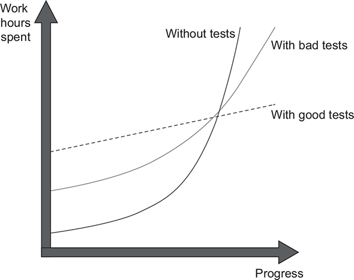
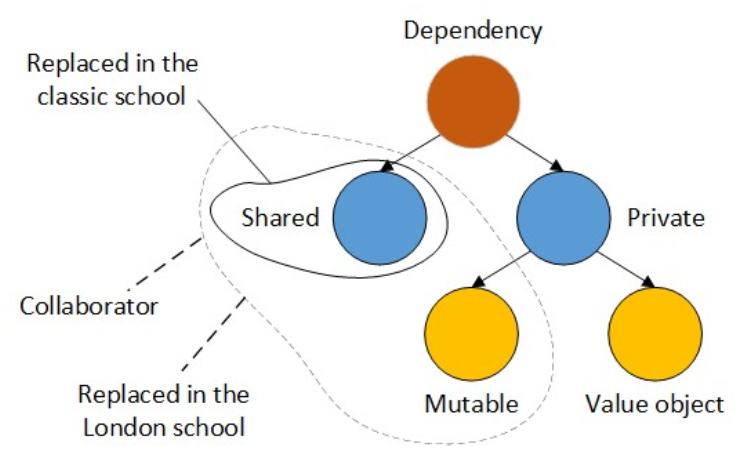
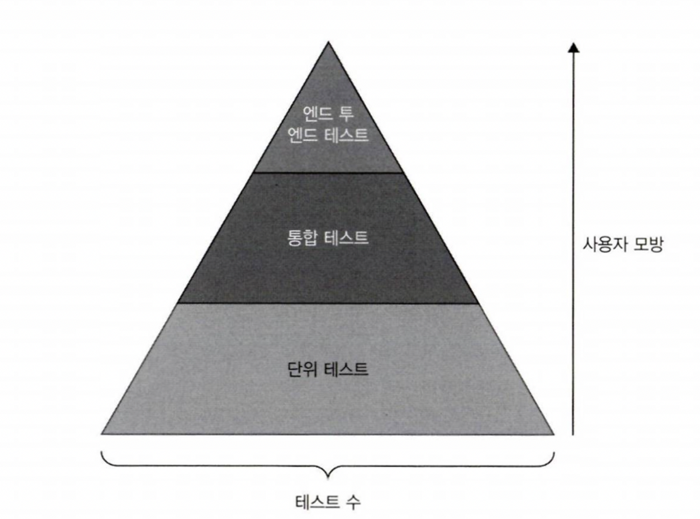

## 단위 테스트, Vladimir Khorikov

### 1. 단위테스트의 목표

- 단위테스트의 목표는 소프트웨어의 지속적인 성장을 가능하게 하는 것
- 유지보수가 지속될수록 코드는 점점 나빠지는 경향이 있다. 즉, 엔트로피가 증가한다. 이를 꼼꼼한 단위 테스트의 작성으로 극복할 수 있다.
- 하지만 핵심은 '좋은' 단위 테스트를 작성하는 것이다. 나쁜 단위 테스트는 오히려 소프트웨어 유지비용을 증가시킬수도 있다.
- 커버리지 지표는 좋은 부정 지표이며, 나쁜 긍정 지표이다. 커버리지 수치가 높다고 하여 테스트 스위트의 품질이 좋다고 할 수 없다.
- 특정 커버리지 수치를 목표로하면 본질에서 멀어질 수 있으므로 좋은 방법이 아니다.
- #### 성공적인 테스트 스위트는 다음과 같은 특성을 가졌다.
  - 개발 주기에 통합되어 있다.
  - 코드베이스 중 가장 중요한 부분만을 대상으로 한다.
  - 최소한의 유지비로 최대의 가치를 이끌어낸다.
- #### 단위 테스트의 목표를 달성하기 위한 유일한 방법은 아래와 같다.
  - 좋은 테스트와 좋지 않은 테스트를 구별하는 방법을 배운다.
  - 테스트를 리팩터링해서 더 가치 있게 만든다.
  
### 2. 단위테스트란 무엇인가
- 단위테스트는 아래와 같은 세가지의 정의로 나타낼 수 있다.
  - 단일 동작 단위를 검증하고
  - 빠르게 수행하고
  - 다른 테스트와 별도로 처리한다.
- 다른 테스트와 별도로 처리한다라는 테스트 격리 관점의 차이로, 고전파와 런던파로 나뉘었다.

- #### 런던파(aka. Mockist)
  - 런던파는 테스트 대상 단위를 분리해야한다고 주장한다. 테스트는 메서드의 클래스와 1:1관계를 가지며, 메서드 수행에 의존하는 불변 값객체를 제외한 모든 것들을 테스트 대역(Test double)으로 대체해야한다.
- #### 고전파(aka. Classist)
  - 고전파는 단위가 아닌 단위 테스트 메서드를 서로 분리해야한다고 주장한다. 테스트의 관점을 코드 단위가 아닌 동작의 단위로 보기 때문에, 하나의 동작에 의존하는 클래스가 있다면 그것 또한 같이 수행되는 게 하나의 단위 테스트를 수행하는 것이라는 관점이다.
- 런던파는 더나은 입자성(작은 조각으로 분리됨), 복잡한 의존관계를 가진 클래스에 대한 테스트의 용이성, 테스트 수행 실패시 디버깅의 용이성 등의 장점을 갖는다.
- 하지만 테스트의 중점이 동작보다 코드에 집중되어 있어, 핵심보다 지엽적인 부분에 집착하여 과잉 명세를 유발하는 문제가 있으며, 복잡한 의존성 자체가 설계상의 문제이지만 모든걸 mock으로 해결해버리면 이 문제를 제대로 파악하지 못하게 된다는 문제가 있다.
- 통합테스트는 단위테스트의 기준 중 하나 이상을 충족하지 못하는 테스트다. e2e테스트는 통합테스트의 일부이지만 보다 더 많은 의존성을 테스트하고, 사용자 관점의 테스트이다.

### 3. 단위 테스트 구조
- 모든 단위테스트는 AAA 패턴(또는 BDD)을 따라야 한다. 테스트 내에 실행구절이나 검증구절이 여러개 있다면 테스트가 올바로 격리되지 못했다는 뜻이다.
- 실행구절이 한 줄 이상이면 SUT(System Under Test)에 문제가 있다는 뜻이다. 이를 사용하는 클라이언트가 한가지 실행을 빼먹어 데이터에 이상이 생기는 불변 위반을 일으킬 수 있다. 캡슐화를 통해 이를 보완하자.
- SUT의 변수이름을 sut로 지정해 테스트에서 구별하자.
- 테스트 데이터를 생성하는 픽스처 코드는 팩토리 메서드로 빼도록 하자. 재사용성을 높이면서도 결합도가 낮고 가독성도 향상시킨다.
- 테스트 메서드명은 너무 엄격한 명명 정책을 시행하지 말고 비개발자들도 누구나 읽을 수 있게 지정하자.
- 매개변수화된 테스트(Parameterized Test)로 유사한 테스트를 통합하자. 다만 비즈니스가 복잡하다면 성공과 실패케이스는 구분하는 게 좋다.

### 4. 좋은 단위 테스트의 4대 요소
- 좋은 단위 테스트에는 네가지 특성이 있다.
  - 회귀 방지
  - 리팩터링 내성
  - 빠른 피드백
  - 유지 보수성
- #### 회귀방지
  - 테스트가 얼마나 버그의 존재를 잘 나타내는지에 대한 척도. 테스트가 코드를 더 많이 실행할수록 회귀방지는 높아진다.
- #### 리팩터링 내성
  - 테스트가 거짓 양성*을 나타내지 않고 코드 리팩터링을 유지할 수 있는 정도를 의미한다.
  - 단위 테스트가 SUT의 최종 결과가 아닌 세부 구현에 집중하면 리팩터링 내성이 낮아짐.
  - 거짓 양성
    - 테스트가 실패했다고 나타내지만 기능은 의도한대로 동작하는 허위 경보를 일으키는 증상
    - 테스트가 SUT의 결과가 아닌 내부 구현에 집중하면 리팩토링시 내부 구현이 틀어져 발생하는 현상
    - 허위 경보에 익숙해지면 경보에 소홀해지고 진짜 경보를 놓칠 수 있으므로 매우 위험하다.
- #### 빠른 피드백
  - 테스트가 얼마나 빨리 수행되는지에 대한 척도이다.
- #### 유지 보수성
  - 테스트 이해 난이도와 직결된다. 테스트가 작을수록 읽기 쉽다.
  - 테스트 실행 난이도와도 직결된다. 외부 의존성이 적을수록 실행이 쉽다.
- 회귀방지, 리팩터링 내성, 빠른 피드백 세가지를 모두 완벽하게 달성할 수는 없다. 각각의 성질이 상충되기 때문
- 하지만 리팩터링 내성은 타협할 수 없기 때문에, 리팩터링 내성을 반드시 지키고 나머지 두가지를 적절히 타협하여야 한다.   
   
  
- 테스트 피라미드는 단위 테스트, 통합 테스트, e2e 테스트의 일정 비율을 일컫는다. 나열 순서대로 테스트 수가 많고, 사용자 경험과 멀다. 또한 나열 순서대로 빠른 피드백이 우수하고, 회귀 방지가 떨어진다.
- 테스트를 작성할 때는 어떤 테스트이건 간에 블랙박스 테스트 기법을 사용하라. 화이트 박스 테스트는 내부 구현과 강하게 결합하여 리팩토링 내성을 잃게 한다.
- 화이트박스 테스트는 테스트 수행 도구보다 분석 도구에서 의미가 있다. 테스트커버리지 도구로 라인 커버리지와 분기 커버리지를 확인만 하고 미흡한 테스트를 블랙박스 테스트 기법으로 추가하자.
