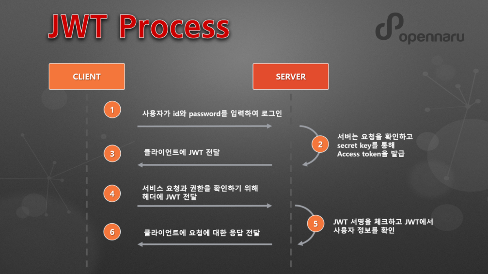
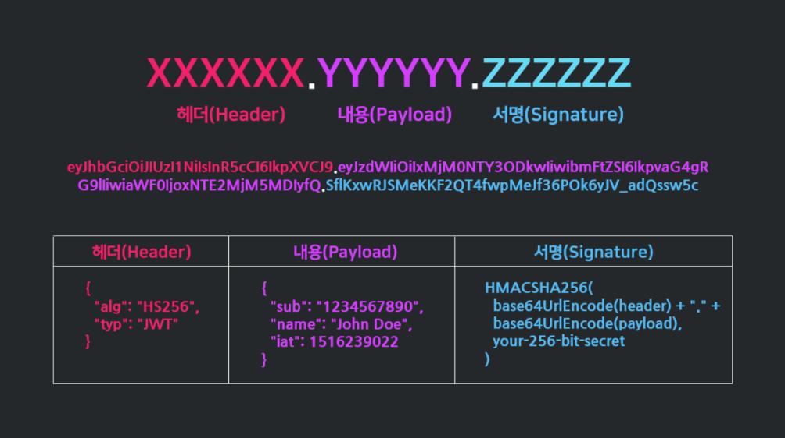

## **JWT(Json Web Token)**
### 쿠키 인증방식
- 로컬에 key-value 형태로 인증정보를 저장, 요청시마다 쿠키헤더에 담아 보내는 방식
- 쿠키값이 요청헤더에 그대로 노출되어 보안에 취약
- 쿠키 용량제한이 있어 많은 정보를 담을 수 없음
- 브라우저간 쿠키지원형태가 달라 브라우저간 공유 불가능
- 쿠키 사이즈가 커질수록 요청시 네트워크 부하가 커짐
### 세션 인증방식
- 요청을 받으면 서버의 메모리나 DB에 인증정보를 저장하고, 클라이언트에 세션 ID를 발급
- 클라이언트는 세션 ID를 쿠키로 저장해놓고 요청시마다 ID를 헤더에 포함해 요청, 서버에서 세션ID를 통해 인증수행
- 서버에서 중요 정보를 보관하기 때문에 쿠키보다는 보안이 좋으나 이것도 세션 ID위장 요청의 위험이 있다.
- 서버에 많은 정보가 저장되기 때문에 서버 부하가 증가한다.
### JWT
1. 유저를 식별하고 인증하기위한 토큰기반 인증기법
2. 세션과 달리 **클라이언트에 저장**되기 때문에 서버의 부담을 덜 수 있다.
3. JWT는 Json데이터를 Base64 URL-safe Encode를 통해 인코딩하여 직렬화. 위변조 방지를 위한 전자서명도 포함.
4. 무상태(Stateless)라는 HTTP의 특징을 그대로 활용할 수 있음.
- #### JWT 작동프로세스

  

- #### JWT 토큰 구조

  