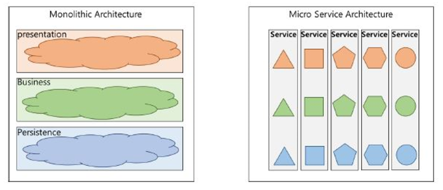

## MSA(Micro Service Architecture)

- 독립되어 각각의 단일 서비스만을 수행하는 프로그램들을 만들고, API통신등을 통하여 통합된 서비스 운영을 수행하는 아키텍쳐
- **기존 Monolithic Architecture의 문제점**
    1. 부분 장애가 전체 서비스의 장애로 확대될 수 있다.
    2. 부분적인 Scale-Out이 어렵다.
    3. 서비스의 변경이 어렵고, 수정 시 장애의 영향도 파악이 힘들다.
    4. 배포 시간이 오래 걸린다.
    5. 하나의 Framework와 언어에 종속적이다.
- **MSA 장점**
    1. 각각의 서비스들이 모듈화 되어 API로 통신하는 형태이므로, 서비스 개발 및 유지보수의 이점이 증가한다.
    2. 서비스의 기능과 목적에 따라 다양한 기술스택을 적용할 수 있다.
    3. 서비스별 독립 배포가 가능하여 CD도 모놀리식에 비해 가볍게 할 수 있다.
    4. 각각의 서비스 부하에 따라 개별적 scale-out이 가능하여 cpu상의 이득이 있다.
- **MSA 단점**
    1. 모놀리식에 비해 상대적으로 복잡하여 통신과 서비스 장애시의 트랜잭션 유지 이슈 등에 대해 고려할 사항이 많다.
    2. 여러 서비스를 연결하는 경우, 각각의 DB도 제각각이기에 트랜잭션 유지가 어렵다.
    3. 통합테스트가 어렵다. 개발환경과 운영환경을 똑같이 가져가는 게 쉽지 않다.
    4. 실제 운영환경에 배포하는 게 쉽지가 않다. 하나의 서비스를 배포하는 경우 다른 서비스들과의 연계상태도 점검해야한다.