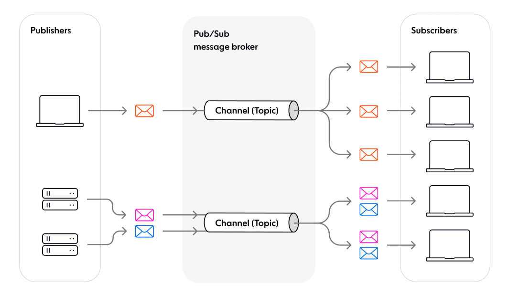

## Pub&Sub 패턴

- pub&sub이란 Publisher & Subscriber를 뜻하며, 다양한 구성요소 또는 서비스간의 비동기 통신을 위해 분산시스템에서 사용되는 아키텍처 디자인 패턴이다.
- 시스템의 규모가 커짐에 따라 필요성이 대두되었으며, 동적으로 구조를 확장해야하는 시스템에 적합한 아키텍처이다.
- Pub / Sub은 게시자와 구독자 간의 메세지 교환을 위한 프레임 워크를 제공한다. 이때 게시자는 특정한 구독자에게 직접적으로 메세지를 보내는 게 아니라, 메세지 브로커를 중개하여 메세지를 전달한다.

- #### pub/sub의 장점
  - 구성요소들간의 결합이 느슨해져 시스템이 더욱 모듈화되고 유연해진다.
  - 높은 확장성. 이론적으로 pub/sub모델에서 게시자는 통신가능한 구독자 수에 제한이 없다.
  - 언어와 프레임워크에 구애받지 않는다.
  - 지연시간이 짧은 실시간 서비스에 이상적인 비동기식 이벤트 기반 통신이다.
- #### pub/sub 패턴 사용 시기
  - 게시자와 구독자 수가 많고 변동이 심한 분산 시스템에 적합하며, 아래와 같은 기능에 사용하면 좋다.
    1. 이벤트 알림 기능
    2. 분산 캐싱 및 분산 로깅
    3. 다중 데이터소스 작업
    4. 업데이트 알림(1:N)
    5. 실시간 채팅, 멀티플레이어 협업 등과 같은 응답성이 뛰어난 사용자 경험이 필요한 기능

- #### pub/sub 패턴이 적합하지 않은 경우
  1. 소규모의 단순한 시스템에는 부적합
  2. 미디어 스트리밍은 엔드포인트간의 동기통신이 필요하여 부적합
  3. 정기작업 및 백그라운드 작업은 메세지 전송 모델과 부적합
  4. 비이벤트 기반 시스템
  5. 동기통신
