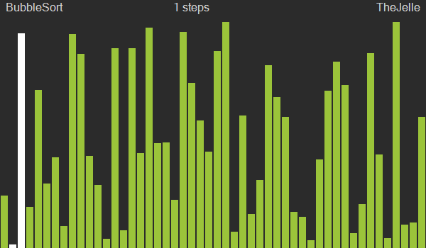
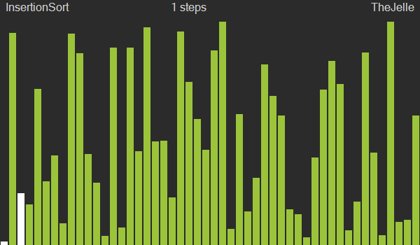
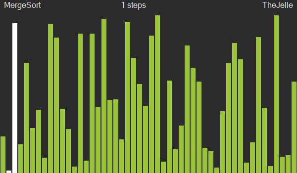
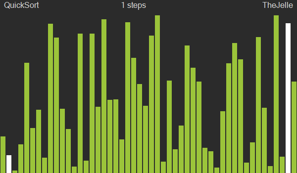
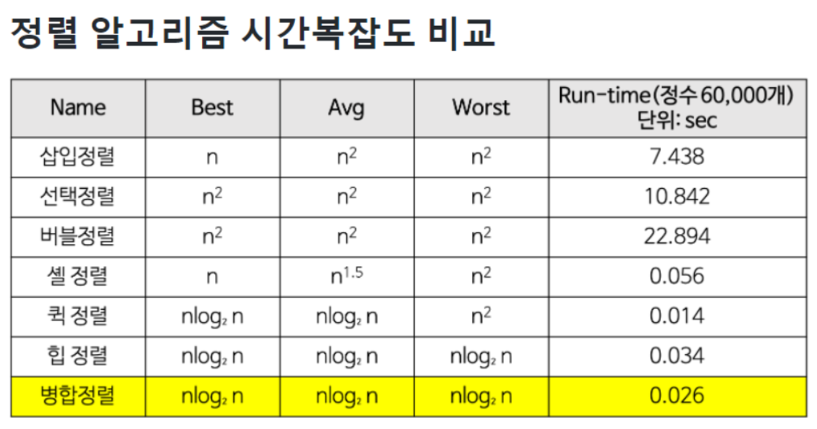

## 정렬

- ### 버블정렬

  

    - 시간복잡도 O(n²)
    - 인접한 두 원소를 검사하여 정렬하는 방식
    - 이중 반복문으로 두 원소를 비교하며, 정렬 조건에 따라 변경이 필요하면 임시변수에 담아두고 두 값을 교환
    - 구현이 간단하지만, 최상/최악 모든 경우에 항상 동일한 고비용의 시간복잡도를 요하기 때문에 잘 쓰이지 않는다.

- ### 선택정렬

  

    - 시간복잡도 O(n²)
    - 이중 반복문으로 전체 리스트를 순회하며 가장 큰/작은 값을 n번째 인덱스와 교환하는 방식
    - 간단한 구현, 항상 최악의 시간복잡도

- ### 삽입정렬

  

    - 시간복잡도 최선O(n) 최악O(n²)
    - 두번째 인덱스부터 차례대로 원소를 하나 집고, 역방향으로 0인덱스까지 하나씩 원소를 비교하며 더 크거나작으면 한칸씩 뒤로 밀며 최종적으로 집은 원소가 들어갈 자리를 찾는 정렬방식
    - 모든 요소가 정렬되어있는 리스트는 최선의 시간복잡도가 나오지만, 반대이면 최악의 시간복잡도

- ### 병합정렬

  

    - 시간복잡도 O(n log n)
    - 리스트를 더이상 쪼갤 수 없을 때까지 계속 쪼개고 좌우값을 비교하며 병합해가는 분할과 정복방식 정렬
    - 항상 O(n log n)효율적인 시간복잡도를 가졌지만, O(n)의 공간복잡도를 가졌다. 즉 메모리를 희생하여 속도를 올리는 방식

- ### 퀵정렬

  

    - 시간복잡도 최선 O(n log n) 최악O(n²)
    - 병합정렬과 같이 분할과 정복방식으로 배열을 쪼개어 나가지만, 병합하는 과정에서는 아무것도 하지 않고 쪼개는 과정에서 정렬을 해나가는 방식
    - 피벗포인트를 하나 지정하고, 피벗보다 작으면 왼쪽으로, 크면 오른쪽으로 이동시키는 방식으로 쪼개어나감
    - 이미 정렬된 경우엔 최악의 시간복잡도 O(n²)를 가지지만, 평균적으로는 병합정렬보다도 20%정도 더 속도가 빠르다

- ### 시간복잡도 비교
  

