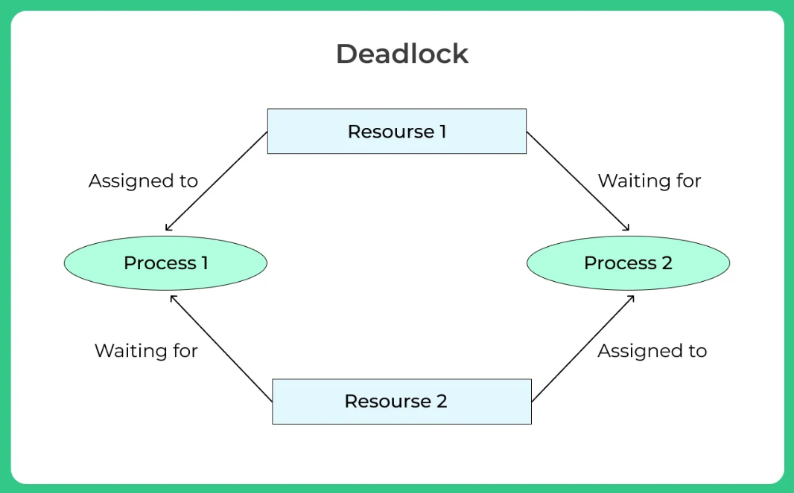

## 교착상태(DeadLock)
  
- 여러 트랜잭션들이 각자 작업한 데이터를 잠금을 한 상태에서 타 트랜잭션이 점유중인 데이터에 잠금 권한을 요청할 때, **작업을 처리하지 못하고 무한정 대기하는 현상**을 일컫는다.
- #### 교착상태 발생 조건
    - **상호 배제(Mutual Exclusion)**
        - 한 리소스는 한 번에 하나의 프로세스만 사용할 수 있음
    - **점유와 대기(Hold and wait)**
        - 한 프로세스가 하나 이상의 자원을 점유하고 있는 동시에 다른 프로세스가 점유중인 자원을 대기하고 있음
    - **비선점(No preemption)**
        - 프로세스가 작업을 끝내고 자원을 스스로 반환할 때 까지 기다림(탈취 불가)
    - **환형 대기(Circular wait)**
        - Hold and wait 관계로, 두 프로세스가 서로의 자원 반납을 기다림
        
- ##### 교착상태 해결방안
    1. **예방 기법**
        - 교착상태가 일어나기 전에 예방하는 기법으로 아래와 같은 방법들이 있음
        1. 각 트랜잭션이 실행되기 전에 필요한 모든 자원을 Lock함

           → 모든 데이터가 Lock되어 병행성이 떨어짐

        2. SET LOCK_TIMEOUT문을 통해 일정 시간이 지나면 쿼리를 취소한다.

           → 기존의 교착상태인 데이터가 있으면, 그 데이터에 접근하는 쿼리만 취소됨. 즉, 근본적인 해결책이 될 수 없음.

    2. **회피 기법**
        - 자원을 할당할 때 TIME STAMP를 활용해서 교착상태가 일어나지 않도록 회피하는 기법으로 가장 많이 사용됨.
        1. wait-die 방식
            - 타트랜잭션에서 잠금중인 데이터를 요청할 때, 현 트랜잭션이 먼저 시작했으면 대기시킨다.
            - 만일 현 트랜잭션이 나중에 시작했으면 포기(die)시키고 나중에 다시 요청한다.
        2. wound-wait 방식
            - 타트랜잭션에서 잠금중인 데이터를 요청할 때, 현 트랜잭션이 먼저 시작했으면 선점(wound)한다.
            - 만일 현 트랜잭션이 나중에 시작했으면 대기(wait)한다.
    3. **낙관적 병행제어 기법**
        - 트랜잭션 실행중에는 검사를 수행하지 않고, 커밋된 후에 데이터에 문제가 있다면 롤백시키는 방식.
        - 트랜잭션이 커밋 후 판독→확인→기록 절차를 거치며 확인단계를 통과해야 기록이 이루어진다.
    4. **빈도 줄이기**
        - 기법을 활용하기 전에 교착상태가 발생할만한 가능성 자체를 줄이는 작업을 수행
            1. 트랜잭션을 자주 커밋
            2. 정해진 순서로 테이블에 접근
            3. 읽기 잠금을 피함
            4. 테이블 단위의 잠금을 획득해 갱신을 직렬화
            5. index설계를 하여 테이블 전체 잠금을 피함
            6. 고립레벨을 낮춤