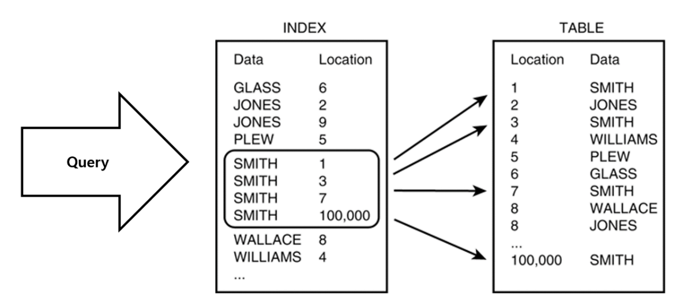
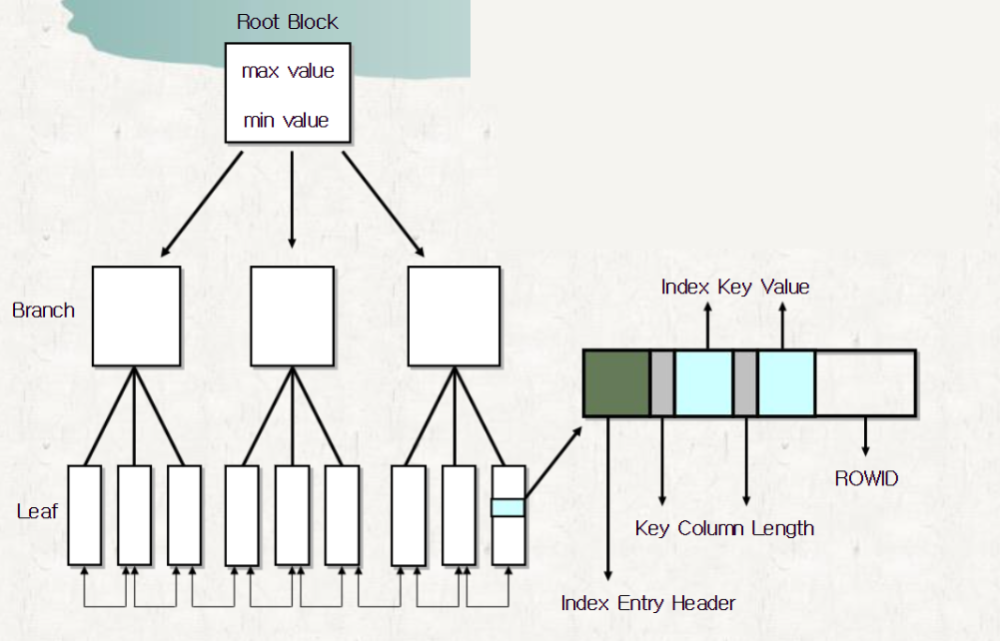

## Index
- 인덱스는 데이터베이스 테이블에 대한 검색성능의 속도를 높여주는 자료구조이다.
- 인덱스 생성 시 데이터를 오름차순 정렬한다.
- #### *인덱스 생성 후 검색 과정*

  

- **장점**
    1. 조건검색 WHERE절의 효율성
        1. index 지정을 하지 않으면 full table scan을 하여 모든 데이터를 뒤지지만, index테이블은 **데이터들이 정렬되어 저장되어 있기 때문**에 조건에 해당하는 데이터들만 빠르게 찾아낼 수 있음
    2. 정렬 ORDER BY절의 효율성
        1. 인덱스 테이블의 데이터는 이미 기본적으로 정렬이 되어 있기 때문에 order by에 의한 정렬이 따로 필요가 없다.
    3. MIN, MAX의 효율적인 처리
        1. 마찬가지로 이미 데이터 크기에따라 정렬되어 있기 때문에 최소최댓값을 구하기가 용이
- **단점**
    1. 인덱스는 DML에 취약
        1. 인덱스가 있으면 삽입,수정,삭제가 이루어질 때마다 본테이블 작업에 추가로 인덱스 테이블 정렬작업까지 이루어지기 때문에 조회보다 위 작업이 빈번한 테이블이라면 오히려 성능 저하가 나타날 수 있다.
    2. 조회 범위가 클 경우 역효과
        1. 테이블에서 검색하고자하는 데이터가 테이블의 10~15%이하일 때는 인덱스스캔이 효율적이나 그 이상은 오히려 비효율적일 수 있다. 가령 전체 데이터를 스캔하는데 굳이 인덱스 테이블을 경유하면 느릴 수밖에 없는 것.
    3. 인덱스를 남발할 경우 성능저하
        1. 인덱스관리는 DB저장공간의 약 10%정도를 추가로 요하기 때문에, 무턱대고 인덱스 테이블을 많이 생성하면 전체 DB의 성능저하가 발생할 수 있다.
        2. 이 점 때문에 성능이슈가 있을 때는 일단 쿼리튜닝을 시도하고 인덱스는 가능한한 최후의 방법으로 시도하는 것이 좋다.

- #### 인덱스 생성전략
    - 인덱스는 자주 사용되는 컬럼에 거는 게 좋으며, PK에 거는 게 가장좋다.
    1. 조건절에 자주 등장하는 컬럼
    2. 항상 =으로 비교되는 컬럼
    3. 분포도가 좋은 컬럼(중복데이터 최소)
    4. ORDER BY절에서 자주 사용되는 컬럼
    5. JOIN조건으로 자주 사용되는 컬럼
- #### 인덱스의 구조
    - 인덱스는 주로 밸런스드 트리 인덱스구조를 사용하며, 그중에서도 B*Tree, B+Tree를 가장 많이 사용한다.
    - **B*Tree 구조도**

        

        1. B*Tree는 대부분의 DBMS, 특히 오라클에서 중점적으로 이용되는 구조이다.
        2. Root / Branch / Leaf 의 계층적 구조를 갖고 있다.
        3. 정렬한 순서가 중간쯤 되는 데이터를 Root로 지정하고, 가지가 되는 Branch를 정의하며, 마지막에 Leaf 블록을 정의하여 데이터와 데이터의 주소인 RowId를 저장한다.