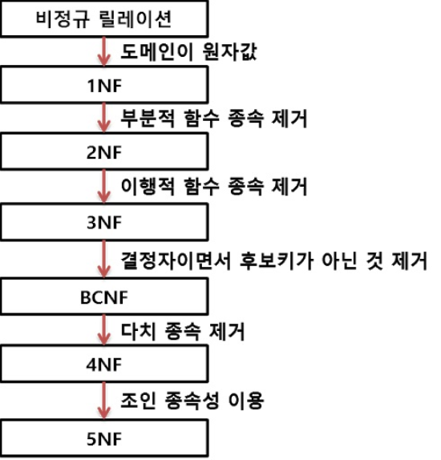

### 정규화(Normalization)

- #### 정규화의 개념
    1. 데이터베이스의 중복을 최소화하기위해 데이터를 구조화해나가는 프로세스
    2. 하나의 큰 테이블에서 여러개의 작은 테이블로 분할하고, 불필요한 데이터를 삭제하는 등의 작업을 수행
    3. 정규화된 데이터 베이스는 확장시 재디자인을 최소화할 수 있음
    4. 각종 이상현상을 방지하기위해, 테이블을 직관적이고 논리적으로 구성
  
- #### 정규화의 장단점
    - **장점**
      - 데이터베이스 변경 시 이상 현상(Anomaly)을 제거할 수 있다.
      - 정규화된 데이터베이스 구조에서는 새로운 데이터 형의 추가로 인한 확장 시, 그 구조를 변경하지 않아도 되거나 일부만 변경해도 된다.
      - 데이터베이스와 연동된 응용 프로그램에 최소한의 영향만을 미치게 되어 응용프로그램의 생명을 연장시킨다.
    - **단점**
      - 릴레이션의 분해로 인해 릴레이션 간의 JOIN연산이 많아진다.
      - 질의에 대한 응답 시간이 느려질 수도 있다. 데이터의 중복 속성을 제거하고 결정자에 의해 동일한 의미의 일반 속성이 하나의 테이블로 집약되므로 한 테이블의 데이터 용량이 최소화되는 효과가 있다.
      - 따라서 데이터를 처리할 때 속도가 빨라질 수도 있고 느려질 수도 있다.
      - 만약 조인이 많이 발생하여 성능 저하가 나타나면 반정규화(De-normalization)를 적용할 수도 있다.

- #### 이상현상
    1. 삽입 이상
        - 튜플 삽입 시 지정하지 않은 속성이 null값을 갖게 되거나 원하지 않는 데이터가 삽입되는 현상
    2. 삭제 이상
        - 튜플 삭제 시 한 튜플에 다양한 정보가 포함돼있어 필요한 정보까지 연쇄적으로 삭제되는 현상.
    3. 갱신 이상
        - 튜플 갱신 시 일관성 유지가 안 되는 현상. 동일한 데이터가 여러 튜플에 나뉘어져 있을 때 하나만 갱신되는 등의 이상.
- #### 정규화 과정
  - 정규화는 모든 정규화 과정을 반드시 수행해야 하는 것은 아니다. 특히 제 4정규화 이상으로 정규화를 수행하면 정규화의 단점이 부각되는 경우가 많기 때문에 보통 정규화는 최대 BCNF까지만 수행하는 경우가 많다.
    
  - **제 1정규화**
    1. 각 컬럼이 하나의 속성만을 가져야 한다.
    2. 하나의 컬럼은 같은 종류나 타입(type)의 값을 가져야 한다.
    3. 각 컬럼이 유일한(unique) 이름을 가져야 한다.
    4. 칼럼의 순서가 상관없어야 한다.
  - **제 2정규화**
    1. 1정규형을 만족해야 한다.
    2. 모든 컬럼이 부분적 종속(Partial Dependency)이 없어야 한다. == 모든 칼럼이 완전 함수 종속을 만족해야 한다.
  - **제 3정규화**
    1. 2 정규형을 만족해야 한다.
    2. 기본키를 제외한 속성들 간의 이행 종속성 (Transitive Dependency)이 없어야 한다.
  - **BCNF 정규화**
    1. 3정규형을 만족해야 한다.
    2. 모든 결정자가 후보키 집합에 속해야 한다.

    
- #### 반정규화
    1. 정규화된 데이터베이스에서 성능상의 이슈가 있을 때 정규화 과정을 역으로 수행하는 반정규화를 진행할 수 있다.
    2. 디스크의 I/O사용량이 많을 때, 조인이 너무 많아 조회 속도가 느릴 때, 일정한 범위의 데이터를 반복적으로 조회할 때 등등의 이슈가 존재
    3. 반정규화를 과도하게 하다보면 데이터베이스 무결성이 깨질 수 있으므로 성능과 무결성 간의 트레이드오프를 잘 하여 결정하여야함.