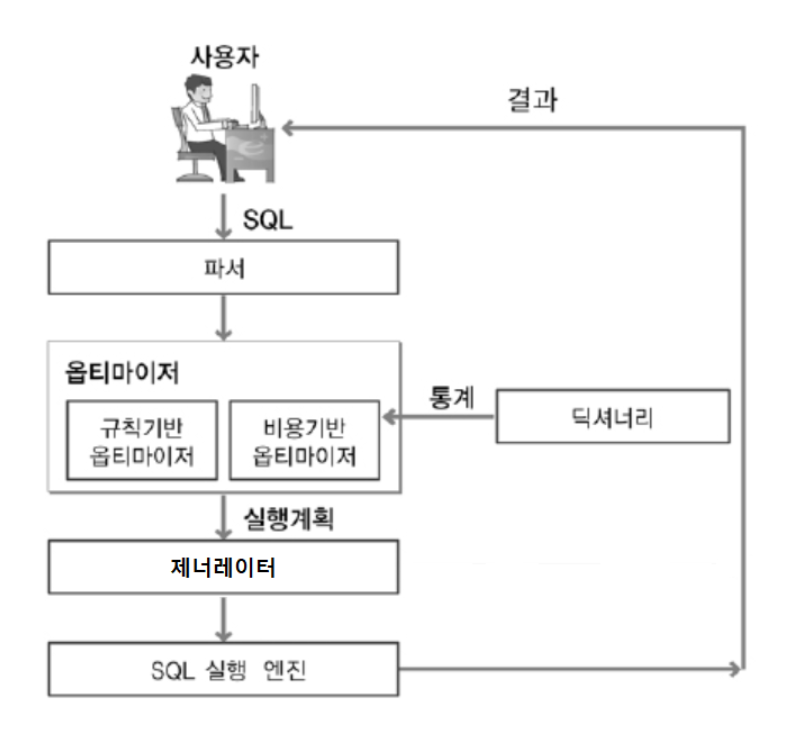
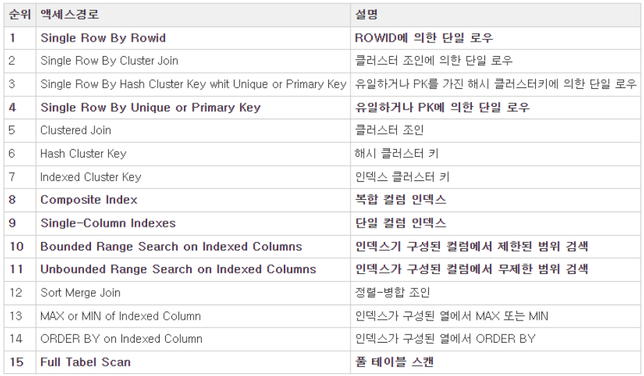

## 옵티마이저(Optimizer)
  
옵티마이저란 쿼리수행 이전에 쿼리 결과를 얻기위한 최적의 경로를 계산하는 DB의 CPU와도 같은 프로그램이다. 개발자가 SQL을 작성하면 DBMS의 옵티마이저는 해당 쿼리에 대한 실행계획을 세우고, 그 실행계획을 기반으로 데이터를 가져온다. 이 과정을 한번 자세히 살펴보자.  

### 쿼리 실행 절차
쿼리의 실행 절차는 크게 Parsing > Optimization > Generation > Execution 과정을 거치며 실행된다.
  
#### 1. SQL Parsing
개발자가 전송한 SQL 쿼리를 분해하고 구성요소를 분석하여 파싱 트리를 만든다. 이 과정에서 SQL 문법도 검사하며, 문법이 정상적일 경우에만 트리를 만들고 잘못 되면 에러를 발생시킨다.  

#### 2. Optimization
파싱단계에서 만들어진 SQL파싱트리를 기반으로 옵티마이저가 가진 여러가지 동작을 수행한다.  
- **Query Transformer**: 파싱된 SQL을 보고 같은 결과를 도출하되, 좀 더 나은 실행 계획을 갖는 SQL로 변환이 가능한지를 판단하여 변환 작업을 수행한다. 이 때 불필요한 조건을 제거하거나 복잡한 연산을 단순화 시키는 등의 작업을 수행한다.
- **Estimator** : 시스템 통계정보를 딕셔너리로부터 수집하여 SQL을 실행할 때 소요되는 총비용을 계산한다.
- **Plan Generator** : Estimator를 통해 계산된 값들을 토대로 후보군이 되는 실행계획을 도출한다.

#### 3. Generation
옵티마이저가 생성한 실행계획을 SQL 엔진이 실제 실행할 수 있는 코드나 프로시저 형태로 포맷팅한다.

#### 4. Execution
포맷팅된 SQL을 실행하고 결과를 사용자에게 전달한다.  

### 옵티마이저의 종류
옵티마이저는 크게 규칙 기반 옵티마이저와 비용 기반 옵티마이저가 있는데, 현대의 DBMS에서 규칙 기반 옵티마이저는 거의 이용하지 않고 대부분은 비용 기반 옵티마이저를 이용하고 있다.

#### 1. 규칙 기반 옵티마이저(Rule-Based Optimizer)
이 방식은 실행 속도가 빠른 쿼리의 규칙을 몇가지 정해두고 순위를 매겨 높은 순위의 연산부터 낮은 순위의 연산까지 차례로 진행해나가는 방식이다. 규칙은 인덱스 구조, 조건절 형태 등에 의해 순위가 정해지며, 순위는 변경할 수 있는 설정도 있긴 하지만 거의 고정으로 사용한다.
규칙의 종류는 아래와 같다.  
  

#### 2. 비용 기반 옵티마이저(Cost-Based Optimizer)
이 방식은 CPU 성능이 좋아진 현대에 가장 많이 사용되는 방식으로, 시스템 통계정보를 기반으로 약 2000개의 실행계획을 세우고 최소 비용의 실행계획을 수행하는 방식이다.
여기서 시스템 통계 정보란 CPU 성능, I/O 속도 등을 의미하며 DB 통계정보로 미사용 테이블, 인덱스, 컬럼 등을 참고하기도 한다. 이 통계정보의 데이터가 다양하고 많을수록 실행계획의 정확도가 높아지기 때문에 통계정보를 정확하게 유지하는 게 중요하다.

#### 실행 계획
실행 계획이란 쿼리가 수행될 수 있는 수많은 경우의 수를 뜻한다. 옵티마이저는 수많은 실행계획 중 하나를 택하여 수행하는데, 아무리 옵티마이저라고 한들 항상 최고의 실행계획만을 택하는 것은 아니다. 애플리케이션 성능에 지대한 영향을 미치는 중요한 쿼리의 경우, 비용기반 옵티마이저의 능력으로도 그다지 빠른 쿼리수행이 되지 않는다면 이 실행계획을 개발자가 직접 확인하고 조정하여 쿼리 튜닝을 수행할수도 있다.
