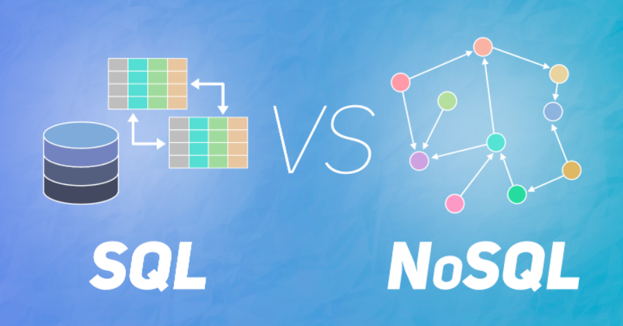

## SQL / No SQL

- ### SQL
    - RDBMS에서 데이터를 저장, 수정, 삭제 및 검색할 수 있음
    - 정해진 데이터 스키마에따라 테이블에 저장된다
    - 데이터는 관계를 통해 여러 테이블에 분산된다
    - 스키마를 준수하지 않은 데이터는 테이블에 추가할 수 없다.
    - 데이터 중복을 피하기위해 관계(Realation)를 이용한다.
    - 정규화가 잘 된 경우, 하나의 테이블에서 중복 없이 하나의 데이터만을 관리하기 때문에 다른테이블에서 부정확한 데이터를 다룰 위험이 없어진다.
    - **SQL의 장점**
        - 명확하게 정의된 스키마로, 데이터의 무결성을 보장함
        - Relation의 개념으로, 각 데이터는 한 번만 저장하면 됨
    - **SQL의 단점**
        - 낮은 유연성, 추후에 수정이 어려우므로 데이터 스키마를 사전에 계획하고 알려야 함
        - 관계를 맺고 있어서 조인문이 많은 복잡한 쿼리가 만들어질 수 있음
        - 대체로 수직적 확장만 가능
- ### No SQL
    - No Schema, No Releation
    - 스키마가 없기 때문에 다른 구조의 데이터를 같은 컬렉션에 추가가 가능하다
    - NoSQL에서는 레코드를 문서(document)라고 하고, Json과 비슷한 형태로 가지고 있다.
    - 관련 데이터를 RDB처럼 여러 테이블에 나누지 않고 동일한 컬렉션에 넣는다.
    - 자주 변경되지 않는 데이터일 때 NoSQL을 사용하면 상당히 효율적이다.
    - **NoSQL의 장점**
        - 유연함. 언제든지 저장된 데이터를 조정하고 새로운 필드 추가 가능
        - 데이터는 애플리케이션이 필요로하는 형식으로 저장됨. 데이터를 읽어오는 속도가 빨라짐
        - 수직/수평 확장에 모두 유리
    - **NoSQL의 단점**
        - 유연성 때문에 오히려 데이터 구조 결정을 미루게 될 수 있음
        - 데이터 중복을 계속 업데이트 해야함
        - 데이터가 중복되어 있기 때문에 수정시 모든 컬렉션에서 수정해야함
    - **NoSQL 데이터베이스 사용이 더 좋을 때**
        - 정확한 데이터 구조를 알 수 없거나 변경/확장 될 수 있는 경우
        - 읽기를 자주 하지만, 데이터 변경은 자주 없는 경우
        - 데이터베이스를 수평으로 확장해야 하는 경우(막대한 양의 데이터를 다루어야 하는 경우)