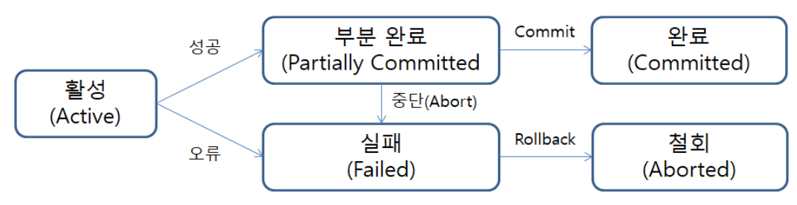

### 트랜잭션
- #### 트랜잭션의 개념
    1. 트랜잭션은 작업의 완전성을 보장해주는 개념.
    2. 하나의 논리적인 작업의 단위를 정해서 작업 내용이 일부만 반영되는 일 없이 모두 반영되거나 반영되지 않게 해주는 역할
- #### 트랜잭션의 특징(ACID)
    1. **원자성(Atomicity)**
        - 데이터가 모두 반영되거나 전혀 반영되지 않아야하는 성질
    2. **일관성(Consistency)**
        - 트랜잭션 작업중 데이터가 변경되더라도, 처음 참조된 데이터로 작업을 진행하여 일관성 있는 결과를 도출해야하는 성질
    3. **독립성(Isolation)**
        - 동시 실행중인 트랜잭션이 있을 때, 타 트랜잭션의 연산에 끼어들 수 없는 성질
    4. **지속성(Durability)**
        - 트랜잭션이 성공적으로 수행됐을 경우, 결과는 영구적으로 반영되어야하는 성질
    

- #### 트랜잭션의 상태

  
  - **활동(Active)** : 트랜잭션이 실행 중인 상
  - **실패(Failed)** :트랜잭션 실행에 오류가 발생하여 중단된 상태
  - **철회(Aborted)** : 트랜잭션이 비정상적으로 종료되어 Rollback 연산을 수행한 상태
  - **부분 완료(Partially Committed)** : 트랜잭션의 마지막 연산까지 실행했지만, Commit 연산이 실행되기 직전의 상태
  - **완료(Committed)** : 트랜잭션이 성공적으로 종료되어 Commit 연산을 실행한 후의 상태

- #### 트랜잭션 격리 수준
    - 트랜잭션 격리수준이란, 여러 트랜잭션이 동시에 수행될 때 트랜잭션들끼리 얼마나 고립되어 있는가를 나타내는 지표로서, 현재 변경이 진행중인 트랜잭션의 데이터를 어디까지 보여줄 것인가를 결정하는 지표이다.
    - 트랜잭션 수준 읽기 일관성을 지키기위해 사용되며, 동시성 제어 문제 해결을 위함이기도 하다.
    - #### 4가지 격리수준
        1. **Read uncommitted**
            1. 고립수준이 가장 낮고 동시성 문제가 가장 큰 격리수준
            2. 트랜잭션 처리중인 아직 커밋되지 않은 데이터도 읽기를 허용함
            3. Dirty Read, Non-Repeatable Read, Phantom Read 현상이 모두 발생 가능
        2. **Read Committed**
            1. 고립수준이 두번째로 낮고 동시성 문제가 두번째로 큰 격리수준
            2. 커밋된 데이터만 읽어오는 격리수준으로, 대부분의 RDB에서 기본으로 사용
            3. undo영역에 있는 데이터를 읽어오므로, 롤백 발생 시 동시성 문제가 발생가능
            4. Non-Repeatable Read, Phantom Read 현상이 발생 가능
        3. **Repeatable Read**
            1. 고립수준이 두번째로 높고 동시성 문제가 두번째로 낮은 격리수준
            2. 트랜잭션이 시작되기 전에 커밋된 데이터만 조회할 수 있음
            3. 변경 전 레코드는 undo공간에 백업해두고, 실제 레코드값을 변경
            4. Phantom Read 현상이 발생 가능
        4. **Serializable**
            1. 고립수준이 가낭 높고 동시성 문제가 가장 낮은 격리수준
            2. 한 트랜잭션에서 select가 수행되면 공유잠금을 걸어 수정,삭제,삽입을 막는다.
            3. 동시처리능력이 떨어지고 성능저하가 발생해 거의 사용되지 않음.
            4. 어떠한 동시성문제도 발생하지 않는다.

    - #### 3가지 동시성 문제
        1. **Dirty Read**
            1. 트랜잭션에서 아직 변경중인 데이터를 읽음으로 인해, 다른 트랜잭션에서 롤백이 발생할 시 롤백시점 이전에 읽은 데이터와 롤백 이후에 읽은 데이터가 달라지는 현상
        2. **Non-Repeatable Read**
            1. 한 트랜잭션 내에서 같은 쿼리를 두 번 수행할 때, 두 쿼리 사이에 다른 트랜잭션이 값을 변경하거나 삭제하여 두 쿼리가 상이하게 조회되는 현상
            2. 한 트랜잭션 내에서 동일한 select를 수행하면 항상 같은 결과를 반환해야한다는 Repeatable Read정합성에 어긋남
        3. **Phantom Read**
            1. 한 트랜잭션 내에서 같은 쿼리를 두 번 수행했을 때, 첫번째 쿼리에는 없던 데이터가 두번째 쿼리에서 나타나는 현상.
            2. 타 트랜잭션에서 insert를 수행할 시 발생하는 문제이며, 쓰기잠금을 걸어야 방지할 수 있다.