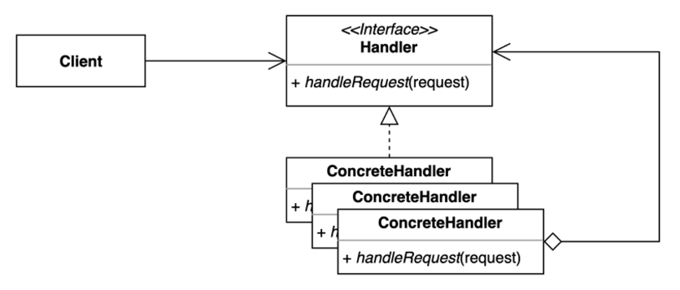
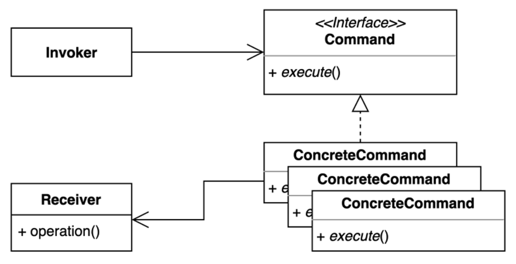
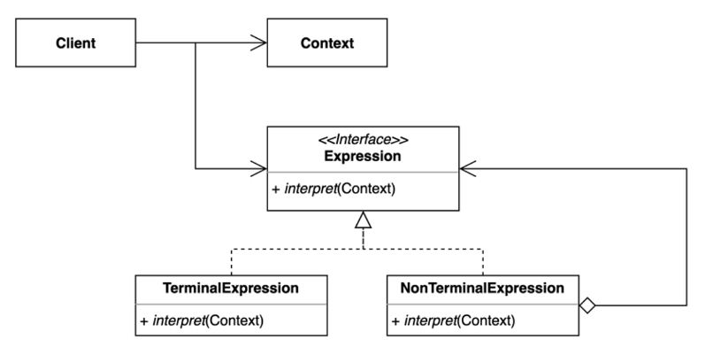
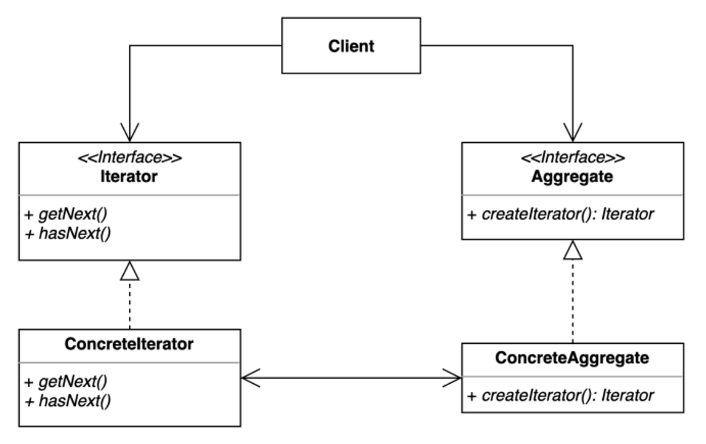
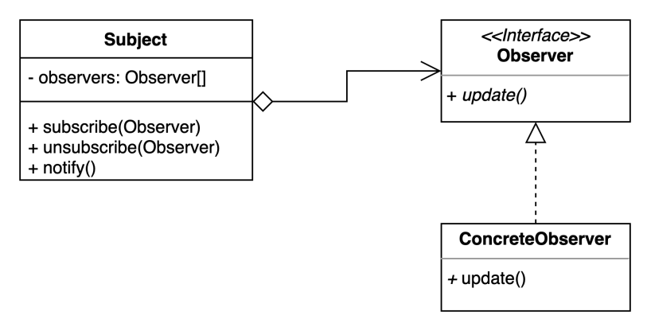
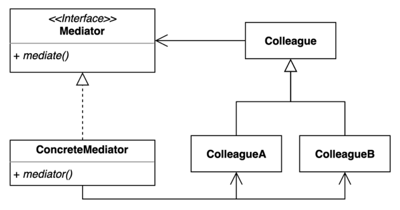
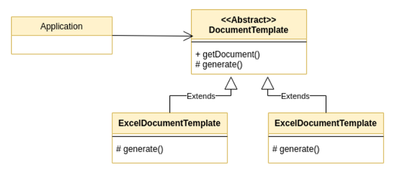
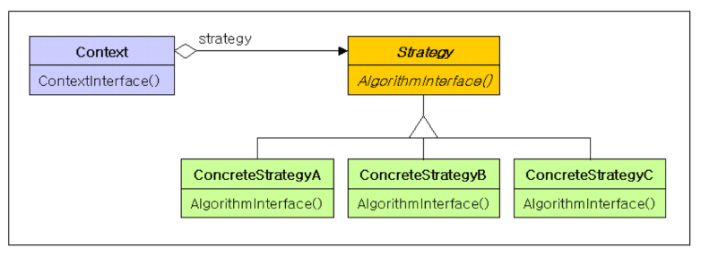

## 행위 패턴(Behavioral Pattern)

### Chain-Of-Responsibility Pattern

- 요청을 보내는 쪽과 처리하는 쪽을 분리하고 처리하는 기능을 체이닝하여 사용하는 기법
- **장점**
    - 클라이언트 코드의 변경 없이 새로운 체인을 추가 및 삭제할 수 있다.
    - 각각의 체인이 단일 책임 원칙을 지키게 된다
    - 체인을 다양한 방법으로 구성할 수 있따.
- **단점**
    - 한번에 체이닝으로 모두 이어버리기 때문에 디버깅이 약간 어려워지는 단점이 있다.

### Command Pattern

- 커맨드 패턴은 호출자와 수신자를 분리하여, 수신자 클래스들의 동작을 하나로 관리하는 커맨드 인터페이스를 통해 호출자의 코드를 변경하지 않고도 다양한 추가수정삭제를 가능하게 해주는 패턴
- **장점**
    - 클라이언트측의 기존 코드를 변경하지 않고 새로운 기능을 만들 수 있다.
- **단점**
    - 코드가 비교적 복잡해지고 클래스가 많아진다.

### Interpreter Pattern

- 인터프리터 패턴은 프로그래밍에서 반복되는 문제를 패턴화하여 문법으로 만들고 해당 문법으로 간편하게 재사용할 수 있도록하는 패턴
- context에 포함된 각각의 요소별로 적합한 expression을 생성하고, 해당 expression들의 재귀적 호출로 큰 문제를 해결한다.
- **장점**
    - 자주 등장하는 문제를 문법화하여 클라이언트에서 간편하게 사용할 수 있다.
    - 기존 코드의 변경 없이 expression의 추가로 기능 확장이 용이하다.
- **단점**
    - 코드 구조가 복잡해지고, 지속적 확장시 expression이 너무 많아지며 parser의 코드가 복잡해진다.
- **자바와 스프링에서**
    - 자바의 컴파일러가 인터프리터패턴을 통해 코드를 해석하고 처리한다.
    - 스프링의 SpEL 표현식도 인터프리터 패턴으로 구현되었다.
    - 정규표현식은 대표적인 인터프리터 패턴 활용의 예이다.

### Iterator Pattern

- 이터레이터 패턴은 집합 객체를 순회하는 방법을 클라이언트에 노출하지 않고 인터페이스로 제공하는 패턴이다.
- **장점**
    - 다양한 집합 객체에 대한 순회방법을 공통된 인터페이스로 제공하여 클라이언트에서 동일한 방식으로 순회가 가능하다.
    - 다양한 객체 순회에 대한 규칙을 클라이언트가 몰라도 된다.
- **단점**
    - 클래스가 증가하고 코드가 복잡해진다.
  
### Observer Pattern

  
- 옵저버 패턴은 다수의 객체가 특정 객체 상태 변화를 감지하고 알림을 받는 패턴이다.
- **장점**
  - 상태를 변경하는 객체(publisher)와 변경을 감지하는 객체(subsriber)의 관계를 느슨하게 유지할 수 있다.
  - Subject의 상태 변경을 주기적으로 조회하지 않고 자동으로 감지할 수 있다.
  - 런타임에 옵저버를 추가하거나 제거할 수 있다.
- **단점**
  - 복잡도가 증가한다.
  - 다수의 Observer 객체를 등록 이후 해지 않는다면 memory leak이 발생할 수도 있다.
- **pub/sub 패턴과의 차이점**
  - Observer 패턴은 Observer와 Subject가 서로를 인지하지만 pub/sub 패턴의 경우 서로를 전혀 몰라도 된다.
  - 위의 특성으로 인해 pub/sub 패턴의 결합도가 더 낮다.
  - Observer 패턴은 대부분 동기로 동작하나 pub/sub 패턴은 대부분 비동기로 동작한다.
  - Observer 패턴은 단일 도메인에서 구현되어야 하지만, pub/sub 패턴은 messeage broker를 통해 크로스 도메인에서도 구현이 가능하다.

### Mediator Pattern

- 여러 객체들간의 상호작용을 중재자 인터페이스를 통해 수행하여 객체들간의 결합도를 낮추는 패턴
- **장점**
    - 대부분의 의존성이 중재자 인터페이스 하나에 몰려있어 의존관계가 간결해진다.
    - 기능 변경 시 컴포넌트의 변경 없이 중재자만을 변경하여 OCP를 준수할 수 있다.
- **단점**
    - 중재자 역할을 하는 클래스에 너무 많은 책임이 몰려 클래스가 복잡해질 수 있다.
- **자바&스프링에서**
    - 스프링MVC의 DispatcherServlet이 대표적인 중재자패턴이라고 할 수 있다.
    - DispatcherServlet은 MVC과정에서 수행해야할 많은 과정에 연관된 객체들과 의존성을 맺고 중간에서 대신 작업을 전달하는 전형적인 중재자역할을 한다.

### Template Method Pattern

- 템플릿 메서드 패턴은 여러 메서드에서 반복적으로 사용되는 공통적인 로직을 템플릿화 시켜 중복 코드를 줄이고 코드를 좀 더 객체지향적이게 만드는 행위 패턴이다.
- 메서드의 역할을 공통로직과 단일로직으로 나누었기 때문에 SRP(단일책임원칙)을 잘 준수한 코드가 된다.
- 하지만 추상클래스가 많아지면 클래스관리가 복잡해지고, 템플릿클래스와 서비스클래스는 상속관계로 강하게 결합되기 때문에 추후 유지보수 시 사이드 이펙트를 유발할 위험성이 증가한다.
- **구현 방법**
    - 템플릿이 될 추상클래스를 생성하여 핵심 서비스가 작동할 추상메서드를 선언한다.
    - 공통로직을 수행할 일반 메서드를 작성하고, 서비스별로 달라지는 핵심 서비스가 동작해야할 부분에는 서비스 추상메서드가 호출되게 한다. 이때 반환 타입이 있다면 제네릭을 이용하는 게 유리하다.
    - 실제 서비스 구현 부분에는 데이터 타입을 템플릿으로 하고, 핵심서비스용 추상메서드를 상속받은 익명클래스를 생성하여 상속받은 메서드에 서비스 로직을 구현한다.

### Strategy Pattern

- 전략 패턴은 실행중 상황에 맞는 알고리즘을 교체할 수 있는 행위패턴이다.
- 각각의 알고리즘들을 클래스로 정의하고 캡슐화하며, 이 알고리즘을 호출하는 구현부에서 어떤 알고리즘이 호출될지 실행중에 결정할 수 있게한다.
- **스프링의 DI**가 전략패턴을 이용한 대표적인 예이다.
- 선언부에서는 선택 대상 알고리즘들을 위임받는 인터페이스를 선언하고, 구현부에는 실제 동작할 알고리즘 클래스를 구현한다.
- 상황에 따라 사용자가 필요한 알고리즘을 전략적으로 선택할 수 있는 게 핵심 요소이기 때문에, 공통 설정 클래스를 사용하든 각 메서드별로 구현클래스를 지정하든 전략 패턴의 수행에는 차이가 없다.
- 템플릿 메서드 패턴처럼 상속을 이용하지 않기 때문에 클래스간의 의존도가 낮아져 안정성이 좋으며, SRP또한 준수하는 패턴