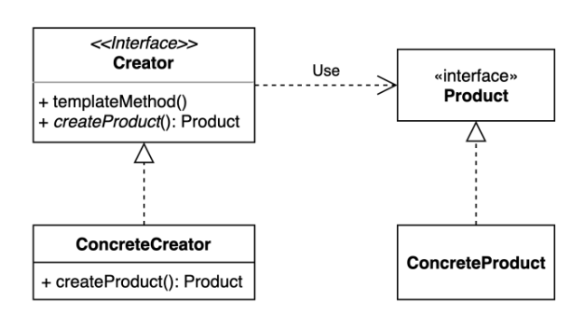
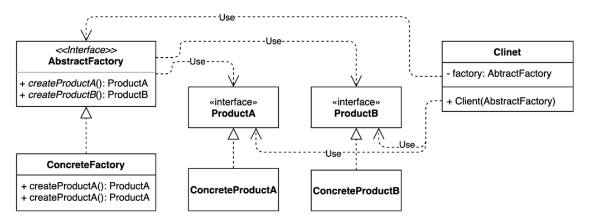
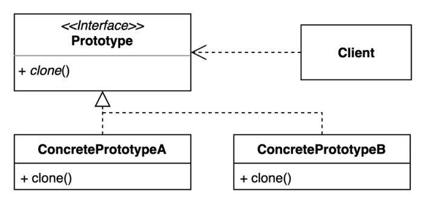

## 생성 패턴(Creational Pattern)

### Singleton Pattern
- 객체를 하나만 생성하여 사용하는 디자인 패턴
- 최초에 한번만 객체를 생성하고, 이후 호출에는 생성된 객체를 반환 시킴
- new를 통해 여러 객체를 생성하지 않아도 되기 때문에 메모리 낭비를 방지 가능
- therad pool, connection pool, cache, logging 객체 등등에 사용됨
- 다만 싱글톤 인스턴스가 너무 많은 일을 하면 결합도가 높아지며 SRP(단일책임원칙)을 위배한다.
- 반복사용 빈도가 낮은 객체를 싱글톤으로 너무 많이 만들면 메모리 낭비가 될 수 있다.
- 멀티스레드 환경에서의 싱글톤 동시성 문제 해결 방안

  → 참고 : https://seunghyunson.tistory.com/28

- **싱글톤 질문**
    - 자바에서 enum을 사용하지 않고 싱글톤 패턴을 구현하는 방법은?
    - private 생성자와 static 메소드를 사용하는 방법의 단점은?
    - enum을 사용해 싱글톤 패턴을 구현하는 방법의 장점과 단점은?
    - static inner 클래스를 사용해 싱글톤 패턴을 구현하라.

###Factory Method Pattern

- 팩토리라는 인터페이스를 통해 특정 구현체(Product)를 Creator 코드의 변경 없이 추가 생성할 수 있는 패턴
- 객체 생성에 필요한 공통적인 부분은 Creator에 정의해두고, 객체별로 달라지는 부분은 각 객체별 ConcreteCreator에 재정의한다.
- 생성자와 객체간의 결합을 줄임으로 생성 클래스와 사용 클래스의 용도가 분리되므로 SRP를 지킬 수 있게 된다.
- Product의 추가에도 생성자 코드는 변경이 필요없어져 OCP를 지킬 수 있게 된다.
- **자바와 스프링에 적용된 팩토리 메서드 패턴**
    - Calendar Class
        - geInstance() 로 넘기는 파라미터에 따라 다른 캘린더가 리턴
    - BeanFactory
        - ClassPathXmlApplicationContext, AnnotationConfigApplicationContext 등 구현체에 따른 팩토리가 리턴됨
- **팩토리 메서드 패턴 질문**
    - 팩토리 메서드 패턴을 적용했을 때의 장점과 단점은?
    - OCP에 대해 설명하시오
    - 자바8에 추가된 default 키워드에 대해 설명하시오

### Abstract Factory Pattern

- 구체적인 클래스에 의존하지 않고 서로 연관되었거나 의존적인 객체들의 조합을 생성하는 인터페이스를 만드는 패턴
- 팩토리메서드 패턴과 유사하지만, 팩토리메서드 패턴은 “팩토리를 구현하는 방법”에 초점을 두는 반면, 추상팩토리 패턴은 “팩토리를 사용하는 방법”에 초점을 둔다.
- 또한 팩토리메서드패턴은 구체적인 객체 생성과정을 분리하여 생성 클래스로 옮기는 것이 목적이지만, 추상팩토리패턴은 여러 객체를 구체클래스에 의존하지 않고 만들 수 있게 해주는 것이 목적이다.

### Prototype Pattern

- 기존 인스턴스를 복제하여 새로운 인스턴스를 만드는 패턴
- 자바의 경우 최상위 클래스인 Object가 기본적으로 clone() 메서드를 가지고 있다.
- 만일 clone() 메서드를 사용하려면 복제하려는 클래스에서 Clonable 인터페이스를 상속받고 clone()을 오버라이딩해야한다.
- **장점**
    - 복잡한 객체를 만드는 과정을 숨길 수 있다.
    - 기존 객체를 복제하는 과정이 새 인스턴스를 만드는 것보다 비용(시간 또는 메모리)적인 면에서 효율적일 수도 있다.
    - 추상적인 타입을 리턴할 수 있다
- **단점**
    - 복잡한 객체의 경우 구현이 복잡할 수 있다. 특히 순환참조가 존재하는 경우 더욱 그렇다.