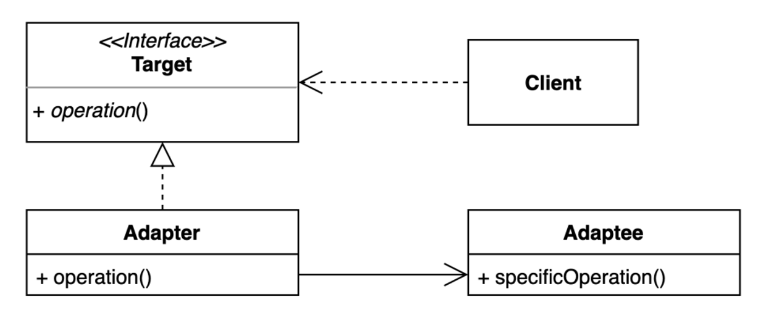
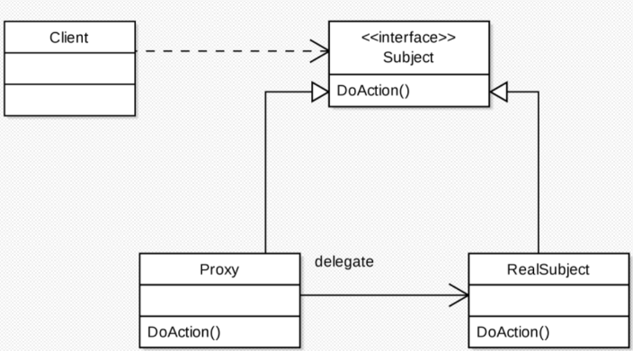
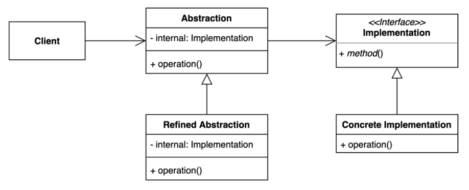
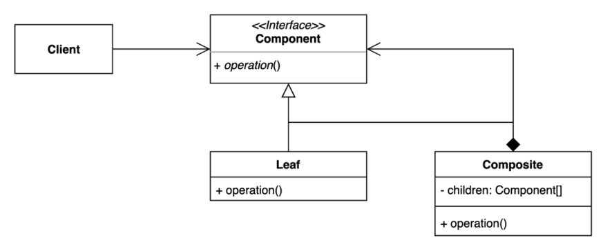
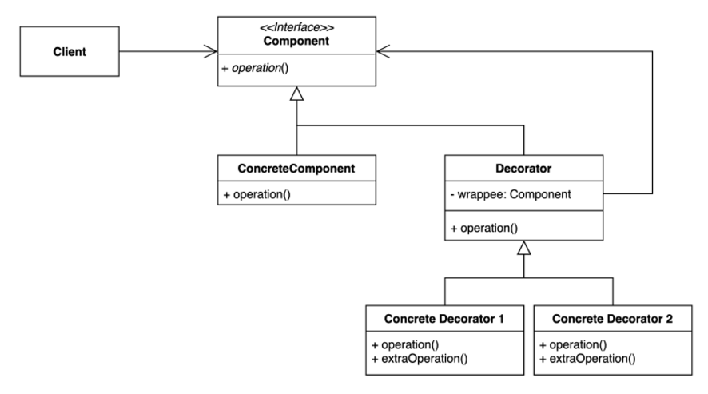
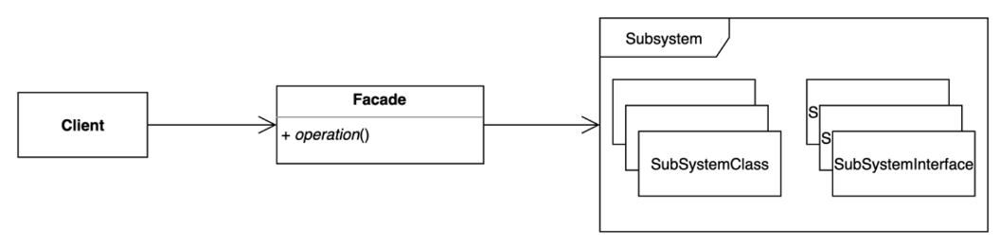
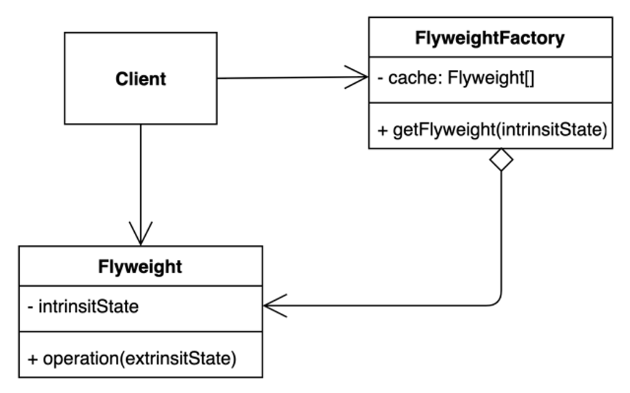

## 구조 패턴(Structurnal Pattern)

### Adapter Pattern

- 호환성이 없는 클라이언트를 인터페이스를 통해 호환성을 맞춰 사용할 수 있게 해주는 패턴
- **장점**
    - 클라이언트와 시스템 양쪽 코드를 모두 변경없이 기능을 호환시켜 사용할 수 있게된다.
    - OCP 원칙과 SRP 원칙을 준수한 설계가 된다
- **단점**
    - 새 클래스의 증가로 복잡도가 증가할 수 있다.
        - 큰 지장이 없을 경우 어댑터 없이 클라이언트 인터페이스를 상속받아 구현하는 것도 대안이다.
- **예시**
    - Spring HandlerAdapter : 다양한 핸들러(Controller)를 스프링이 처리하여 MVC를 실현할 수 있게 해주는 어댑터
    - Arrays.asList(…), Collections.list(…) : 인자로 받은 객체들을 지정한 객체로 변환해줌
    - InputStreamReader(InputStream), OutputStreamReader(OutputStream) : 스트림을 리더로 변환해줌

### Proxy Pattern

- 어떤 객체를 사용하고자 할 때,  객체를 직접 참조하는 것이 아닌 해당 객체를 대변하는 프록시 객체를 통해 객체에 접근할 수 있도록 하는 방법
- **장점**
    - 사이즈가 큰 객체가 로딩되기 전에 프록시객체를 통해 참조할 수 있다.
    - 실제 객체의 public, protected 메소드를 숨기고 인터페이스를 통해 노출 시킬 수 있다.
    - 로컬에 있지 않고 떨어져 있는 객체를 사용할 수 있다.
    - 원래 객체의 접근 이전에 사전 처리를 할 수 있다.
- **단점**
    - 객체 생성 시 프록시 생성과정이 추가되므로 빈번한 객체생성 시에 성능저하
    - 프록시 내부에 객체생성을 위해 스레드가 생성, 동기화가 구현되어야 하는 경우 성능이 저하 될 수 있음
    - 로직이 난해해져 가독성이 떨어질 수 있음
- **자바와 스프링에서의 프록시**
    - 자바의 DynamicProxy
    - 스프링의 AOP

### Bridge Pattern

- 프로그램에서 구체적인 계층(기능계층)과 추상적인 계층(구현계층)을 분리하여 연결하는 패턴
- 기능계층과 구현계층의 연결에는 상속보다 조합을 사용한다.
- **장점**
    - 확장시 기존 코드의 변경 필요 없음 OCP
- **단점**
    - 계층구조가 늘어나 복잡할수도
- **예시**
    - java DirverManager : connection, execute 등의 구현계층과 Driver의 기능계층을 분리

### Composite Pattern

- 트리구조의 객체구조에서 클라이언트가 트리의 레벨을 알 필요 없이 원하는 기능을 사용할 수 있게 해주는 패턴
- **장점**
    - 복잡한 트리구조를 간단하게 사용할 수 있다.
    - 재귀와 다형성을 활용할 수 있다.
    - 클라이언트 코드 변경 없이 새로운 타입을 추가할 수 있다(OCP).
- **단점**
    - 트리구조에서 구현가능하기 때문에 이 패턴을 위한 지나친 일반화가 이루어질 수 있다.

### Decorator Pattern

- 상속이 아닌 위임을 사용하여 보다 유연하게 런타임에 동적으로 기능을 추가하는 패턴
- **장점**
    - 새로운 클래스를 만들지 않고도 기존 기능들을 조합해서 사용할 수 있다.
    - 컴파일 타임이 아닌 런타임에도 기능을 변경할 수 있다.
- **단점**
    - 부가 기능이 적을 때는 인터페이스의 추가로 구조가 더 복잡해보일 수 있다.
- **자바&스프링에서의 데코레이터 패턴**
    - InputStream : new BufferedStreamReader(new InputStreamReader(new InputStream()))
    - java.util.Collections가 제공하는 메소드들 활용한 랩퍼
    - ServerHttpRequestDecorator : 리퀘스트를 커스텀할 수 있는 데코레이터

### Facade Pattern

- 클라이언트가 사용하는 복잡한 서브시스템 의존성을 간단한 서브시스템으로 추상화 시키는 패턴
- 정면, 표면이란 뜻의 facade의 의미대로, 세부 구현 코드는 클라이언트에게 노출하지 않고 서브시스템을 노출한다.
- **장점**
    - 서브 시스템 의존성을 한 곳으로 모아 의존성 관리가 편해진다.
    - 클라이언트는 기능 사용을 위한 최소한의 정보만 알면 되므로 모듈 사용이 더욱 편리해진다.
- **단점**
    - 서브 시스템 클래스가 많은 의존성을 모두 갖게 된다

### Flyweight Pattern

- 자주 변하는 속성(또는 외적인 속성, extrinsit)과 변하지 않는 속성(또는 내적인 속성,
  intrinsit)을 분리하고 재사용하여 메모리 사용을 줄일 수 있다
- 캐싱 기능과 거의 동일한 목적을 가지고 있다.
- **장점**
    - 애플리케이션 메모리 사용량을 줄일 수 있다
- **단점**
    - 코드의 복잡도가 증가할 수 있다.
- **자바의 Flyweight 패턴**
    - Interger 클래스 : -128~128 범위의 정수는 캐싱하여 같은 객체를 리턴함