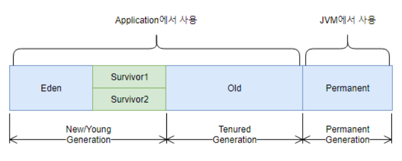

## Garbage Collection(Garbage Collection)

- 애플리케이션 런타임 중에 Heap영역에 생성된 객체들을 참조 빈도에 따라 자동으로 정리 및 삭제해주는 기능
- #### GC  구조

    

    - **Young 영역**
        1. 생성된 객체가 할당되는 영역
        2. 대부분의 객체가 금방 참조해제되기 때문에, 많은 객체가 이 영역에 생겼다 사라짐
        3. 이 영역에 대한 GC를 Minor GC라고 부른다
    - **Old 영역**
        1. Young영역에서 참조상태를 지속 유지한 객체들이 이동되는 영역
        2. Young영역보다 크게 할당되고, 가비지는 적게 발생한다
        3. 이 영역에 대한 GC를 Major GC 또는 Full GC라고 부른다
    - **Old영역의 Card Table**
        1. Old영역에서 Young영역의 객체를 참조한 정보를 쌓아두는 테이블
        2. Young영역에서 GC가 발생할 때, Old영역 전체를 대상으로 참조현황을 파악하는 것은 비효율적이므로 카드테이블을 스캔하여 참조여부를 파악한다.
- #### GC 동작방식
    1. **Stop The World**
        - GC를 실행하기위해 JVM의 실행을 멈추는 작업
        - GC를 실행하는 스레드 이외의 모든 스레드의 작업이 중단되고, GC가 완료되면 재개
        - 이런 점 때문에 GC수행 시 성능저하가 발생. 튜닝을 위한 다양한 옵션을 JVM에서 제공함
    2. **Mark and Sweep**
        1. Mark : 사용되는 메모리와 사용되지 않는 메모리를 식별하는 작업
        2. Sweep : Mark단계에서 사용되지 않는 것으로 판명된 메모리를 해제하는 작업
    - **Minor GC 동작방식**
        - Eden 영역 : 새로생성된 객체가 할당(Allocation)되는 영역
        - Survivor 영역 : 최소 1번 이상의 GC에서 살아남은 객체가 존재하는 영역
        1. 새로 생성된 객체가 Eden 영역에 할당
        2. 객체가 계속 생성되어 Eden영역이 꽉차게되고 GC가 발생
            1. Mark and Sweep과정을 거쳐 사용되지 않는 객체는 Eden영역에서 제거
            2. 살아남은 객체는 Survivor영역 중 1곳 으로 이동. 살아남을 때마다 Obejct header에 age값 카운트
            3. 위 과정이 반복되다가 Survivor영역이 꽉 차면 살아남은 객체를 다른 Survivor영역으로 이동시킴
            4. 위 과정을 반복하며 계속 살아남은 객체(age가 높은 객체)는 Old영역으로 이동(Promotion)시킴
    - **Major GC 동작방식**
        - Minor GC가 계속되어 Old영역의 메모리도 꽉 차게되면 Major GC가 발생한다.
        - Minor GC는 보통 0.5~1초 사이의 짧은 시간이 소요되지만 Major GC는 10배 이상의 시간이 걸리기 때문에 성능에 큰 영향을 끼친다.