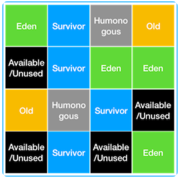

## Garbage Collection(Garbage Collection)

- 애플리케이션 런타임 중에 Heap영역에 생성된 객체들을 참조 빈도에 따라 자동으로 정리 및 삭제해주는 기능
- #### GC  구조

    

    - **Young 영역**
        1. 생성된 객체가 할당되는 영역
        2. 대부분의 객체가 금방 참조해제되기 때문에, 많은 객체가 이 영역에 생겼다 사라짐
        3. 이 영역에 대한 GC를 Minor GC라고 부른다
    - **Old 영역**
        1. Young영역에서 참조상태를 지속 유지한 객체들이 이동되는 영역
        2. Young영역보다 크게 할당되고, 가비지는 적게 발생한다
        3. 이 영역에 대한 GC를 Major GC 또는 Full GC라고 부른다
    - **Old영역의 Card Table**
        1. Old영역에서 Young영역의 객체를 참조한 정보를 쌓아두는 테이블
        2. Young영역에서 GC가 발생할 때, Old영역 전체를 대상으로 참조현황을 파악하는 것은 비효율적이므로 카드테이블을 스캔하여 참조여부를 파악한다.
- #### GC 동작방식
    1. **Stop The World**
        - GC를 실행하기위해 JVM의 실행을 멈추는 작업
        - GC를 실행하는 스레드 이외의 모든 스레드의 작업이 중단되고, GC가 완료되면 재개
        - 이런 점 때문에 GC수행 시 성능저하가 발생. 튜닝을 위한 다양한 옵션을 JVM에서 제공함
    2. **Mark and Sweep**
        1. Mark : 사용되는 메모리와 사용되지 않는 메모리를 식별하는 작업
        2. Sweep : Mark단계에서 사용되지 않는 것으로 판명된 메모리를 해제하는 작업
    - **Minor GC 동작방식**
        - Eden 영역 : 새로생성된 객체가 할당(Allocation)되는 영역
        - Survivor 영역 : 최소 1번 이상의 GC에서 살아남은 객체가 존재하는 영역
        1. 새로 생성된 객체가 Eden 영역에 할당
        2. 객체가 계속 생성되어 Eden영역이 꽉차게되고 GC가 발생
            1. Mark and Sweep과정을 거쳐 사용되지 않는 객체는 Eden영역에서 제거
            2. 살아남은 객체는 Survivor영역 중 1곳 으로 이동. 살아남을 때마다 Obejct header에 age값 카운트
            3. 위 과정이 반복되다가 Survivor영역이 꽉 차면 살아남은 객체를 다른 Survivor영역으로 이동시킴
            4. 위 과정을 반복하며 계속 살아남은 객체(age가 높은 객체)는 Old영역으로 이동(Promotion)시킴
    - **Major GC 동작방식**
        - Minor GC가 계속되어 Old영역의 메모리도 꽉 차게되면 Major GC가 발생한다.
        - Minor GC는 보통 0.5~1초 사이의 짧은 시간이 소요되지만 Major GC는 10배 이상의 시간이 걸리기 때문에 성능에 큰 영향을 끼친다.
  
### GC의 종류
JVM은 GC를 여러가지 알고리즘을 통해 수행할 수 있다. 자바 버전별로 default GC 알고리즘이 정해져 있는데, 필요에 따라 default GC 알고리즘을 다른 알고리즘으로 변경할 수도 있고, GC 옵션설정을 해서 GC 최적화를 시킬수도 있다.

#### 1. Serial GC
serial GC는 가장 기본적인 형태의 GC로, 단일 CPU 코어 환경에서의 동작을 전제로 설계된 GC 알고리즘이다. 그렇기에 현재와 같은 멀티프로그래밍 환경에서는 성능이 현저히 떨어지기 때문에 거의 사용되지 않는 알고리즘이다.  
serial GC의 동작방식을 간단히 설명하면, Young 영역에서는 Mark and Sweep 작업을 통해 미사용 메모리를 해제하는데, Old 영역에서는 Mark and Sweep and Compact라고 하여 Compact 작업이 추가된다.  
Compact 작업은 사용중인 메모리 영역을 한 쪽으로 몰아 외부 단편화를 제거하는 작업으로서, 메모리 가용량은 충분히 확보되지만 작업의 오버헤드가 매우 크다는 단점이 있다.
  
***Serial GC의 사용**
```
java -XX:+UseSerialGC -jar Application.java
```

#### 2. Parallel GC
parallel GC는 throughput GC라고도 불리며, Java 8의 default GC이다. 기본적인 동작방식은 SerialGC와 동일하나, young영역을 정리하는 Minor GC 수행시에 단일 스레드가 아닌 멀티 스레드로 GC를 수행하여 멀티프로그래밍 환경에서 serial GC에 비해 이점을 가진다.
아래와 같이 사용 및 설정을 할 수 있다.

***Parallel GC의 사용**
```
java -XX:+UseParallelGC -jar Application.java

// 사용할 쓰레드의 갯수
-XX:ParallelGCThreads=<N>

// 최대 지연 시간
-XX:MaxGCPauseMillis=<N>
```

#### 3. Parallel Old GC
Parallel GC와 거의 동일하지만, Parallel GC가 young 영역에 대해서만 멀티 스레딩을 수행하여 Old 영역 GC시 오버헤드는 여전히 발생하는 문제 해결을 위해 Old 영역에서도 멀티 스레드를 사용하도록 업데이트하였다.
Major GC시에 Mark and Sweep Compact가 아닌 Mark-Summary-Compact라는 방식을 이용한다.
  
#### 4. CMS(Concurrent Mark Sweep) GC
CMS GC는 기존 GC 알고리즘들의 Stop the world 시간을 최대한 줄이기 위해 고안된 알고리즘으로서, 멀티스레딩을 활용하는 것은 parallec GC와 동일하지만, Mark and Sweep 과정을 Concurrent 하게 수행하여 stop the world 시간을 최소화한다.
이 기간동안 애플리케이션의 응답이 멈추는 게 아니라 GC처리에 의해 다소 느려지는 정도로 stop the world 문제를 개선하긴 하였지만, compact 과정이 빠졌기 때문에 애플리케이션 구동시간이 길어질수록 메모리 단편화가 심해져 나중에는 시스템에 의한 Compact수행으로 Stop the world시간이 매우 길어지는 문제점이 있다.
이러한 문제점으로인해 CMS GC는 Java 9부터 deprecated 되었고, Java 14에 들어서는 완전히 사용이 중지되었다.
  
#### 5. G1GC(Garbage First GC)
G1GC는 기존 GC들이 Young/Old 2가지 영역으로만 나눠서 메모리 영역을 정해두고 관리하던 것과 달리, 모든 메모리 영역을 통합하고, Region이라는 논리적 개념으로 분할하여 **가비지가 가장 많은 Region에 대해 우선적으로 GC를 수행**하는 알고리즘이다.

***G1GC에서의 Region**  


이 Region의 종류는 기존의 Eden, Old, Survivor 개념의 Region 세가지에 더해 Humonoguos, Available/Unused가 추가되었다.
Humonogous는 Region크기의 50%를 초과하는 큰 객체들을 저장하는 region이며, Available/Unused는 아직 사용되지 않은, 사용 가능한 영역의 region이다.  
이와 같이 동일한 크기의 여러 region으로 나눈 메모리에서 가비지가 많은 region을 우선적으로 gc를 수행하는 게 G1GC의 개념이며, 이 때 MinorGC와 MajorGC는 아래와 같이 수행된다.
  
**Minor GC**  
minor GC는 eden region이 꽉차게 되면 수행되는데, eden 영역에 대한 Mark and Sweep을 수행하고, 살아남은 객체를 다른 region으로 이동시킨다. 만일 이때 이동된 영역이 Available/Unused region이면 해당 영역은 Suvivor영역이 되고, 그리고 gc가 수행된 기존의 eden region은 역으로 Available/Unused region이 된다.

**Major GC**  
객체가 너무 많아져 빠르게 메모리를 회수할 수 없을 떄 Major GC가 수행되는데, Major GC수행시에 GC는 가비지가 많은 영역을 미리 파악하고 있다가 해당 영역들을 우선적으로 GC처리한다. 이 영역은 region단위로서 부분적이고, concurrent하게 처리되기 때문에 애플리케이션 지연이 최소화되며 가비지가 많은 영역에 대해서만 정리를 하므로 훨씬 효과적이다.
  
이렇게 G1GC는 많은 부분이 개선된 GC로서 Java9 이후로의 모든 버전에서는 default GC로 채택되어 사용되고 있다.
