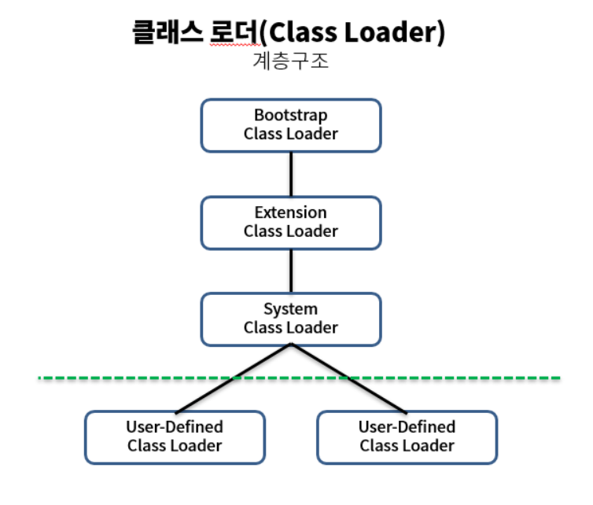
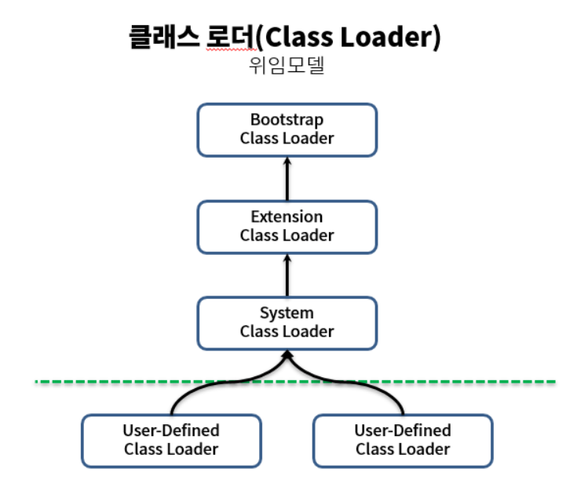
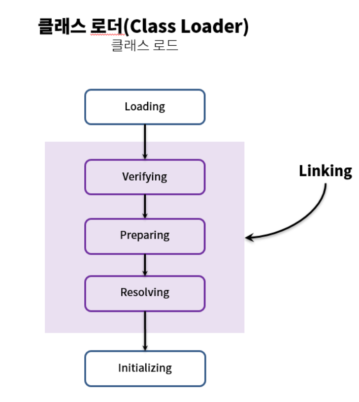
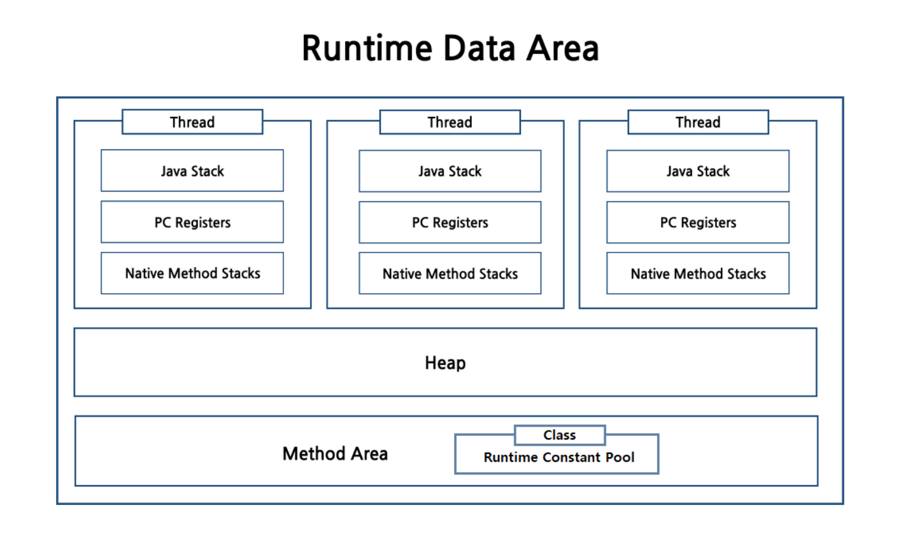
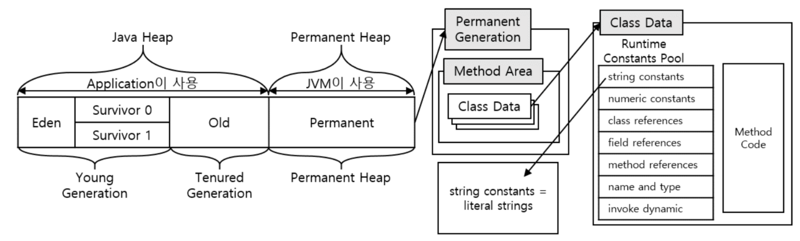

## JVM(Java Virtual Machine)

- JVM은 자바가 가지는 가장 특징적인 기술로서, 프로그램과 OS사이에 실행되며 직접적으로 자바프로그램을 동작시키는 역할을 한다.
- OS가 바로 자바 프로그램을 실행시키지 않고 JVM을 실행시키며, JVM은 컴파일된 파일인 클래스파일을 읽어들여 프로그램을 실행시킨다.
- 이렇게 OS가 아닌 JVM이 프로그램을 실행시키기 때문에, 자바는 OS에 종속적이지 않을 수 있게 된다.
- ### JVM의 특징
    - #### 클래스로더(Class Loader)
        - 클래스 로더는 컴파일된 클래스 파일들을 필요한 시점에 동적으로 로딩하는 역할을 수행한다.
        - **클래스로더의 특징**
            - **계층구조**

                

                1. Bootstrap Class Loader
                    - 최상위 클래스로, 유일하게 Java가 아닌 네이티브 코드로 구현되어있다.
                    - JVM이 실행될 때 같이 메모리에 올라간다.
                    - Object클래스를 포함한 각종 Java API들을 로드한다.
                2. Extension Class Loader
                    - 기본 Java API를 제외한 확장 클래스들을 로드한다.
                3. System Class Loader
                    - 사용자가 작성한 어플리케이션 클래스들을 로드시킨다.
                    - classpath내의 클래스들을 로드한다.
                4. User-Defined Class Loader
                    - 어플리케이션 사용자가 직접 코드상에서 생성하여 사용하는 클래스로더
            - **위임모델**

                

                - 위임모델은 계층구조에서 클래스로더가 탐색하는 순서 및 중복된 클래스에 대해 우선적인 로드 순위를 정하는 개념이다.
                - 탐색 순서는 아래와 같다.
                    1. 클래스 로더 캐시
                    2. 상위 클래스 로더
                    3. 자기 자신
            - **가시성 제한**
                - 클래스로더 캐시를 확인 후 상위 클래스로더를 확인할 때, 하위 클래스로더는 확인 불가능한 특성
            - **언로드(Unload) 불가**
                - 클래스를 로드하는 것은 가능하지만 언로드하는 것은 불가능한 특성
            - **이름공간(Name space)**
                - 클래스로더들이 클래스를 보관하는 공간으로써, 클래스가 로드되면 이곳에 저장이된다.
                - FQCN(Fully Qualified Class Name: 패키지명을 포함한 식별자)을 기준으로 보관된다.

        - **클래스 로드 과정**

            

            1. 로딩(Loading)
                - 클래스 파일을 가져와서 JVM메모리에 로드한다.
            2. 검증(Verifying)
                - 읽어들인 클래스가 자바 언어 명세 및 JVM명세에 맞게 구성되어 있는지 검증한다.
                - 가장 많은 시간이 걸리는 단계이다.
            3. 준비(Preparing)
                - 클래스에 정의된 데이터구조들에 맞는 필요한 메모리를 할당한다.
            4. 분석(Resolving)
                - 아직 주소가 할당되지 않은 객체, 즉 심볼릭 레퍼런스를 메모리영역에 있는 실제 객체를 가리키도록 한다.
            5. 초기화(Initializing)
                - 클래스 내에 정의된 static 필드들의 값을 할당한다.
    - **런타임 데이터 영역(Runtime Data Area)**

        

        - 자바 애플리케이션을 실행하기 위한 메모리 영역이다.
        - 런타임 데이터 영역은 총 6가지로 구분되며, 크게는 JVM단위와 Thread단위로 나눌 수 있다.
        - **JVM단위**

            

            1. Heap
                - 모든 클래스 인스턴스와 긴 생명주기를 가지는 객체들이 저장되는 영역
                - heap 메모리 해제는 오직 GC에 의해서만 수행됨
                - 모든 스레드가 공유하는 영역이라 Race Condition(경쟁상태)를 유발할 수 있음
            2. Method Area
                - 클래스정보를 최초로 메모리에 올릴 때 초기화되는 대상들을 올리는 영역
                - 필드, 생성자, 메서드 등이 저장된다
                - 클래스 멤버라고도 하는 스태틱 자원들도 이 영역에 저장된다
            3. Runtime Constant Pool
                - 런타임 상수 풀에는 메서드 영역에 클래스 정보가 로드될 때 생성
                - 런타임에 해석되는 메서드와 필드의 참조 등 여러 종류의 상수가 저장되어 있음
        - Thread단위
            1. PC Register
                - 스레드가 생성될 때 마다 생성되는 공간
                - 현재 실행중인 명령을 저장하는 역할
            2. JVM Stack
                - **JVM Frame**을 저장하는 역할
                - JVM Frame?
                    - 메소드가 호출될 때마다 생성되며, 메소드의 상태정보를 저장함
                    - 구성요소
                        1. Local Variables
                            - 메서드 내의 지역변수를 저장하는 곳
                            - 클래스 메서드(static)일 경우 첫번째 메서드 파라미터가 0번 index에 저장이후 차례대로 저장
                            - 인스턴스 메서드일 경우 this가 0번 인덱스에 저장 이후 첫번째 파라미터부터 차례대로 저장
                        2. Operand Stack
                            - 프레임 생성 당시에는 비어있으며 메서드 내 계산과정등에 이용된다
                        3. Constant Pool Reference
                            - 현 JVM Frame에 속한 메서드가 속해있는 클래스의 런타임 상수풀을 참조한다
            3. Native Method Stack
                - 자바가 아닌 다른 언어로 작성된 네이티브 메서드를 지원하기 위한 스택
    - #### 실행 엔진(Execution Engine)
        - 클래스 파일을 실행시키는 방식에는 크게 두 가지가 있다.
        1. **인터프리터(Interpreter)**
            - JVM의 기본적인 클래스 실행방식으로, 런타임 중에 바이트코드를 한 라인씩 읽어서 실행한다.
            - 실행되는 시점부터 한 라인씩 읽는 특징으로 인해, 속도에 문제가 있다.
            - 반복적으로 호출되는 경우에도 매번 다시 라인을 읽는다.
        2. **JIT(Just In Time) 컴파일러**
            - 인터프리터의 문제점을 해결하기위해 도입된 방식으로, native 컴파일과 캐싱이 핵심이다.
            - 자주 사용되는 바이트코드를 기계어로 컴파일하여 캐싱하고, 재호출 시 캐시에서 읽어들이는 방식을 사용한다.
            - 컴파일 임계치(compile threshould)를 기준으로 컴파일 여부가 결정되며, 이 임계치는 메서드 호출횟수, 루프 내 회전수를 기준으로 정해진다.
            - 임계치에 도달하지 못한 코드들은 기존의 인터프리터 방식으로 실행되게 된다.