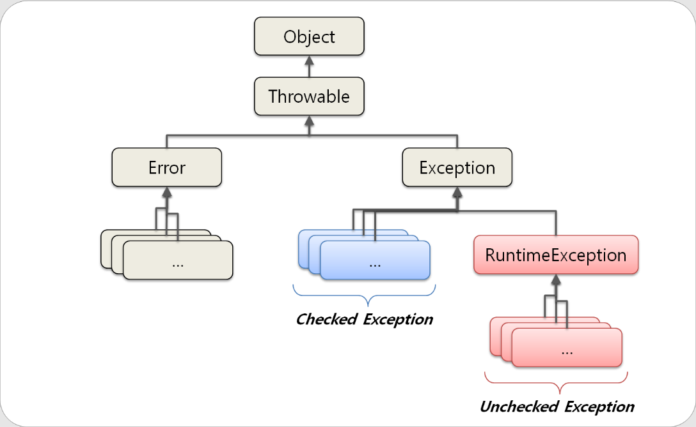
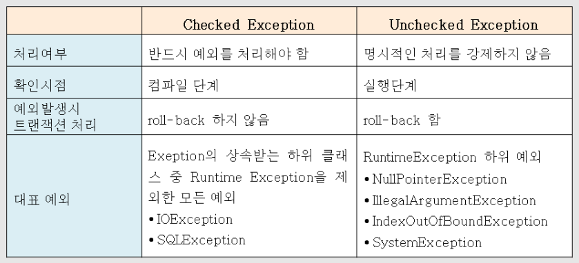

- ### Java Bean
    - 특정한 정보를 가지고 있는 클래스를 표현하는 하나의 규칙으로, MVC구조상에서 데이터를 표현하기위한 규칙이다.
    - 필드는 private 접근자로 감추고, public getter/setter를 통해 접근하도록 한다. 이 필드를 property라고 한다.
    - no-argsconstructor, 전달인자 없는 기본 생성자로 생성된다.
    - **SpringBean?**
        - 스프링 IoC컨테이너에 의해 생성되고 관리되는 객체를 SpringBean이라고 한다.
  

- ### Exception

    

    - 자바의 예외는 크게 3가지로 나눌 수 있다.
        1. Checked Exception(체크 예외)
        2. Unchecked Exception(언체크 예외)
        3. Error(에러)
    - **Error?**
        - 에러는 시스템에 비정상적인 상황이 발생했을 경우 발생.
        - OutofMemory, StackOverflow 등이 있음
        - 개발자가 쉽게 예측할 수 없음
    - **Checked Exception?**
        - 체크예외는 반드시 에러처리를 해야하는 특징이 있어 예외처리를 하지 않으면 컴파일 시 에러를 발생시킨다.
        - FileNotFoundException, ClassNotFoundException, IOException 등이 있음
    - **Unchecked Exception?**
        - RuntimeException의 하위 클래스들로, 예외처리를 강제하지는 않는다.
        - NullPointerException, ArrayIndexOutOfBoundsException등이 있다.
        - 주로 개발자들의 실수에 의해서 발생하는 에러이다.
    - #### Checked Exception vs Unchecked Exception

        

        - Rollback 수행 여부의 차이를 참고바람  

- ### 상속과 위임
    - 상속과 위임은 모두 두 클래스간의 연관관계를 형성하는 방법
    - 위임 - 클래스 내에 다른 클래스의 필드를 생성하여 참조할 수 있게하는 것
    - 상속은 부모 클래스의 메서드와 변수를 그대로 사용할 수 있어 코드를 줄일 수 있지만, 부모와 자식의 관계가 명확하게 Is-a인 관계에서만 사용해야한다.
    - 관계가 명확하지 않으면 상속보다는 위임을 사용하는 게 안전하다.
    - 다만 기존에 존재하는 API에 넘겨주는 클래스의 경우 위임을 이용하면 API스펙이 변경되므로 상속을 사용하는 게 맞을 수 있다

- ### synchronized
    - 동기화 함수 설정 옵션
    - 멀티스레드 환경에서 특정 값의 동기화가 필요할 때 이용
    - 함수에 synchronized를 걸지만 실제로는 해당 객체 자체에 lock이 걸린다.
    - 만일 동일 객체 내에서 동기화가 필요한 파트를 구분하고 싶으면, synchronized block을 이용헤야함
    - synchronized block은 파라미터로 넘긴 객체를 하나의 sync로 묶어서 동기화 관리

- ### serializable
    - 시스템 내부에서 사용되는 객체 또는 데이터를 외부의 자바 시스템에서도 사용할 수 있도록 byte형태로 변환하거나, 변환된 byte코드를 다시 객체로 읽어들이는(역직렬화) 기술
    - serialVersionUID 값을 비교해서 동일 객체인지 판단
    - API로 객체 데이터를 담아서 전송하는 경우나, 파일로 주고 받는 경우 등에 직렬화가 필요함

  
- ### lambda
    - java8에서 도입된, 익명함수를 생성하기위한 표현식
    - 장점
        - 코드의 간결성 확보 가능
        - 지연연산 수행으로 불필요한 연산 최소화하여 성능 향상
        - 멀티스레드 지원으로 병렬처리 가능
        - 함수형 인터페이스의 간결한 사용 가능
    - 단점
        - 너무 남발할 시 오히려 가독성이 떨어지는 결과
        - 많은 것이 생략된 구조로 인해 디버깅이 어렵다

  
- ### 동시성 이슈
    - 동시성과 병렬성
        - 동시성
            - 동시에 실행되는 것처럼 보이는 것
            - 싱글 코어 환경에서 여러개의 스레드를 동작시키기위한 방식으로, 여러 스레드가 번갈아가며 실행됨
        - 병렬성
            - 실제로 동시에 실행되는 것
            - 멀티 코어 환경에서 여러개의 스레드가 동시에 실행되는 것을 의미한다.
    - 동시성 제어방법
        1. 암시적 Lock
            - 메서드 또는 변수에 synchronized 키워드를 사용하는 것
            - 해당 키워드가 선언된 변수또는 데이터는 하나의 스레드가 점유 시 작업이 끝날 때까지 lock을 검
        2. 명시적 Lock
            - ReentrantLock객체를 사용하여 로직 내부에서 lock과 unlock을 직접 지정해주는 방식
            - 한번에 여러 lock을 사용하고 싶거나, lock의 범위가 메서드 내부에 한정되지 않을 때 사용한다.
        3. volatile키워드 사용
            - 자원의 가시성(visibility)을 높이는 해당 키워드를 사용하여 메인메모리에서만 값을 참조하도록 함
            - 그러나 이 방법은 하나의 스레드에서만 쓰기 작업을 수행하고, 나머지 스레드는 읽기작업을 수행할 경우에만 효과
            - 각각의 스레드가 같은 자원을 레지스터, 캐시메모리라는 다른 공간에서 읽는 상황을 방지하기 위한 것일 뿐이므로, 두 스레드(t)가 각각 t1읽기→t2읽기→t1쓰기→t2쓰기 순으로 진행되면 dirty read가 발생하는 것은 여전함
            - 또한 최적화를 위한 캐시메모리 사용을 포기하는 것이므로, 성능의 저하가 필연적으로 발생함
        4. Concurrent 패키지의 객체 사용
            - 스레드 내의 로직에 사용되는 자료구조를 Concurrent패키지에서 제공하는 자료구조를 활용하여 작성
            - Concurrent패키지의 자료구조들은 모두 Thread-safe하게 구현되어 있다.
        5. 불변객체 사용
            - final 키워드를 사용하거나, setter메서드를 없애는 방식으로 내부 데이터가 변화될 여지를 제거한 객체를 사용
    
  
- ### 자바 버전 특징
    - Java 8
        1. 람다 표현식 추가
        2. 스트림 추가
        3. 인터페이스 deafult메서드 기능 추가
        4. Optional 추가
    - Java 9
        - Parallel GC → G1 GC로 default GC변경
    - Java 11
        1. String, File 클래스에 몇가지 메소드 추가
        2. 람다에서 var키워드 사용 가능
        3. HttpClient클래스 추가
        4. JVM 성능 향상
        5. Docker에서 힙에서 사용되는 메모리량을 세부적으로 조절할 수 있도록 하는 JVM옵션 추가
    
  
- ### 자바 프로그램의 기본 동작 과정

  → 자바 소스 파일 작성

  → 자바 컴파일러(javac)가 .java 파일을 컴파일하여 바이트코드로 이루어진 클래스파일(.class) 작성

  → JVM이 클래스파일을 읽어들여서 프로그램을 동작시킴

- ### ThreadLocal
  - 멀티 스레딩 환경에서 공유자원의 thread-safe를 보장해주기 위한 자료구조
  - 메소드 내에서 사용되는 변수는 JVM 스택영역에서 생성되고 소멸되므로 항상 thread-safe가 보장되지만, 클래스의 멤버변수는 heap영역에 존재하며 여러 스택영역(스레드)에서 동시에 접근이 가능하므로 race condition이 발생할 가능성이 있다.
  - 이런 경우 멤버변수를 ThreadLocal로 wrapping 해주게 되면, 여러스레드에서 동시에 접근하더라도 마치 스택영역에서 선언된 변수와 같이 해당 멤버변수를 각 스레드별로 독립적으로 사용할 수 있게 된다.
  - **동작 원리**
    - ThreadLocal은 내부적으로 Map 형태로 스레드의 value를 관리한다.
      - ex) {"thread1-id" : "value", "thread2-id" : "value", ...}
  - **주의 사항**
    - 스레드에서 ThreadLocal변수를 사용할 때, 새로운 key-value가 추가되는 형식이므로, 만일 사용 후 스레드에서 ThreadLocal key를 release시키지 않는다면 thread key가 무한히 증식하여 메모리 누수를 일으킬 수 있다.
    - 또한 thread-id를 통해 관리되는 방식이므로, 만일 스레드 풀을 사용하여 동일한 thread를 여러번 재사용할 경우, 이전의 thread에서 사용했던 값이 남아있어 원치않은 문제를 발생시킬 수 있다.
    - 결론은 항상 사용 후 release를 잘 시켜줘야한다.
