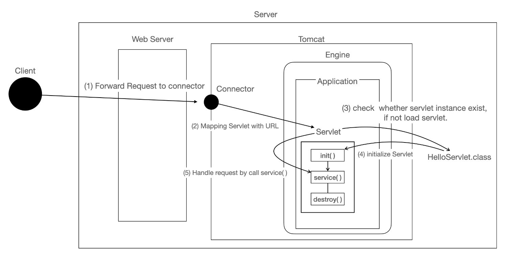

## Servlet

  

- 서블릿은 동적인 페이지를 처리하기위한 기술로, 자바 클래스로 구현하며 WAS의 서블릿컨테이너(=웹컨테이너)에서 동작함
- MVC패턴에서 컨트롤러의 역할을 담당한다.
- 클라이언트에서 최초요청을 받으면 init() 메서드를 통해 서블릿을 초기화하고, 서비스를처리하는 스레드를 생성하여 클라이언트의 http요청 속성에 맞는 서비스를 실행한다.
- 서블릿 초기화정보는 싱글톤으로 관리되기 때문에, 서버를 내리거나 임의로 destory()를 하지 않는 이상 지속적으로 상태를 유지한다.
- #### 서블릿컨테이너
    - 서블릿을 관리해주는 컨테이너로, 아래와 같은 기능을 수행한다.
    1. 생명주기 관리
        - 서블릿 init(), destroy()등 서블릿의 생성과 소멸을 관리해줌
    2. 통신지원
        - 클라이언트와의 HTTP통신을 위한 소켓통신을 서블릿이 직접 수행해줘 개발자는 서비스 로직에만 집중할 수 있다.
    3. 멀티스레딩 관리
        - 각 클라이언트의 요청 처리수만큼 스레드를 생성해서 처리하는 방식이므로 스레드를 관리해주는 역할도 한다.
    4. 선언적인 보안관리
        - 서블릿 컨테이너는 xml 배포 서술자(web.xml)에 기록된 내용을 토대로 보안관련 코드를 자동 생성해주므로, 개발자가 일일이 서블릿에 보안 코드를 구현하지 않아도 보안관리가 가능하다.

참고 : https://sgcomputer.tistory.com/226