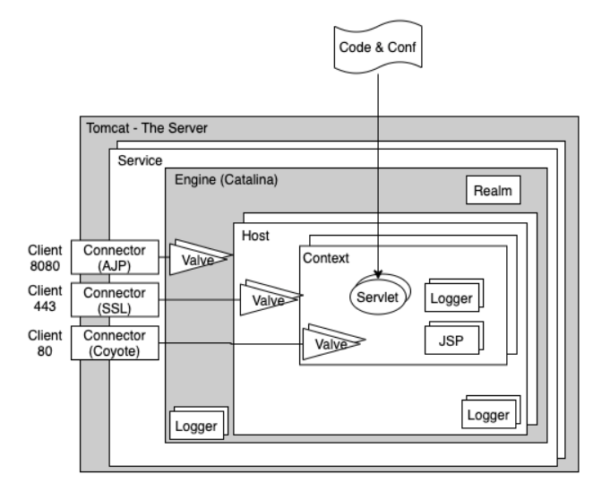
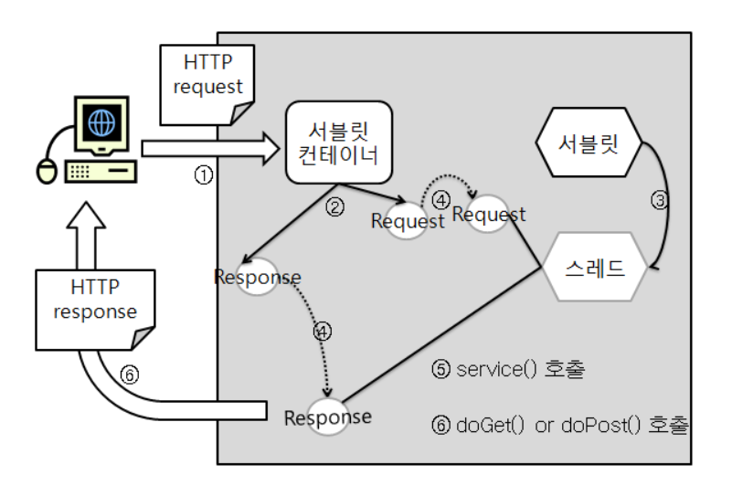

## Servlet

  

- 서블릿은 동적인 페이지를 처리하기위한 기술로, 자바 클래스로 구현하며 WAS의 서블릿컨테이너(=웹컨테이너)에서 동작함
- MVC패턴에서 컨트롤러의 역할을 담당한다.
- 클라이언트에서 최초요청을 받으면 init() 메서드를 통해 서블릿을 초기화하고, 서비스를처리하는 스레드를 생성하여 클라이언트의 http요청 속성에 맞는 서비스를 실행한다.
- 서블릿 초기화정보는 싱글톤으로 관리되기 때문에, 서버를 내리거나 임의로 destory()를 하지 않는 이상 지속적으로 상태를 유지한다.
- #### 서블릿컨테이너
    - 서블릿을 관리해주는 컨테이너로, 아래와 같은 기능을 수행한다.
    1. 생명주기 관리
        - 서블릿 init(), destroy()등 서블릿의 생성과 소멸을 관리해줌
    2. 통신지원
        - 클라이언트와의 HTTP통신을 위한 소켓통신을 서블릿이 직접 수행해줘 개발자는 서비스 로직에만 집중할 수 있다.
    3. 멀티스레딩 관리
        - 각 클라이언트의 요청 처리수만큼 스레드를 생성해서 처리하는 방식이므로 스레드를 관리해주는 역할도 한다.
    4. 선언적인 보안관리
        - 서블릿 컨테이너는 xml 배포 서술자(web.xml)에 기록된 내용을 토대로 보안관련 코드를 자동 생성해주므로, 개발자가 일일이 서블릿에 보안 코드를 구현하지 않아도 보안관리가 가능하다.

참고 : https://sgcomputer.tistory.com/226

## Tomcat

톰캣은 크게 5가지의 주요 구성요소로 이루어져있다.
1. **Server**  
서버는 톰캣 그 자체로 모든 톰캣의 구성요소를 포함하는 top level 컴포넌트이다.
2. **Service**  
서비스는 하나의 엔진과 하나 이상의 커넥터를 갖는 컴포넌트로, 클라이언트의 요청을 커넥터를 통해 엔진에 전달하는 역할을 수행한다.  
    2-1) Connector
   - 커넥터는 크게 HTTP/1.1 Connector, HTTP/2 Connector, AJP Connector로 나뉜다. 디폴트 커넥터는 HTTP 1.1 커넥터에 해당하는 Coyote 커넥터이다.
   - 커넥터의 동작방식은 BIO, NIO, APR로 나뉜다. BIO는 tomcat7의 기본 방식으로 하나의 Thread는 하나의 Connection만 담당한다. NIO는 Tomcat 8.5 이상의 기본 방식으로 하나의 Thread가 여러개의 Connection을 담당한다. ARP는 특수 프로토콜인데 Tomcat 10부터는 삭제된다.
3. **Engine**  
엔진은 본격적으로 HTTP요청을 처리하는 컨테이너로, Engine의 명세를 구현한 기술을 서블릿 컨테이너라고 부르며, 톰캣의 기본 엔진이 바로 Catalina이다. 엔진은 요청 처리, 서블릿 관리, 세션 관리, 스레드 관리 등의 중요한 역할을 수행한다. 이 엔진은 하나 이상의 Host를 가질 수 있다.
4. **Host**  
호스트는 엔진 내에 존재하는 가상호스트로서 여러개가 존재할 수 있으며, 한 개 이상의 컨텍스트를 갖는 컴포넌트이다. IP 또는 호스트명으로 구분된다.
5. **Context**  
컨텍스트는 웹 애플리케이션으로써, 이곳까지 도달한 요청을 스프링의 애플리케이션 컨텍스트가 처리한다.

### 서블릿 컨테이너의 요청 처리 과정
  
1. HTTP Request를 서블릿 컨테이너로 전송
2. 요청을 받은 서블릿 컨테이너는 HttpServletRequest, HttpServletResponse 객체를 생성
3. 요청받은 request를 처리할 서블릿을 탐색, 만일 서블릿이 실행된적이 없다면 init()으로 초기화 한 후, 스레드를 생성
4. 생성된 스레드로 request, response를 전달
5. 요청을 받은 스레드는 service()를 호출
6. 요청 종류에 따라 doGet() 또는 doPost() 호출
7. 처리 완료된 응답을 HttpServletResponse로 보내고, 클라이언트로 응답을 전송. 완료된 후 HttpsServletRequest, HttpServletResponse 객체 소멸.

