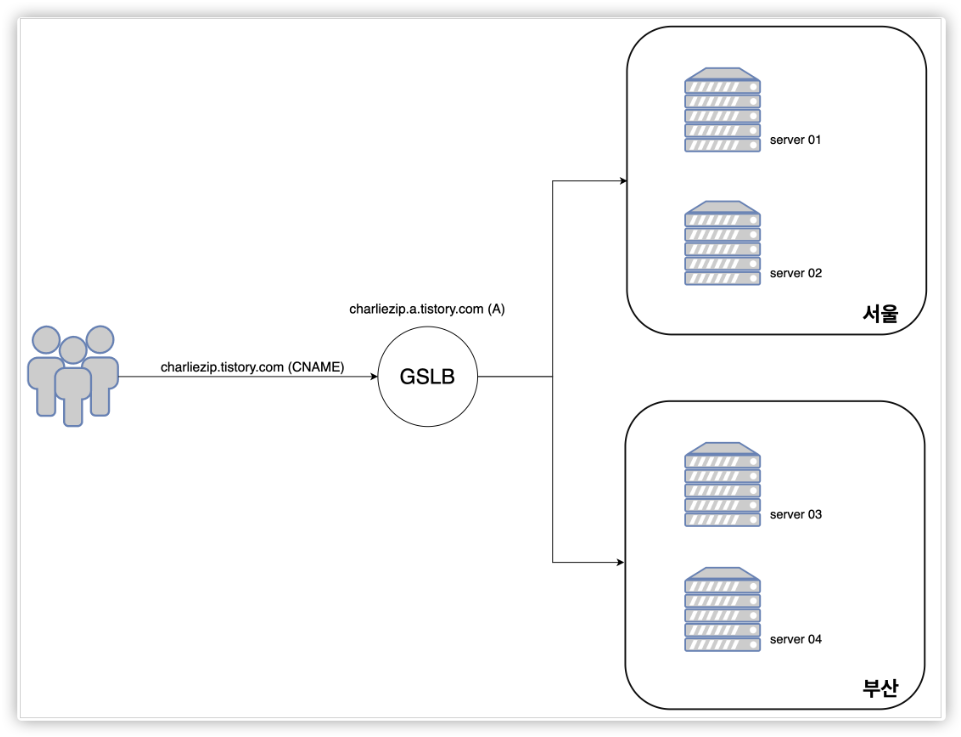

## GSLB(Global Service Load Balancing)

GSLB는 비즈니스 연속성 및 재해 복구에 사용되는 기술들의 집합을 의미한다.
이름은 로드 밸런싱이란 이름이지만 로드 밸런싱보다는 DNS의 개념에 더 가까운 기술이다.
DNS정보가 고정되지 않고 동적으로 변경될 수 있으며, 동일한 도메인으로 들어오는 요청을 분석하여 적절한 서버를 찾아준다. 

- #### GSLB의 목적
    - **disaster recovery(재난 복구)**
        - 실패에 대해 대처할 수 있는 서버를 제공한다
    - **load sharing(부하 분산)**
        - 많은 트래픽을 여러 서버로 분산시킨다
    - **performance(성능)**
        - client위치나 네트워크에 따라 최적의 성능을 낼 수 있는 서버를 찾아 선택해준다.
    

- #### GSLB의 주요 기술
    - **Health Check**
        - 등록된 호스트들에 주기적으로  health check 수행
        - 호스트가 실패할 경우 DNS응답에서 해당 호스트 제거
        - 실패한 호스트로의 접근을 막아 서버 가용성을 높일 수 있다.
    - **TTL**
        - DNS에서 권한을 가진 네임서버는 특정 레코드에 TTL을 설정할 수 있다.
        - 캐시 네임서버는 TTL시간동안 캐시에 저장하고, 클라이언트에 요청이 오면 캐시에 있는 값을 반환한다.
        - TTL의 값이 너무 길면 GSLB상태 정보가 제때 동기화되지 못 하고, 너무 짧으면 네임서버에 가해지는 부담이 커진다.
    - **네트워크 거리 & 지역**
        - 주기적으로 성능을 측정하고 그 결과를 저장한다.
        - DNS질의에 대해 지리적으로 가까운 서버를 반환하거나 네트워크 거리가 가까운 서버를 반환한다.