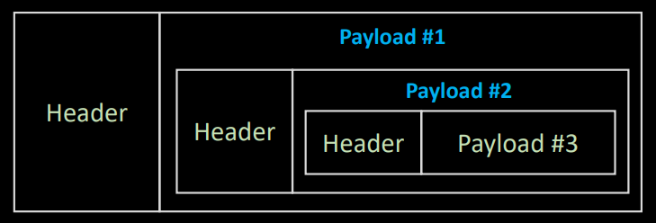
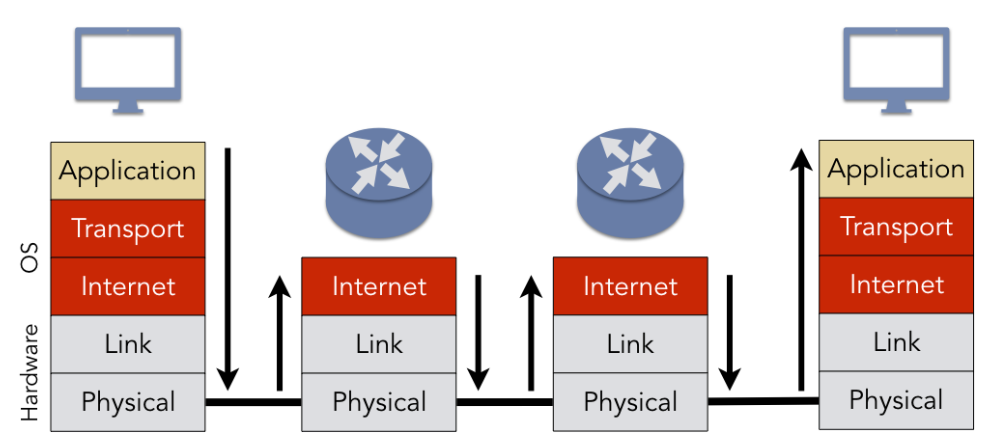
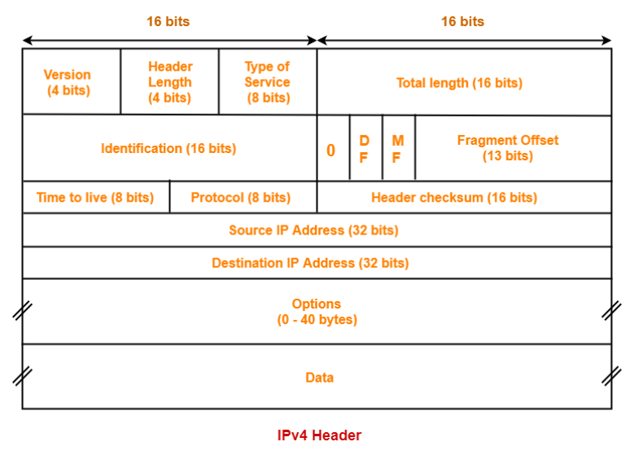

## 외워서 끝내는 네트워크 핵심이론

### MAC, IP, Port
- **MAC** : L2 layer, 랜카드 식별자
- **IP** : L3 Layer, Host 식별자
- **Port** : L4 Layer, Process & L2 Interface & Network Service 식별자

### Host
호스트는 네트워크에 연결된 장치(컴퓨터)를 의미한다. 그리고 이 장치의 목적에 따라 또 두가지로 구분할 수 있다.
- Switch : 스위치나 라우터 등 네트워크 그 자체를 이루는 장치
- End-Point : 클라이언트, 서버 등 서비스를 구성하는 단말 장치

### Swith가 하는 일
스위치는 고속도로망에 비유했을 때, 매 교차로마다 어디로 가는 것이 더 효율적일지 판단하는 장치라고 할 수 있다.
- **Router** : L3 Switch라고도 하며, 목적지까지 가기위한 경로를 판단하는 스위치이다.
- **Routing table** : 고속도로 상의 이정표와 같은 역할을 하는 테이블. 라우터는 라우팅 테이블을 기준으로 경로를 선정한다.
- **Packet** : 네트워크망을 통해 이동하는 데이터의 단위
- **Metric** : 라우팅 테이블에서 각각의 목적지로 이동하는 비용의 개념. 라우터는 가장 적은 비용의 경로를 선택한다.
  
### L2 Layer 용어들

- **NIC(Network Interface Card)** : == LAN(Local Area Network) Card와 동일한 의미
- **L2 Frame** : Ethernet Frame이라고도 하며, 2계층 네트워크에서 데이터를 전송할 때 사용되는 기본 단위이다.
- **L2 Access Switch** : End-point(NIC)와 직접적으로 연결되는 스위치. MAC Adress를 기반으로 스위칭 한다.
  - Link-up & Link-down : L2 스위치 포트의 상태를 의미하는 용어. link-up은 정상 연결 상태를, link-down은 단절 상태를 의미한다.
  - *Uplink : 상위 네트워크로 연결되는 것을 의미하는 용어. L2와 별개로 네트워크 장비의 계층구조를 표현할 때 쓰인다.
- **L2 Distribution Switch** : L2 Access 스위치를 위한 스위치. VLAN(Virtual LAN)을 제공하기위해 사용하는 것이 일반적.
- **Broadcast** : 1:1 단방향 네트워크 통신이 아닌 1:N 전방향 네트워크 통신을 의미한다. 네트워크에는 broadcast 통신을 위한 특별한 주소가 있다. Frame header에 오는 목적지 주소는 48bit의 MAC주소가 입력되는데, 이 주소가 모두 1로 이루어져 있으면 이는 특정 NIC가 아닌 전체 네트워크에 전송한다는 뜻이다.
  - broadcast의 문제점 : 브로드캐스트 통신의 문제점은 해당 통신이 전송되는 순간 모든 네트워크는 해당 브로드캐스트 통신을 처리하느라 다른 네트워크 통신이 지연되게 된다. 이 문제 때문에 네트워크는 단순히 모든 네트워크에 브로드 캐스팅을 하는 게 아닌 특정 규칙에 따라 전송하는데, 이를 어떻게 전송할 것인가에 대한 부분은 상당히 복잡한 문제이다.
- **LAN과 WAN** : 일반적으로 LAN은 2계층 이하의 통신을 의미하는데, 이는 달리 말하면 물리적인 계층이라 할 수 있다. WAN(Wide Area Network)는 일반적으로 인터넷을 의미하고, 이는 물리가 아닌 논리적 네트워크 또는 가상화 네트워크라고 부른다.

### L3 Layer 용어들
- **IPv4** : 32비트 IP 주소체계. dot으로 구분하며 각 자리에는 8비트의 수가 올 수 있다. 주로 앞쪽 3자리 까지는 네트워크 주소를 의미하며, 마지막은 호스트 주소를 의미한다.
- **Packet** : L3 IP(Internet Protocol)에서의 데이터 단위이다. src/dest를 포함하는 헤더와 페이로드 데이터로 구성되어 있다.
- **MTU(Maximum Transmission Unit)** : 패킷의 최대 크기. 1500byte 로 약 1.4KB 이다.
- **Wireshark** : 네트워크 도/감청 프로그램. 패킷의 상세 정보를 확인할 수 있다.
- **En/Decapsulation** : 캡슐화/역캡슐화로, 네트워크 데이터를 각 레이어의 형식에 맞게 포장하고 해제하는 것을 의미한다. 네트워크 데이터는 여러 층의 중첩 캡슐화로 구성되어 있다.
  * **네트워크 데이터 구조**
    
- #### 네트워크 계층별 데이터 단위
  - Stream : 5~7계층 데이터의 단위. header/payload 구조가 아닌 직렬화된 형태를 지닌다.
  - Segmentation : 4계층 TCP의 데이터 단위. MSS(Maximum Segment Size)는 1460byte이다.
  - Packet : 3계층 IP의 데이터 단위.
  - Frame : 1~2계층 데이터의 단위

### TCP/IP 송수신 흐름
  
두 컴퓨터간 tcp/ip 통신이 이루어질 때는 대략 아래와 같은 과정을 거친다.
1. 전송하려는 데이터 stream이 애플리케이션 Buffer에 로드된다.
2. 애플리케이션 버퍼에서 소켓 버퍼로 데이터를 보낸다. 이 때, 소켓 버퍼의 크기는 제한적이기 떄문에 데이터를 분할하여 순서대로 전송한다.
3. 소켓 버퍼의 데이터를 4계층으로 보내면서 TCP 데이터 단위인 Segment로 Encapsulation한다.
4. 4계층에서 세그먼트를 받으면 다시 3계층 IP 단위인 Packet으로 캡슐화하여 보낸다.
5. 3계층에서 패킷을 받으면 다시 2계층 단위인 Frame으로 캡슐화하여 데이터를 보낸다.
6. NIC는 frame으로 캡슐화된 데이터의 header 정보를 기반으로 데이터를 전송한다.
7. 데이터를 단말 밖으로 보내고 나면 OS는 몇번 데이터를 보냈는지 기록하고, 보낸 데이터가 잘 도착했다는 신호를 기다리고 있게 된다.
8. 전송된 프레임은 네트워크 구성에 따라 여러 장치(router 등)를 거치며 dest 단말에 도착하게 된다.
9. 프레임을 받은 단말은 1~5 과정을 역순으로 반복하며 데이터를 역캡슐화 하고 애플리케이션 버퍼에 쌓는다.
10. 버퍼에 정상적으로 스트림 데이터가 적재되면, 몇번 데이터를 받았고 여유 공간은 얼마나 남았는지에 대한 응답 데이터(ACK)를 보내게 된다.
11. src에서 ACK를 수신하면, 다음 위 과정을 반복하며 다음 순서의 데이터를 전송하게 된다.

#### TCP/IP 송수신 과정에서의 장애
위와 같은 흐름으로 데이터를 송수신하다가 여러가지 요인으로 송수신 장애가 발생할 수 있다. 대표적으로 발생하는 장애는 아래와 같다.

1. Loss : 세그먼트가 유실됨
2. ACK Duplicate : 송신 측에서 ack응답을 받지 못해 re-trans를 수행했는데 동시에 수신측에서 ACK를 보내면 같은 데이터가 두번 수신됨
3. Out of Order : 세그먼트 순서가 뒤엉켜 차례대로 오지 않음
4. Zero Window : 소켓 버퍼의 여유 공간이 없음. 프로세스가 소켓 데이터를 빼가는 속도보다 소켓에 쌓이는 속도가 빠른 경우.

### IP header
  
패킷의 헤더에는 여러가지 정보가 포함되어 있다. 이 헤더 데이터의 크기는 20바이트로 이루어져 있으며, 헤더를 제외한 페이로드의 크기는 MTU에서 헤더 크기를 뺀 1480바이트 정도로 생각하면 된다.
헤더에 포함된 데이터들은 아래와 같다.

- 버전(Version) : IP의 버전을 나타낸다. IPv4와 IPv6가 있으므로, 4나 6이 올 수 있다.
- 헤더 길이(Header Length) : 헤더의 길이, 즉 크기를 나타내는데, 일반적으로는 20바이트지만 옵션을 사용할 경우 최대 60바이트까지 늘릴 수 있다.
- ToS(Type of Service) : 패킷 처리에 대한 우선순위를 결정하는 값이다.
- 전체 길이(Total length) : 헤더와 페이로드를 포함한 전체 길이이다.
- 식별자(Identification) : 패킷의 고유번호이다. MTU 크기에 따라 분할된 패킷을 재조립할 때 식별자값이 필요하다.
- 플래그(Flags) : IP 패킷의 분할 가능 여부와 마지막 fragment인지 확인하는 값이다.
- 분할 위치(Fragment Offset) : 프래그먼트로 분할된 패킷이 몇번째 분할인지를 나타내는 값. 재조립 시 이 값을 필요로 한다.
- TTL(Time To Live) : 패킷의 수명. 라우터 1개를 지날 때마다 1씩 감소하고 0이 되면 소멸한다.
- 프로토콜(Protocol) : TCP의 경우 6을, UDP는 17을 갖는다.
- 헤더 체크섬(Header Checksum) : IP 헤더의 오류 여부를 검사하는 값
- 출발지 주소(Source IP Address) : 패킷을 송신하는 출발지 주소. 8비트로 4분할 된(4옥텟) 32비트 주소가 입력된다.
- 도착지 주소(Destination IP Address) : 패킷을 수신하는 도착지 주소. 마찬가지로 32비트이다.
- 옵션(Options) : 패킷의 전송 경로나 IP 프로토콜의 동작 옵션을 정의하는 데이터이다.

### Subnet Mask & CIDR
#### 서브넷 마스크(Subnet Mask)
서브넷 마스크는 IP주소에서 네트워크 아이디와 호스트 아이디를 구분하기위한 보조 값이라고 할 수 있다.
네트워크 장비는 서브넷 마스크 주소와 IP 주소를 AND 연산하여 네트워크 주소를 판별하고, 우리 네트워크 ID와 같으면 통과 시키는 식으로 작동했었다.
마스크 연산이 어디에서 이루어지냐에 따라 A,B,C Class 로 IP의 클래스를 구분하기도 했는데, 이는 과거에 주로 쓰이던 방식으로 최근에는 CIDR 방식을 표준으로 한다.

#### CIDR(Classless Inter-Domain Routing)
이름 그대로 클래스 없는 도메인간의 라우팅이란 뜻의 CIDR은, 서브넷 마스크를 사용하지 않고 IP 주소 뒤에 "/"로 구분하여 표시하는 prefix값으로 네트워크 ID를 판별하는 방식이다.
prefix는 192.168.0.8/24 와 같이 표기되며, 숫자는 비트를 의미한다. 즉, 24 prefix는 8*3 비트이므로, C클래스인 서브넷 마스크 255.255.255.0과 같은 의미를 지닌다.
CIDR 표기법은 서브넷 마스크에 비해 훨씬 직관적이며, 8비트 이하의 값으로 네트워크ID를 잘라 서브넷팅을 수행하기도 훨씬 편하여 서브넷 마스크에 비해 이점이 많다.
  

### L3 주요 개념들  

#### Host 자신을 가리키는 IP주소
127.0.0.1이라는 주소는 외부의 ip가 아닌 현재 프로세스와 동일한 호스트를 가리키는 주소이다. dest 주소가 127.0.0.1이면 통신 시 NIC로 도달하지 않고 L3 IP에서 다시 TCP로 되돌려 동일 호스트 내에서 도착지를 찾게 된다.
이렇게 호스트 내에서만 이루어지는 통신을 IPC(Inter Process Protocol)이라 한다.

#### TTL과 단편화
- TTL(Time To Live)는 패킷의 수명으로 라우터 한 개를 지날 때마다 1씩 줄어들며 0이 되면 소멸한다. TTL이 없으면 도착지가 잘못된 패킷이 끝없이 네트워크에 잔존하여 도착지를 찾아다니면서 부하를 일으킬 수 있기 때문에 TTL은 필수적이다.
- 단편화는 데이터 송신과정에서 현재 패킷의 크기보다 작은 MTU(Maximun Transmission Unit)를 가진 라우터를 만날 때 발생된다. 일반적으로 MTU는 1500이지만 이보다 낮은 MTU를 가진 라우터가 존재할 수 있는데, 이런 경우 패킷을 모두 실을 수 없으므로 두개로 분할(fragmentation)하여 보내게 되는데 이 작업을 단편화라 한다. 단편화된 패킷은 도착지에 도착해서 IP에서 재조립되는데 이런 작업은 부하를 일으키므로 단편화는 가급적 최소화하는 것이 좋다. 그래서 이런 단편화를 예방하기위해 경로상의 라우터중 최소 MTU값을 가진 라우터를 기준으로 최초 패킷 사이즈를 조절하는 등의 방식으로 해결할 수 있다.
  * *Router가 1500MTU 이하인 경우? : 현대 네트워크에서 라우터 자체가 1500이하 MTU인 경우는 거의 없다. 다만 VPN을 이용한다면, 특히 IP Sec VPN이용 시 1500이하가 될 수도 있어 이런 경우는 단편화 예방기법의 적용이 필요해진다.
  
#### DHCP
DHCP(Dynamic Host Configuration Protocol)는 호스트의 IP, Subnet mask, Gateway 정보 등을 자동으로 설정해주는 프로토콜이다. DHCP를 사용하면 호스트 서버 부팅 시 서버가 DHCP서버를 찾는 브로드캐스트 패킷을 전송하게 된다. DHCP서버가 아닌 서버는 이 패킷을 무시하고, DHCP서버가 받으면 호스트 서버와 통신을 시작하며 해당 호스트가 사용할 적절한 네트워크 정보를 할당해주게 된다. 이 DHCP는 반드시 호스트와 같은 브로드캐스트 네트워크(동일 게이트웨이)에 있어야만 한다.

#### ARP
ARP(Address Resolution Protocol)는 IP주소를 통해 MAC주소를 알아내려고 할 때 사용되는 프로토콜이다. ARP가 필요한 경우는 게이트웨이의 MAC주소를 알아낼 때 필요한데, 게이트웨이의 MAC주소가 필요한 이유는 L2 Frame의 header에 Dest 정보를 담을 때 게이트웨이의 MAC주소와 도착지 IP를 담기 때문이다.
이러한 ARP의 동작 과정은 DHCP와 비슷하게 먼저 호스트에서 특정 IP를 찾는 패킷을 브로드캐스팅하고, 응답을 받은 호스트(게이트웨이)는 자신의 MAC Address를 reply하는 식으로 동작하게 된다. 다만 매번 브로드캐스팅하지는 않고, ARP Cache를 활용하여 최초 응답을 받은 이후에는 캐시를 참조하는 식으로 동작한다.

#### Ping과 RTT
Ping은 통신상태 측정을 위한 유틸로서, 목적지와의 정상적인 통신이 가능한지, 통신 시간은 얼마나 걸리는지 등을 파악하기 위해 사용한다. 여기서 Ping에 소요되는 시간을 RTT(Round Trip Time)이라고 하며, 이런 Ping은 인터넷 제어 메세지 프로토콜인 ICMP(Internet Control Message Protocol)을 사용하여 수행된다. 