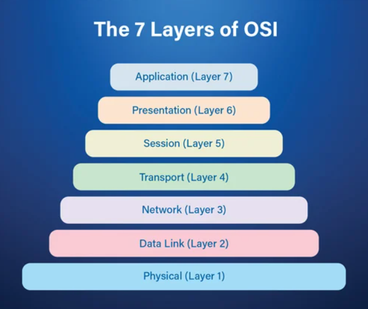

## OSI 7Layer

- #### 응용계층
    - HTTP, FTP, SMTP, POP3, IMAP, Telnet등의 프로토콜이 있다
    - 최종목적지, 응용프로그램을 통해 서비스를 수행(ex. explore, chrome)
- #### 표현계층
    - JPEF, MPEG, GIF, ASCII 등
    - 전송하는 데이터의 표현 방식을 결정(ex. data변환, 인코딩, 압축, 암호화 등)
- #### 세션계층
    - API, Socket등
    - TCP/IP 세션 체결, 포트번호 기반 통신 세션 구성
    - 주 지점간의 프로세스 및 통신 호스트 간의 연결 유지
- #### 전송계층
    - TCP / UDP
    - port번호, TCP/UDP 결정 > TCP헤더 붙음
    - 두 지점간 신뢰성 있는 데이터를 주고받게 해주는 역할
    - 신호를 분산하고 다시 합치는 과정을 통해 에러와 경로 제어
- #### 네트워크계층
    - Router
    - 데이터를 목적지까지 가장 안전하고 빠르게 전달
    - 라우터를 통해 경로를 선택하고 주소를 정하고(IP) 경로(Route)에 따라 패킷을 전달
- #### 데이터링크계층
    - 브리지, 스위치, 이더넷 등
    - 물리계층을 통해 송수신되는 정보의 오류와 흐름을 관리하여 안전한 통신흐름을 관리
    - 프레임에 물리적 주소(Mac address)를 부여하고 에러검출, 재전송, 흐름제어 수행
- #### 물리계층
    - 통신 케이블, 리피터, 허브 등
    - 전기적, 기계적, 기능적 특성을 이용해서 통신케이블로 데이터를 전송하는 물리적 장비
    - 전기적 신호(0, 1)로 주고받는 기능