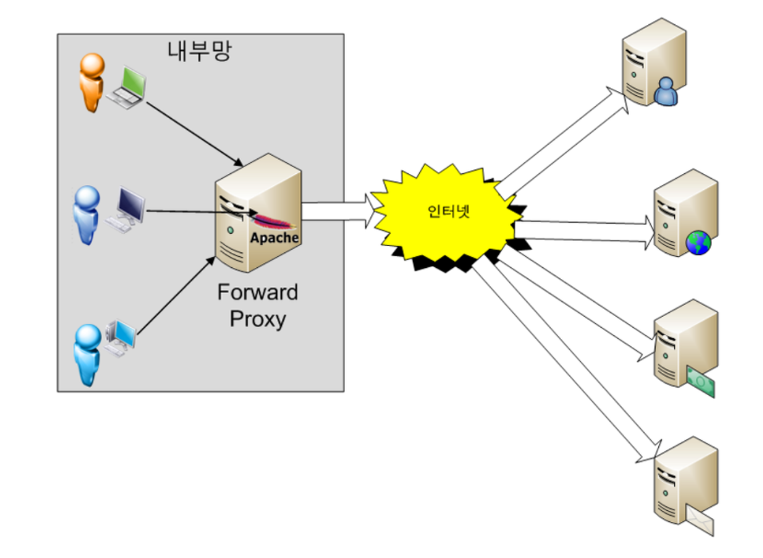
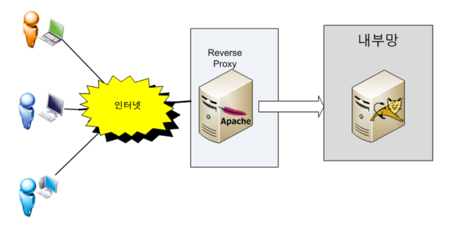

## 프록시 서버(Proxy Server)
- 프록시 서버란 서버와 클라이언트의 사이에서 통신을 중계해주는 서버로서, 보안과 통신성능 향상의 이점을 얻을 수 있는 서버다.
- #### 프록시서버의 특징
    1. 캐시 기능을 사용하여 동일한 요청에 대해서는 캐시를 활용하여 트래픽을 줄일 수 있다.
    2. IP를 바꾸기 위한 용도로서도 많이 사용되고 있다.
    3. 외부 인터넷 침입을 막는 방화벽과도 많은 연관이 있다.
- #### Forward Proxy

  

    - 내부 망에서 외부 인터넷으로 보내는 요청을 대신 받는 서버로, 유저가 보낸 요청을 프록시서버가 받아서 대신 외부 서버와 통신하여 결과를 받고, 해당 결과를 유저에게 전달해주는 방식으로 동작한다.
    - 유저가 프록시 서버 사용설정을 해야하므로 유저가 프록시 서버를 이용중이란 것을 인지할 수 있다.
    - 특정 사이트에 대한 접근만 허용을 해주는 등으로 유저의 외부인터넷 사용을 제한할 수 있고, 대역폭 사용도 줄일 수 있으므로 기업에서 주로 많이 이용을 한다.
- #### Reverse Proxy

  

    - 외부 인터넷에서 내부 망으로 들어오는 요청을 대신 받는 서버로, 요청에 대한 결과를 대신 유저에게 전달해주는 방식으로 동작한다.
    - 유저 입장에서는 자신이 보낸 요청에 대한 응답이 프록시 서버가 처리한 내용이란 것을 인지할 수 없다.
    - 일반적이지 않은 요청을 프록시서버단에서 차단할 수 있어 보안성능이 향상되고, 혹시 해킹 당하더라도 본 서버가 아닌 프록시서버가 해킹 당하는 것이기 때문에 안전할 수 있다.
    - 이런 구성에서는 보통 WAS 내장 웹서버를 사용하지 않고 웹서버와 WAS를 따로 두어서 웹서버를 프록시서버로 관리한다.