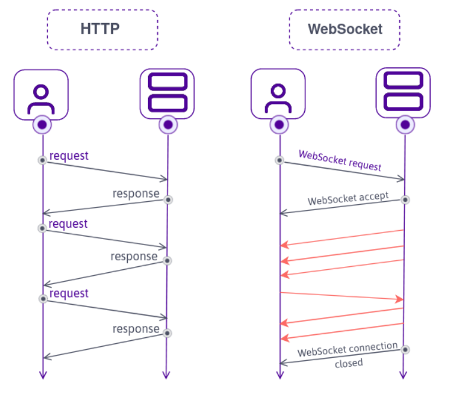
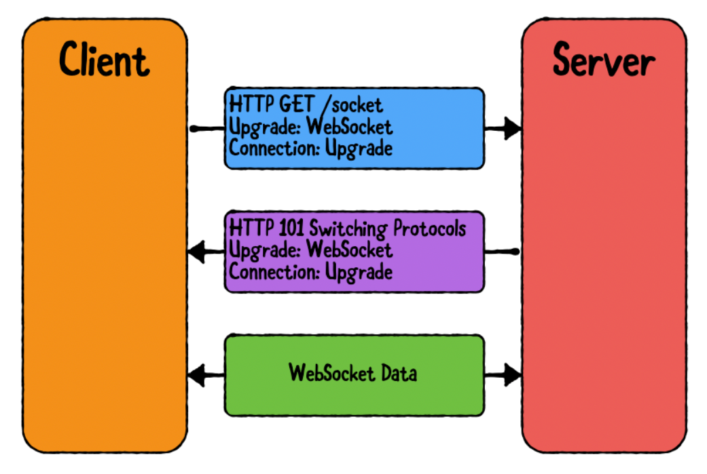
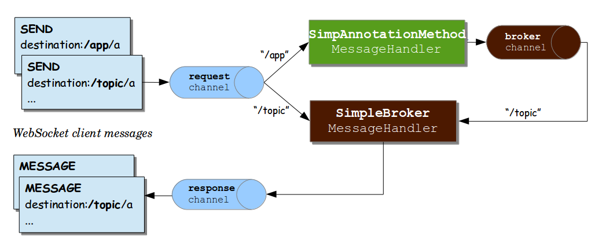

WebSocket
===
 
### 웹소캣이란?
WebSocket이란 Server와 Client간의 소켓 커넥션을 유지하면서 양방향 통신이 가능하게 하는 기술이다.
무엇보다 실시간적 상호작용이 중요한 채팅이나 게임등에 주로 사용되는 기술이다. 

### HTTP와의 차이점
HTTP는 요청-응답 형식의 1회성 통신이므로 서버가 Response를 돌려주고 나면 4way handshake 과정을 통해 연결을 끊는다. 즉, 1회성 통신이다.  
반면 WebSocket은 연결을 지속한 채로 유지하다가 커넥션 종료 이벤트가 발생해야만 연결을 끊는 연결형 통신방식이다.

### 웹소켓 연결 방법

1. 1차적으로 TCP Handshake를 통해서 연결을 체결하고 서버는 101코드를 응답해준다
2. 클라이언트가 101응답을 받으면 서버와 웹소켓 연결을 체결한다

- 웹소켓을 위한 별도의 포트를 오픈할 필요는 없다. 80, 443 사용
- 웹소켓도 https와 마찬가지로 운영환경에선 암호화가 적용된 wss를 사용해야한다.

# STOMP Websocket

Simple/Stream Text Oriented Message Protocol 으로서, WebSocket 자체는 통신 방식에 대한 기술이라면 STOMP는 WebSocket으로 통신하기위한 방법을 규약화 시킨 웹소캣 메시지 프로토콜이다.
- STOMP는 pub/sub 기반의 구독발행 모델로 동작한다.
- Spring에서는 WebSocket 의존성 추가시 기본적으로 STOMP를 지원한다.
- STOMP를 사용하면 별다른 메세징 형식을 개발할 필요가 없다.
- 인메모리 Message Message Broker를 이용할 수도 있지만, 서비스를 위해서는 주로 외부 메세지 브로커인 RabbitMQ, Kafka등을 이용하여 구현한다.

### STOMP Architecture

### STOMP 통신 흐름
- 사용자들은 특정 토픽을 구독(subscribe)한다. 채팅을 예로들면 이 토픽은 채팅방 고유번호가 될 수 있다.
- 구독한 사용자는 메세지를 발송(publish)한다.
- STOMP 서버는 메세지를 수신하여 작성한 로직에 따라 처리한 뒤, Message Broker로 메세지를 전달한다.
- 메세지를 수신한 메세지 브로커는 해당 토픽의 큐에 메세지를 추가한다.
- 큐에 추가된 메세지는 차례대로 해당 토픽을 구독하고 있는 모든 사용자에게 broadcast 된다.

