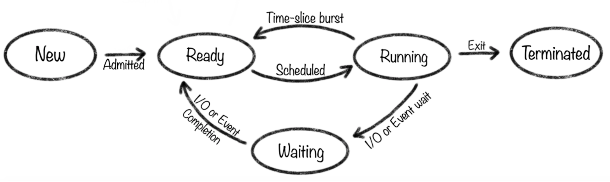
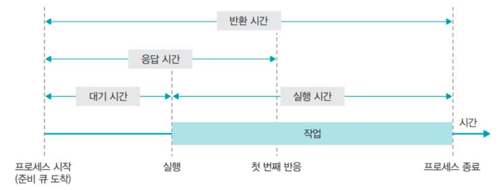
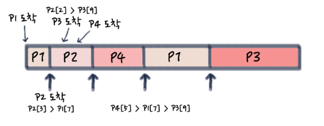
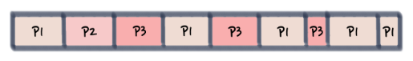

## CPU 스케줄링

- CPU 스케줄링은 CPU사용에 대한 권한을 여러 프로세스들에게 분배하여 효과적인 다중 프로그래밍을 구현할 수 있게 하는 기법이다.
- CPU 스케줄링의 목적은 CPU를 유휴 상태로 낭비하는 시간 없이 최대로 활용하여 다중 프로세스의 처리를 효율적으로 수행할 수 있도록 하는 것이다.
### 프로세스 스케줄링 과정

- 프로세스는 실행되면 종료되기 전까지 준비 상태, 실행 상태, 대기 상태를 전환하며 작업을 수행한다.
- **준비 상태**
  - CPU를 할당 받기 위해 준비 큐에서 스케줄러의 선택을 기다리는 상태
  - 준비 큐는 반드시 FIFO 입출력 구조가 아닌 알고리즘에 따라 여러 방식으로 구현된다
  - 일반적으로 메모리에 적재되어 있고 실행 가능한 상태의 프로세스들이 준비 상태에 있는다.
- **실행 상태**
  - CPU를 할당 받아 실제 코드를 실행하고 있는 상태
  - 실행 상태인 프로세스는 한번에 단 하나의 프로세스만 존재할 수 있다(1코어 기준)
- **대기 상태**
  - CPU가 아닌 다른 이벤트를 기다리고 있는 상태
  - 일반적으로 I/O 작업이 일어난 경우 I/O의 완료 이벤트까지 대기 상태로 기다리게 되며, 다른 이벤트를 기다릴 수도 있다.
  - 대기 상태가 종료되면 준비 상태로 갈 수도 있지만 상황에 따라 바로 실행 상태로 갈수도 있다

### 비선점 / 선점 스케줄링
- CPU 스케줄링은 다음 네 가지 상황에 발생할 수 있다.
  - 한 프로세스가 실행 상태에서 대기 상태로 전환될 때
  - 프로세스가 실행 상태에서 준비 완료 상태로 전환될 때(예: 인터럽트 발생)
  - 프로세스가 대기 상태에서 준비 완료 상태로 전환될 때(예: I/O 종료 시)
  - 프로세스가 종료할 때
- 이 중 1, 4번째 상황은 선택의 여지가 없이 반드시 다른 프로세스가 실행상태로 진입해야 한다. 이러한 상황에서만 스케줄링이 일어나는 것을 **비선점 스케줄링**이라 한다.
- 반면 2, 3번 상황에서 스케줄링이 발생하는 경우는 상황에 따라 현재 실행 상태인 프로세스를 밀어내고 다른 프로세스가 실행될 수도 있어 이런 스케줄링은 **선점 스케줄링**이라 한다.
- window, mac, linux 등 대부분의 OS는 선점형 스케줄링을 사용한다.

### 스케줄링 기준
- 스케줄링은 우선 순위를 판단하기 위한 아래와 같은 5가지 기준을 사용한다.
  - 대기시간(waiting time): 프로세스가 생성된 후 실행되기 전까지 대기하는 시간(준비 큐에서 대기한 시간)
  - 평균 대기 시간: 모든 프로세스의 대기 시간을 합한 뒤 프로세스의 수로 나눈 값
  - 응답 시간(response time): 첫 작업을 시작한 후 첫 번째 출력(반응)이 나오기 전까지 시간
  - 실행시간: 프로세스 작업이 시작된 후 종료되기까지의 시간
  - 반환시간(turn around time): 대기 시간을 포함하여 실행이 종료될 때까지의 시간
  

### 스케줄링 알고리즘
- 스케줄링이 일어나 프로세스를 준비 큐에 삽입할 때 어떤 기준으로 어디에 삽입할 건지를 결정하는 다양한 알고리즘이 있다.
- **비선점 알고리즘**
  - FCFS(First Come First Served)
    - 먼저 CPU점유를 요청하는 순서대로 스케줄링하는 방식
    
      |     | 수행시간 | 대기시간 | 반환시간 |
      |------|------|------|------|
      | P1  | 15   | 0    | 15   |
      | P2  | 5    | 15   | 20   |
      | P3  | 3    | 20   | 23   |
    - 위와 같은 프로세스 요청이 있을 때, **평균 대기 시간은 (0 + 15 + 20) / 3 = 11.7 이다.
    - 만일 P3-P2-P1 순서로 실행이 됐다면 평균 대기 시간은 (0 + 3 + 8) / 3 = 2.7 이다.
    - 즉 수행시간 시간에 따라 평균 대기 시간이 바뀐다.
  - SJF(Shortest Job First)
    - 수행 시간이 짧은 프로세스부터 CPU를 할당하는 방식
    - 평균 대기 시간을 최소화 하기위해 사용한다
    
      |     | 수행시간 | 대기시간 | 반환시간 |
      |------|------|------|------|
      | P1  | 6   | 3    | 9   |
      | P2  | 3    | 0    | 3   |
      | P3  | 8    | 16   | 24   |
      | P4  | 7    | 9    | 16   |
    - 위와 같은 프로세스가 있을 때 실행 순서는 P2 → P1 → P4 → P3 순서가 된다.
    - 평균 대기 시간은 (3 + 0 + 16 + 9) / 4 = 7 으로, 들어오는 순서와 상관없이 항상 동일하다.
    - SJF는 준비 큐에 있는 프로세스들만을 기준으로 하여 비선점이지만, SJF와 비슷한 SRTF(Shortest Remaining Time First)는 새로 도착한 프로세스의 수행시간이 현재 실행중인 프로세스보다 짧다면 CPU사용을 선점하는 식으로 동작한다.
- 
- **선점 알고리즘**
  - 선점형 스케줄링은 아래와 같은 공통적인 룰이 있다.
    - 높은 우선순위를 갖는 프로세스는 항상 먼저 스케줄되어야 한다.
    - I/O Bound 프로세스는 CPU Bound 프로세스보다 반드시 높은 우선순위에 있어야 한다.
    - Time Slice시에는 프로세스의 수행시간보다 조금만 더 많아야 한다.
    - Real-Time 프로세스는 다른 프로세스보다 매우 높은 우선순위를 갖는다.
  - SRT(Shortest Remaining Time)
    - 최단 잔여시간을 우선으로 하는 스케줄링
    - 프로세스 도착시마다 실행중인 프로세스까지 포함하여 잔여시간을 계산, 가장 짧은 잔여시간인 프로세스가 CPU를 선점하는 방식
    - 선점형 SJF라고도 불린다.
    
      |     |도착시간 | 수행시간 | 종료시간 | 대기시간 | 반환시간 |
      |-----|------|------|------|------|------|
      | P1  |1| 8    | 17   | 9    | 17   |
      | P2  |2| 4    | 5    | 0    | 4    |
      | P3  |3| 9    | 26   | 15   | 24   |
      | P4  |4| 5    | 10   | 2    | 7    |
    - 위와 프로세스는 아래의 그림과 같이 수행된다.
      
  - RR(Round Robin)
    - 모든 프로세스가 같은 우선순위를 갖고, time slice를 기반으로 스케줄링 한다.
    - time slice가 일어나면 실행중인 프로세스는 중단되고, 준비 큐의 끝으로 이동한다.

      |     | 수행시간 | 대기시간 | 반환시간 |
            |------|------|------|------|
      | P1  | 13   | 10   | 23   |
      | P2  | 7    | 3    | 10   |
      | P3  | 3    | 12   | 15    |
    - 위와 같은 프로세스는 아래의 그림과 같이 수행된다.
      
    - Time slice 기준 값이 너무 커 가장 수행시간이 긴 프로세스보다 크다면 SJSF와 동일하게 동작한다.
    - Time slice 기준 값이 너무 작다면 Context Switch가 너무 빈번하게 발생하여 성능이 저하된다.