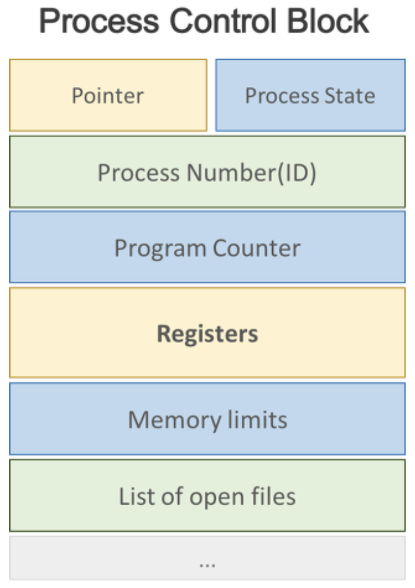
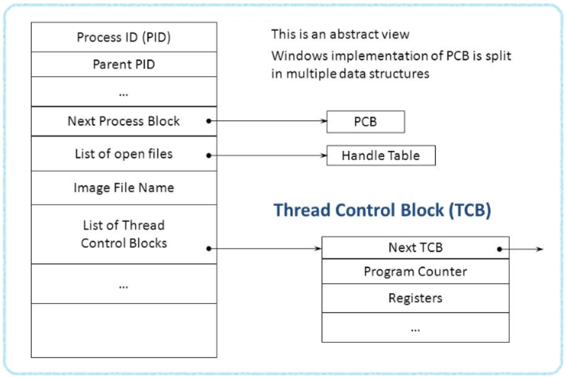

## Context Switching, PCB, TCB

### Context Switching?
컨텍스트 스위칭이란 CPU가 현재 작업중인 프로세스에서 다른 프로세스로 넘어갈 때, 현재 프로세스의 정보를 PCB에 저장하고 넘어갈 프로세스의 정보를 PCB에서 읽어와 레지스터에 적재하는 과정을 의미한다.

***컨택스트 스위칭의 동작 과정**
  

1. **요청 발생** : 인터럽트나 트랩에 의해 컨텍스트를 바꿔야한다는 요청이 들어옴
2. **PCB에 프로세스 정보 저장** : 현재 실행중이던 프로세스 P1의 정보를 PCB1에 저장하고 프로세스 상태를 running -> wating으로 변경
3. **새로운 프로세스 할당** : 스케줄링 큐에서 다음으로 실행할 프로세스 P2 정보를 가져와 ready -> running상태로 변경 후, PCB2에서 컨텍스트 정보를 읽어들여 CPU 레지스터에 적재
4. **새로운 요청 발생** : 인터럽트나 트랩에 의한 컨텍스트 스위칭 요청이 다시 발생. 2~3과정을 다시 반복하여 P2 정보를 PCB2에 저장하고 P1정보를 PCB1에서 읽어들여 CPU를 점유함
  
- 컨텍스트 스위칭은 인터럽트 발생 시에 동작하지만, 시스템 콜에의한 인터럽트는 컨텍스트 스위칭이라고 하지 않는다. 시스템 콜은 서로 다른 프로세스로의 전환이 아닌 동일 프로세스 내에서 유저모드 -> 커널모드로의 전환이므로 이는 프로세스 교환에 비해 오버헤드가 훨씬 적다.
- 컨텍스트 스위칭은 오버헤드가 상당하므로 잦은 컨텍스트 스위칭은 CPU의 작업 처리 효율성을 저하시킨다. 그러므로 time slice를 너무 작게 설정하는 건 좋지 않지만, 그렇다고 또 너무 크게 설정하면 시분할 시스템의 의미가 퇴색되므로 적당한 값을 정하는 것이 중요하다.

### PCB(Process Control Block)?
PCB는 운영체제가 프로세스를 제어하기 위해 정보를 저장해놓는 곳으로, 프로세스마다 유지하는 정보를 담는 자료구조이다. 각 프로세스가 생성될 때마다 PCB도 생성되며, 프로세스 소멸과 함께 PCB도 소멸된다.
PCB는 아래와 같은 정보를 담고 있다.  

***PCB의 구조**  
  

1. 프로세스의 상태(process state)
2. 프로그램 카운터(program counter)
3. CPU 레지스터(CPU register)의 값
4. CPU 스케줄링 정보(CPU Scheduling information)
5. 메모리 관리 정보(memory management information)
6. 자원 사용 정보(accounting information)
7. 입출력 상태 정보(I/O status information)
  
프로세스 상태는 waiting, running, ready 등의 프로세스 대기 상태를 의미한다. 프로그램 카운터는 다음에 수행할 명령의 위치를 가리키며, CPU 레지스터 값은 CPU연산을 위해 현 시점에 레지스터에 어떤 값을 저장하고 있는지를 나타낸다.
CPU 스케줄링 정보와 메모리 관리 정보는 각각 CPU 스케줄링과 메모리 할당을 위해 필요한 정보이다.
자원 사용 정보는 사용자에게 프로세스 자원 사용량에 대한 정보를 제공하기 위한 정보이며, 입출력 상태 정보는 프로세스가 오픈한 파일 정보등의 프로세스 I/O작업에 대한 정보이다.

### TCB(Thread Control Block)
스레드 제어 블록은 스레드의 생명주기와 같이 생성 및 소멸되는 자료구조로서, 프로세스 내에서 실행중인 스레드들의 정보를 담고 있다.  

***PCB와 TCB의 구조**
  

스레드도 프로세스와 마찬가지로 다중 스레드 환경에서 컨텍스트 스위칭이 발생하기 때문에, TCB의 정보를 통해 컨텍스트 스위칭이 수행된다.
다만, TCB가 담고 있는 정보는 PCB에 비해 훨씬 가벼우므로, 프로세스간 컨텍스트 스위칭에 비해 스레드 컨텍스트 스위칭 비용은 훨씬 저렴하다.

