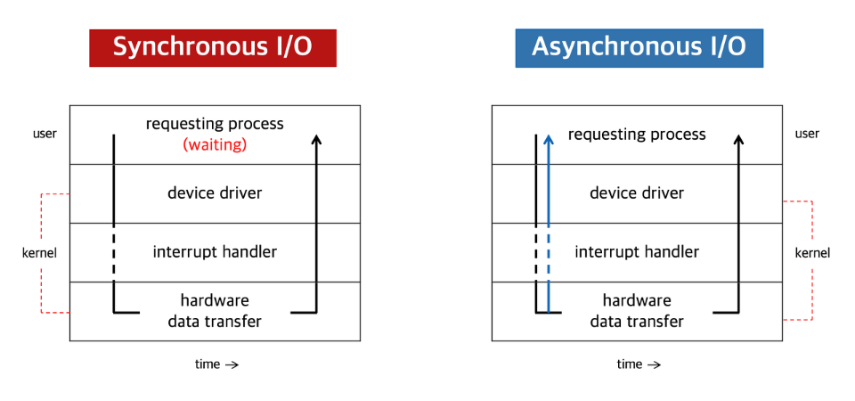
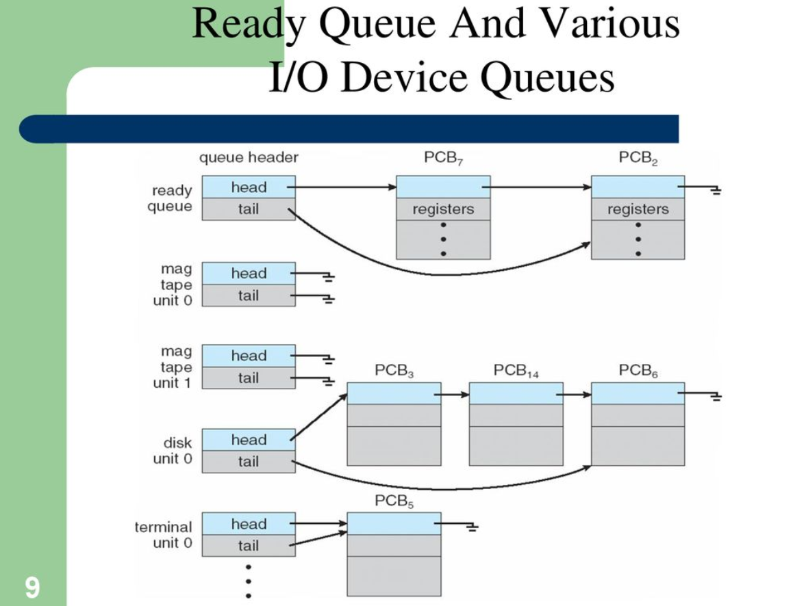

## I/O(Input/Output) 종류

I/O 작업이란 컴퓨터가 외부의 장치들과 데이터를 주고 받는 작업을 의미한다.
이를 일반적인 CPU의 연산작업과 구분하는 이유는, I/O 작업은 CPU연산에 비해 작업 완료 시간이 상당히 긴 편이며, 그 긴 시간 동안 CPU연산을 수행하는 게 아닌 외부 장치의 응답을 기다리는 구조이기 때문이다.
생각해보자. 만일 한국에서 미국에 있는 서버에 통신 요청을 보내면 응답을 받기까지 시간이 상당히 걸릴 것이다. 그럼 이 시간동안 컴퓨터는 가만히 기다리기만 해야할까? 그러면 컴퓨터의 작업 처리 속도가 매우 저하될 수 있기 때문에 운영체제는 이런 I/O작업을 효율적으로 처리하기 위한 아래와 같은 방식들을 마련해두었다.

### Sync I/O(동기 입출력)
> *지금부터 설명할 동기/비동기의 내용은 주체를 CPU가 아닌 실행중인 프로세스를 주체로하여 이해해야한다.

먼저 동기식 I/O는 프로세스가 여러 작업들을 수행하던 중 I/O요청이 발생했을 때, 해당 I/O작업의 결과를 받을때까지 해당 프로세스의 실행을 중단시킨다는 개념이다.
이 때 중단시킨 프로세스가 A프로세스라면, A프로세스는 Block-state 상태로 변경되고 CPU는 A프로세스가 아닌 다른 CPU연산을 처리할 수 있는 프로세스 B를 프로세스 큐에서 꺼내 해당 프로세스의 작업을 처리한다. 
그리고 B의 프로세스를 처리 중, A에서 보냈던 I/O작업이 외부장치에서 처리완료되면, 외부 장치는 CPU에 하드웨어 인터럽트를 발생시켜 A의 I/O작업이 완료되었음을 알린다. 그러면 CPU는 다시 B프로세스를 중단시키고 A프로세스의 처리를 재개한다. 이와 같은 중단 - 양도 - 재개 방식의 처리를 동기식 I/O라고 한다.

### Async I/O
비동기식 I/O는 프로세스가 여러 작업들을 수행하던 중 I/O요청이 발생했을 때, 해당 프로세스를 중단시키지 않고 계속 수행한다는 개념이다.
즉, A프로세스에서 I/O가 발생했다면, 일단 외부장치에 I/O요청을 보내는 것까진 동기식과 동일하지만, 이후 중지시키고 다른 B같은 프로세스를 찾는 게 아닌 A프로세스에서 I/O요청의 작업만 대기상태로 돌려놓고, 다른 처리가능한 작업을 수행하는 것이 비동기식 I/O이다.
그리고 외부장치에서 작업이 끝나면 마찬가지로 인터럽트를 발생시켜 A가 건너뛰고 하고 있던 다른 작업을 중단한 뒤, 대기 시켜놓은 I/O작업을 마저 처리하게 된다. 이와 같이 중단과 자원의 양도 없이 하나의 프로세스에서 계속해서 수행 가능한 작업을 돌리는 것을 비동기식 I/O라고 한다.

> ***Sync & Async I/O Flow** 
> 

### 동기식 I/O에서의 동시성 문제
그런데 동기식 I/O에서는 한 가지 문제가 있다. 만일 A프로세스에서 I/O가 발생해서 B프로세스로 넘어갔는데 B프로세스에서도 I/O가 발생하는 경우, 그리고 두 I/O가 모두 같은 대상의 작업인 경우(ex.같은 파일 수정) 해당 장치의 컨트롤러는 B의 요청을 먼저 처리할수도 있다. 이렇게 되면 1을 먼저 write하고 직후에 2를 write했지만 최종 파일은 1로 기록되는 식의 동시성 문제가 발생할 수 있다.
이런 경우를 대비하여 디바이스 컨트롤러에는 각각의 디바이스별로 큐를 두어 I/O작업이 발생한 순서대로 처리하도록 하고 있다.
> ***I/O Device Queue**
> 