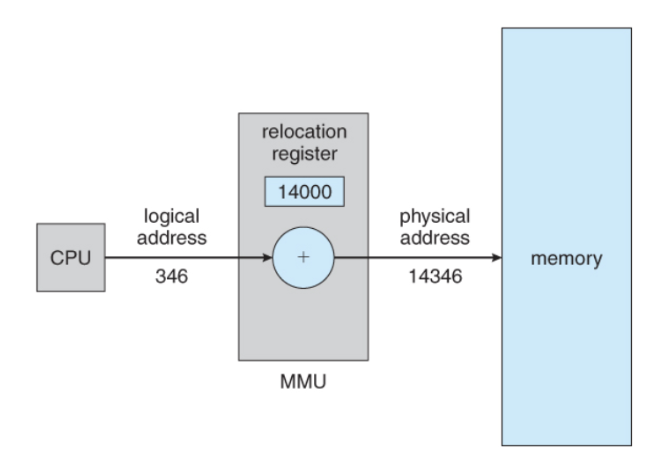
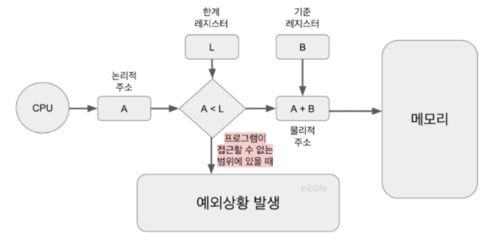

## 커널(Kernel)과 듀얼 모드

### 커널이란?

커널은 넓게 보면 운영체제 그 자체라고 할 수 있는데, 그만큼 운영체제의 가장 핵심적인 기능을 수행한다. 커널의 기능은 사용자가 직접 사용할 수 없고 시스템 콜을 통해서만 커널의 기능을 사용할 수 있다. 커널이 담당하는 기능은 아래와 같다.
- 태스크 관리자 : CPU를 Task라는 추상적 자원으로 제공
- 메모리 관리자 : 메모리를 segment나 page로 제공
- 파일시스템 : 디스크를 파일로 제공
- 네트워크 관리자 : 네트워크 장치를 소켓으로 제공
- 디바이스 드라이버 관리자 : 각종 장치를 디바이스 드라이버를 통해 접근 가능하도록 함

커널은 물리적인 자원(하드웨어)를 추상화된 객체로 제공하여 여러 사용자 또는 여러 프로세스가 물리 자원을 균등하고 효과적으로 사용하며 작업을 수행할 수 있도록 해준다.

### Dual-Mode
듀얼 모드란 컴퓨터의 중요한 물리적 자원을 사용자가 직접적으로 사용하지 못하도록 하기위해 운영체제를 다루는 방식을 두 가지로 나눈 것을 의미한다. 모드는 아래와 같이 사용자 모드와 커널 모드가 있다.

1. #### 유저 모드
   - 시스템 자원의 사용과 관계 없는 비교적 덜 중요한 연산만을 담당하는 모드이다.
   - 유저모드로 사용 중 시스템 자원이 필요해졌을 경우, System Call을 요청하여 커널 모드로 전환할 수 있다.
   - 애플리케이션 실행 및 애플리케이션의 기능의 사용 등 사용자 인터페이스에서 행해지는 모든 명령을 담당한다.
2. #### 커널 모드
   - 시스템 자원에 대한 제어권을 갖는 모드로, 제약 없이 모든 연산을 사용할 수 있다.
   - System Call으로 점화된 작업을 처리한다.
   - Mode bit라는 것을 이용하여 유저모드와 커널모드를 구분한다. 0이면 커널모드, 1이면 유저모드이다.
   - 메모리 관리, 스케줄링, 파일 시스템 관리 등 커널의 기능을 수행한다.

