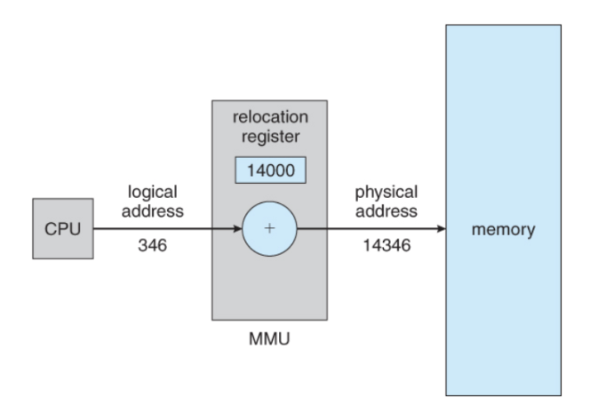
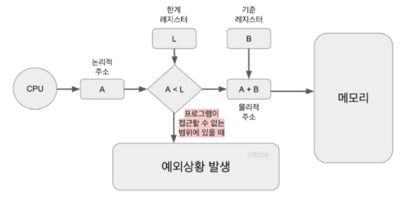
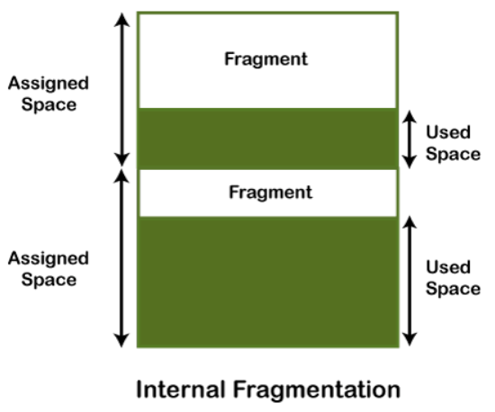
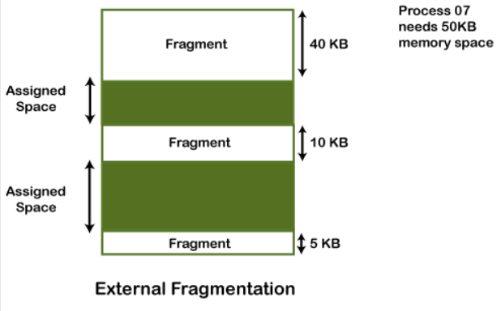
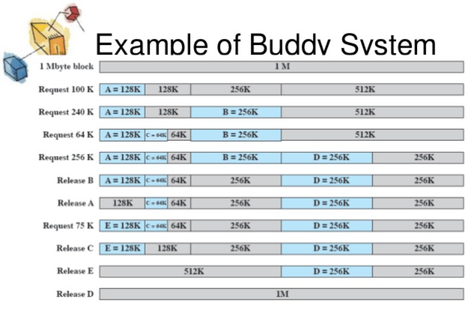

## 메모리 관리(Memory Management)

운영체제에서 프로그램을 실행하면 해당 프로그램의 데이터는 메모리(RAM)에 로드된다. 이 때 메모리 공간은 한정적이기 때문에, 어떤 데이터를 메모리에 올릴지, 각 프로그램의 메모리 주소를 어떻게 구분할지, 어떤 프로그램에게 더 많은 공간을 줄지 등등 수많은 고려사항이 필요하다. 운영체제는 이러한 메모리 관리를 자동적으로 수행하는 다양한 기법을 갖고 있으며, 그 덕분에 사용자는 메모리에 신경을 쓰지 않고 편하게 컴퓨터를 이용할 수 있게 되는 것이다. 이러한 메모리 관리 기법에는 어떤 것들이 있는지 하나씩 알아보자.

### 주소바인딩
프로그램이 메모리에 적재되면 그 프로그램만의 독자적인 주소 공간이 생성된다. 이 주소 공간을 논리적 주소(logical address) 또는 가상 주소(virtual address)라고 한다. 그리고 cpu는 이 논리 주소에 근거해 프로그램을 실행하게 된다. 실제 데이터가 올라가는 위치인 물리 주소는 cpu가 참조하지 않으며, 오직 논리주소만을 참조하여 프로그램을 실행한다.  

이 두가지의 주소영역, 물리적 주소와 논리적 주소를 연결시켜주는 방식을 주소 바인딩이라고 하며, 주소 바인딩은 물리 메모리에 적재되는 시기에 따라 아래와 같은 세가지 방식으로 구분할 수 있다.  

#### 1. 컴파일 타임 바인딩(compile time binding)
프로그램이 컴파일을 하는 시점에 물리적 메모리의 몇번지에 위치할 것인지를 결정한다.  
절대주소에 적재된다고하므로 절대코드(absolute code)를 생성하는 바인딩 방식이라고 말하기도 한다.  
만일 실행중 메모리 위치를 변경하고 싶을 경우 컴파일을 다시해야하는 문제가 있어 현재의 시분할 시스템에서는 거의 사용되지 않는 기법이다.

#### 2. 로드 타임 바인딩(load time binding)  
프로그램의 실행이 시작될 때 물리적 메모리 주소가 결정되는 바인딩 방식이다.  
로더(loader)에 의해 물리적 메모리가 부여되며, 프로그램 종료시까지 주소가 고정된다.  
컴파일러가 재배치 가능 코드(relocatable code)를 생성한 경우에 가능한 주소 바인딩 기법이다.
  
#### 3. 실행시간 바인딩(run time binding)
프로그램 실행 중에도 그 프로그램의 물리적 메모리 주소가 변경될 수 있는 바인딩 기법이다.
CPU가 주소를 참조할 때마다 주소 매핑 테이블(address mapping table)을 이용하여 바인딩을 점검해야 한다.  
실시간 바인딩을 위해서는 기준 레지스터와 한계 레지스터, MMU라는 하드웨어적인 지원이 필요하다.

### MMU(Memory Management Unit)
MMU는 cpu에게 받은 논리 주소를 기반으로 실제 물리주소를 찾아가기위한 장치로서, 각각의 프로그램이 동일한 논리주소를 갖고 있더라도 기준레지스터와 조합하여 별도의 물리주소를 찾아가도록 할 수 있다.  
  
MMU가 메모리를 찾아가는 방식은 위의 그림과 같다. 먼저 CPU가 논리 메모리주소 346에 대한 데이터를 요청하면, MMU는 이 346의 논리주소를 재배치(기준) 레지스터의 값과 조합하여, 14346이라는 물리 주소를 얻은 뒤 메모리에 해당 주소의 데이터를 요청한다.
여기서, 재배치 래지스터의 값의 기준은 현재 CPU를 점유하고 있는 프로세스를 기준으로 값이 설정되며, 그러므로 컨텍스트 스위칭이 발생할 때마다 재배치 레지스터의 값도 변하게 된다.  

#### * 한계 레지스터(limit register)  
  
하지만 위 방식으로 메모리 주소를 변환하다 보면 변환 결과가 해당 프로세스가 가질 수 있는 메모리 주소 영역을 벗어나는 연산 결과가 나올수도 있다. 이런 경우를 대비해서 MMU는 한계 레지스터의 도움을 받는데, 한계 레지스터는 해당 프로세스가 가질 수 있는 주소 범위를 기록해두고, 매 논리 주소 요청이 올 때마다 이 범위를 벗어나는지 확인하여 만일 벗어난다면 트랩을 발생시켜 해당 프로세스를 종료시키게 하는 역할을 한다.
  
### 메모리 관리 관련 용어

#### 동적로딩(Dynamic Loading)
동적로딩은 여러 프로그램이 동시에 실행되는 다중 프로그래밍 시스템에서 한정된 메모리 공간을 효율적으로 사용하기위한 기법이다.  
프로그램 코드의 많은 부분은 예외 상황 처리와 같은 방어용 코드로 이루어져 있는데, 이런 코드를 모두 항시 메모리에 올리고 있는다면 자주 사용되지도 않는 코드로 메모리를 낭비하는 것으로 볼 수 있다.
그렇기에 동적로딩은 프로그램에서 자주 사용되는 부분만 메모리에 올려두고, 나머지는 필요한 경우에만 가져 오도록 함으로써 메모리 사용의 효율성을 높인다.
동적 로딩은 프로그래머가 직접 구현할 수도 있고, 운영체제가 지원하는 라이브러리를 사용할 수도 있다.

#### 동적연결(Dynamic linking)
연결(linking)은 작성한 소스코드를 컴파일한 목적 적코드와 컴파일된 라이브러리 파일들을 묶어 하나로 실행하는 과정을 의미한다.
이중 동적연결이란 목적파일과 라이브러리파일의 연결을 실제 필요해지는 순간까지 지연시키는 기법을 의미하고, 정적연결은 실행파일이 생성될 때 관련 라이브러리를 모두 연결하여 생성하는 방식이다.
정적 로딩보다 동적 로딩이 메모리 사용측면에서 효율적인 이유는, 정적 로딩의 경우 프로그램 실행에 너무 많은 메모리를 필요로 하며, 여러 프로그램에서 동일한 라이브러리를 사용하더라도 개별 프로그램이 모두 해당 라이브러리 코드를 별개로 갖고 있는 등의 낭비가 발생할 수 있다.
반면에 동적로딩은 라이브러리 코드가 포함되지 않아 기본 크기가 훨씬 작으며, 라이브러리가 필요해지는 경우 먼저 메모리상에 해당하는 라이브러리가 있는지 찾아보고 이미 있는 경우 해당 라이브러리를 참조하므로 동일한 라이브러리가 메모리상에 단 하나만 존재해도 된다는 장점이 있다.

#### 중첩(Overlays)  
중첩이란 프로세스의 주소 공간을 분할해 실제 필요한 부분만 메모리에 적재하는 기법을 의미한다. 동적로딩과 유사하지만, 목적에서 큰 차이가 있다.
동적 로딩은 여러 프로세스를 하나의 메모리에 효율적으로 올리기 위해 필요한 부분만을 올리는 거지만, 중첩의 경우 하나의 프로그램의 실행에 필요한 데이터가 메모리에 모두 올라갈 수 없을 때, 일단 당장 필요한 부분만 올리고 해당 작업이 완료되면 내린 뒤 다음 부분을 올리는 식으로 동작하는 기법이다.
즉 중첩은 메모리가 매우 작던 초창기 컴퓨터에서 자주 사용되었으며, 이런 점에서 장기 스케줄러와도 비슷한 개념이라고 할 수 있다. 
중첩은 프로그래머가 직접 구현해야했으며, 그래서 이를 수작업 중첩이라고도 불렀는데, 이는 상당히 복잡한 작업이었다.
    

### 물리적 메모리의 할당 방식
물리적 메모리 영역은 운영체제 상주 영역과 사용자 프로세스 영역으로 나뉘게 된다.
운영체제 상주영역은 인터럽트 벡터와 함께 물리 메모리의 낮은 주소 영역을 사용하며, 사용자 프로세스 영역은 높은 주소 영역에 위치한다.
이제부터는 이 사용자 프로세스 영역의 할당 방식에 대해 알아보고자 한다.

#### 연속 할당 방식
연속 할당 방식은 프로세스를 메모리에 올릴 때 주소 공간을 여러개로 분할하지 않고 메모리의 한 곳에 연속으로 적재하는 방식이다.  
이 방식은 물리 메모리를 고정된 크기로 나눠 놓는지 여부에 따라 고정분할 방식과 가변분할 방식으로 나뉜다.

#### 1) 고정분할 방식
- 고정분할 방식은 전체 물리 메모리 공간을 지정된 개수로 나누어 놓는 방식이다.
- 분할의 크기는 모두 동일하게 할 수도 있고 다르게 할 수도 있다.
- 각 영역에는 하나의 프로세스만 올라가므로 수행 가능한 전체 프로세스가 제한되어 융통성이 떨어진다.
- 메모리 내부 단편화와 외부 단편화이 발생할 수 있다.  
> #### 내부 단편화(internal fragmentation)
>   
  내부 단편화란 프로세스가 자신이 필요로 하는 크기보다 큰 메모리에 할당되어 나머지 메모리를 낭비하게 되는 현상을 의미한다.
> #### 외부 단편화(external fragmentation)
>   
  외부 단편화란 프로세스의 크기가 메모리 영역의 크기보다 커서 할당되지 못해 메모리가 낭비되는 현상을 의미한다.
  
#### 2) 가변분할 방식
- 가변분할 방식은 메모리에 적재되는 프로그램의 크기에 따라 분할의 크기, 개수가 동적으로 변하는 방식이다.
- 분할의 크기를 프로세스보다 일부러 크게 잡지는 않으므로 내부 단편화는 발생하지 않지만, 중간 지점의 프로세스가 종료될 경우 발생한 빈 공간에 다른 큰 프로세스가 들어가지 못하는 외부 단편화는 발생할 수 있다.
- 물리적 메모리 내 가용공간 중 어떤 위치에 올릴 것인지하는 동적 메모리 할당 문제(dynamic storage-allocation problem)가 존재한다.
- 동적 메모리 할당 문제를 해결하는 방법으로는 최초적합, 최적적합, 최악적합 방식이 있다.
> #### 최초적합(first-fit)
> 최초적합 방식은 가용 가능한 메모리 공간을 차례로 살펴보며 할당이 가능한 공간이 발견되면 바로 메모리를 할당하는 기법이다. 전체 메모리를 탐색하지 않기 떄문에 시간 측면에서 효율적이다.
> #### 최적적합(best-fit)
> 최적적합 방식은 전체 메모리 공간중 현재 프로세스의 크기와 가장 가까운 크기의 주소 공간을 할당하는 방식이다. 공간을 효율적으로 사용하지만 가용공간 리스트가 정렬되어 있지 않은 경우 전체를 탐색해야 하므로 시간적으로는 비효율적이다.
> #### 최악적합(worst-fit)
> 최악적합 방식은 가용 가능한 메모리 공간 중 가장 큰 공간에 프로세스를 할당하는 기법이다. 최적적합과 마찬가지로 시간적 오버헤드가 큰 편이며, 가용 공간을 빨리 소진한다는 문제가 있다.

#### 외부 단편화 해결 기법
가변분할 방식의 외부단편화를 해결하기위한 기법에는 크게 아래와 같은 세가지 종류가 있다.
- #### 컴팩션(compaction)
  - 컴팩션은 전체 메모리에서 할당된 부분을 한쪽으로 몰고 할당되지 않은 부분을 다른 한쪽으로 몰아 외부 단편화를 제거하는 기법이다.
  - 컴팩션은 전체 메모리를 이동시키는 작업이므로 시스템 오버헤드가 매우 큰 작업이다.
  - 오버헤드를 줄이기 위해선 최소한의 이동만으로 여유 공간을 확보해야하는데, 이는 상당히 복잡하다.
  - 컴팩션은 런타임 바인딩 방식이 지원되는 환경에서만 수행 가능하다.
- #### 통합(coalescing)
  - 통합은 인접한 두 메모리 영역을 합쳐 더 큰 메모리 영역을 만드는 방식이다.
  - 프로세스가 종료되고 메모리에서 내려가면서 주변의 인접한 빈 메모리 영역이 있다면 통합을 한다
  - 통합으로 확보되는 영역이 컴팩션에 비해 크지는 않지만 메모리 이동이 필요 없어 적은 오버헤드로 외부 단편화를 줄일 수 있다.
- #### 버디 시스템(Buddy system)
  
  - 버디 시스템은 메모리를 할당하는 시점에 남아 있는 메모리 공간 중 현재 프로세스가 들어갈 수 있는 2^n크기의 공간을 찾고, 해당 공간을 2로 나누어가며 프로세스의 크기보다 작아져 더이상 나눌 수 없을 때까지 나누어 메모리를 할당하는 방식이다.
  - 메모리를 해제할 때는 나누었던 인접한 메모리 영역을 2^n 크기가 되는 만큼 반복적으로 합치며 여유 메모리 영역을 확보하는 식으로 동작한다.
  - 메모리 로드 및 언로드시 연산이 추가되어 약간의 오버헤드가 있지만 효과적으로 외부 단편화를 해결하는 기법이다.
  

#### 불연속할당 기법 (non-contiguous allocation)
불연속 할당기법이란 하나의 프로세스가 물리 메모리의 여러 위치에 분산되어 올라갈 수 있는 메모리 할당 기법을 의미한다.  
불연속 할당기법에는 프로그램을 동일한 크기의 여러 부분으로 나눠 메모리에 올리는 페이징 기법과, 일정하지 않은 단위로 나눠 올리는 세그멘테이션 기법, 각 세그멘테이션을 페이지 단위로 동일하게 나누어 메모리에 올리는 페이지드 세그멘테이션 기법 등이 있다.
  
