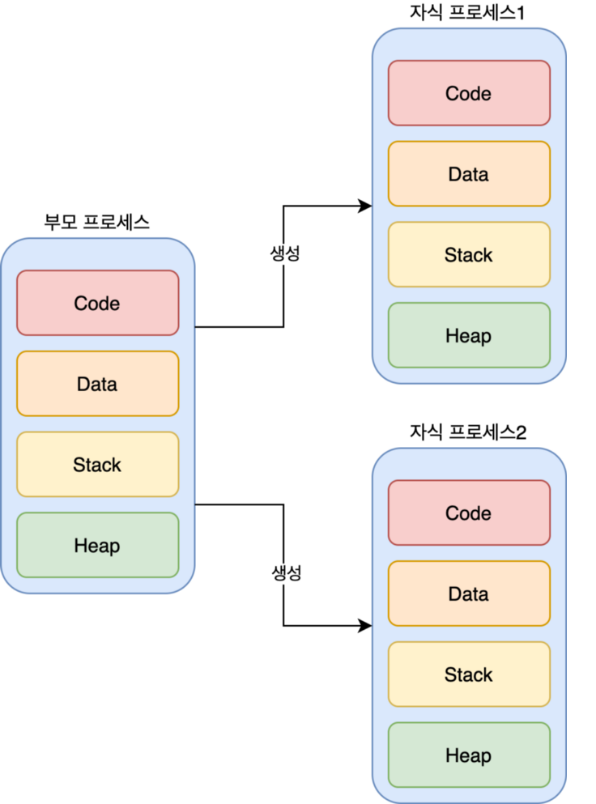
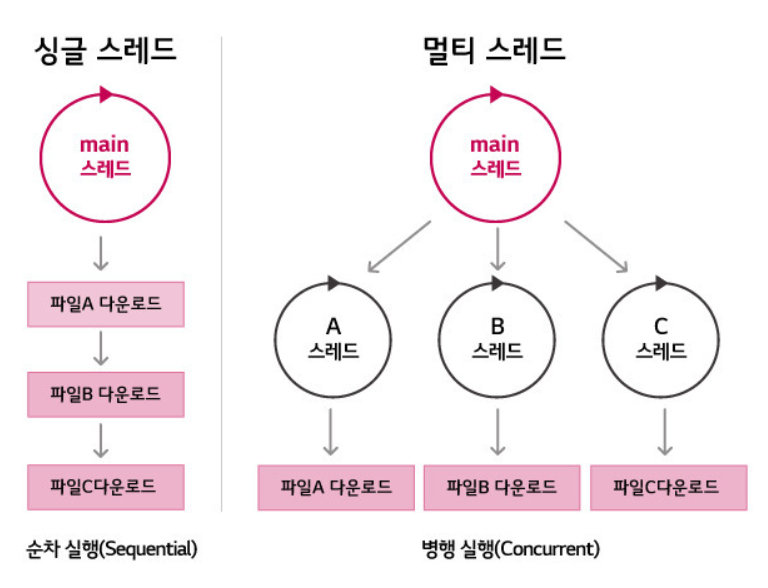

## Multi Process & Multi Thread
멀티프로세스와 멀티스레드는 한 애플리케이션에서 여러 작업을 처리하는 방식이라고 할 수 있다.
여러 작업을 나누어 처리함으로써 처리 성능의 향상을 이끌어낼 수 있지만, 이 과정에서 발생하는 문제들도 몇가지 있다. 하나씩 살펴보자.

### Multi Process
멀티 프로세스는 운영체제에서 하나의 프로그램에 대해 동시에 여러 프로세스로 실행할 수 있게 해주는 기술을 의미한다. 기본적으로는 프로그램당 하나의 프로세스를 실행하지만, 부가적인 기능을 위해 여러개의 프로세스를 추가 생성하는 것이다.

**멀티 프로세스의 구조**

  
멀티 프로세스의 내부 구조를 보면 하나의 메인 부모 프로세스가 여러개의 자식 프로세스를 생성하는 구조이다. 부모 프로세스와 자식 프로세스는 각각의 고유한 PID를 가지고 있어 통신이 가능은 하지만, 메모리 공간은 별개로 가지고 있어 서로 다른 작업을 수행한다.

#### 멀티 프로세스의 장단점
**장점**  
- 프로그램 안정성
  - 멀티 프로세스는 여러 프로세스 중 하나의 프로세스가 장애가 발생하였다고 하더라도, 전체 프로그램의 실행 자체에는 영향을 주지 않아 다른 프로세스는 안전성을 보장받는다.
- 병렬성
  - 멀티 프로세스는 각각의 프로세스를 CPU코어가 병렬로 처리하기 때문에 처리 성능이 향상된다. 다만 이것은 멀티 스레드도 동일하다.

**단점**
- 자원 공유 비효율성
  - 멀티스레드는 각각 독자적인 메모리 공간을 가지는데, 이는 일반적인 방법으로는 메모리 공유가 불가능하여 자원의 공유가 필요한 작업에서는 구현이 복잡할 수 있다.
- 컨택스트 스위칭 오버헤드
  - 멀티스레드는 cpu에서 프로세스단위로 작업을 전환할 때마다 발생하는 컨텍스트 스위칭 비용이 상당히 커서 여러 프로세스가 계속해서 전환되면 처리 성능이 저하될 수 있다.

### Multi Thread
멀티 스레드는 하나의 프로세스 내에서 스레드를 여러개로 나누어 생성하여 작업을 병렬로 처리하기위한 기술으로, 프로세스와 1:N 관계를 갖는다.

***멀티 스레드 구조**

#### 멀티 스레드의 장단점
**장점**
- 스레드의 경량성
  - 스레드는 프로세스에 비해 각각의 인스턴스가 담고 있는 정보가 훨씬 적어서 여러개의 스레드가 생성되어도 시스템에 가해지는 부담이 프로세스에 비해서 적다.
- 컨텍스트 스위칭 효율성
  - 스레드도 전환시 컨텍스트 스위칭이 발생하지만, 프로세스의 스위칭에 비하면 훨씬 빠르게 스위칭이 이루어진다. 결과적으로 이는 작업 처리속도의 증대로 이어진다.
- 자원 공유의 효율성
  - 스레드는 스택영역을 제외하면 나머지 heap, code, data 영역을 공유하기 떄문에 스레드간 자원을 공유하며 병렬처리를 해야할 경우에는 멀티 프로세스보다 훨씬 효율적인 처리가 가능하다.

**단점**
- 안정성 저하
  - 멀티 스레드는 하나의 프로세스에 모든 스레드가 의존하고 있는 관계이므로, 메인 프로세스에 장애가 발생하면 모든 스레드의 장애로 이어지는 단점이 있다.
- 동기화로 인한 성능 저하
  - 스레드끼리 자원을 공유하는 점이 장점이기도 하지만, 자원을 공유하며 동시성 문제를 해결하기위한 lock등의 기법으로 인해 작업 종류에 따라서는 동기화 비용이 너무 커질 수도 있다.
- 데드락
  - 스레드간 자원 공유시 동기화 처리를 제대로 하지 않으면 a스레드와 b스레드가 끊임 없이 서로의 lock해제를 기다리는 데드락에 진입할 수 있다.
- 단일 코어에서는 무의미함
  - 멀티 프로세스도 동일하게 가지는 문제인데, 병렬처리는 어디까지나 코어의 갯수만큼만(하이퍼 스레딩 적용시 더 많이 가능) 병렬처리가 가능하므로 단일 코어 시스템에서는 의미가 없다.
