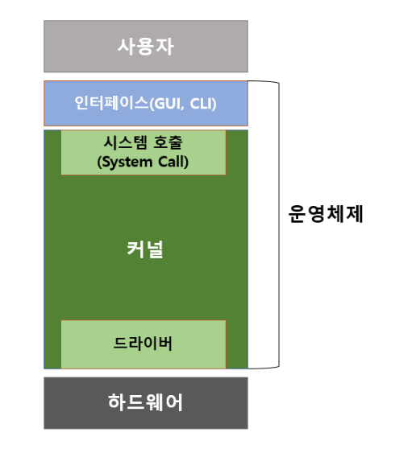

## 운영체제(OS, Operating System)
### 운영체제의 정의
- 운영체제란 컴퓨터 시스템의 자원들을 효율적으로 관리해주며, 사용자가 컴퓨터를 편하고 효율적으로 사용할 수 있는 환경을 제공하는 프로그램의 집합이다. 사용자와 하드웨어를 이어주는 일종의 인터페이스 역할을 한다.

### 운영체제의 역할
- **사용자를 위한 역할**
  - OS는 사용자가 컴퓨터 시스템을 사용하기 편리하게 사용할 수 있도록 GUI, CLI와 같은 인터페이스를 제공한다.
- **하드웨어를 위한 역할**
  - 운영체제의 핵심적인 역할은 각종 하드웨어를 관리하는 역할인데, 크게 아래와 같이 세가지로 나눌 수 있다.
  1. **프로세스 관리**
     - 운영체제는 동시에 여러가지 프로그램이 실행된다. 하지만 CPU 코어 하나당 동시에 처리 가능한 연산은 하나의 프로세스 뿐이므로 수많은 프로세스에 대한 동시 실행 전략이 필요하다. 시분할 방식, 프로세스 스케줄링 등으로 운영체제가 이를 관리한다.
  2. **메모리 관리**
     - 프로그램이 실행되기 위해서는 메모리가 필요하다. 동시에 여러 프로그램이 실행되는 상황에서 한정된 메모리 자원을 어느 프로그램에 얼마나 할당해주고, 어떻게 분할할지등을 관리하는 역할도 OS가 수행한다. 메모리 관리방식으로는 고정 분할 방식, 가변 분할 방식, 가상 메모리 등이 있다.
  3. **하드웨어 관리**
     - OS는 사용자가 직접적으로 하드웨어를 컨트롤 할 수 없게 하고 사용자가 수행하려는 작업에 맞춰 직접 하드웨어를 컨트롤한다. 이를 통해 데이터 소실 방지나 보안 유지 등을 이룰 수 있고, 여러 I/O(Device, Network, File 등)작업을 수행하여 사용자가 간편하게 하드웨어를 다룰 수 있도록 한다.

### 운영체제의 구조

- 여러 프로그램이 실행되는 운영체제에서는 모든 프로그램의 데이터가 메모리에 올라가지 않고 그때그때 필요에 따라 메모리에 올렸다 내렸다하는 과정을 거친다. 하지만 항상 메모리에 올라가있는 프로그램도 있는데, 이것을 커널(Kernel)이라고 한다. 커널은 운영체제의 핵심 역할을 담당하며, 그 자체로 운영체제라고 불리기도 한다.
- **인터페이스**
  - 커널은 컴퓨터 시스템을 관리하기위한 프로그램이지만 사용자가 커널 자체를 직접 다룰 수는 없다. 이 커널을 다루기 위해 GUI, CLI와 같은 인터페이스를 제공하는데, 이를 쉘(Shell)이라고도 한다. 쉘 역시 껍대기라는 그 이름 처럼 운영체제의 겉부분에서 커널을 사용하기위한 다양한 명령어를 지원하여 사용자의 의도를 해석하고 커널에 명령을 전달하는 역할을 한다.
- **커널**
  - 커널은 속, 알맹이라는 그 뜻처럼 운영체제의 가장 핵심이다. 커널은 프로세스, 메모리, 저장장치를 관리하는 프로그램이며 시스템 호출과 드라이버라는 두가지 영역으로 나눌 수 있다.
    1. **시스템 호출(System Call)**
       - System Call은 커널이 하드웨어를 보호하기위한 인터페이스라고 할 수 있다. 사용자가 직접적으로 하드웨어를 컨트롤 하는 것을 막고 매뉴얼화된 하드웨어 사용 함수를 제공하여 해당 함수를 통해서만 사용자가 하드웨어를 제어할 수 있도록 한다. 이로인해 사용자의 실수로 인한 데이터의 유실이나 시스템 장애를 예방하고 사용자가 시스템 자원을 다루기 쉽도록 한다.
    2. **드라이버(Driver)**
       - 드라이버는 커널과 하드웨어의 인터페이스라고 할 수 있다. 커널은 마우스 키보드와 같은 기본 입출력장치 컨트롤에 대한 부분은 이미 제작되어 있어 해당 장치를 연결하기만 해도 동작하지만, 그래픽카드, 프린터, 스캐너 등과 같은 복잡한 장치들은 해당 장치를 사용하기위해 해당 장치 제조사에서 제공하는 드라이버를 설치해야한다.
       
    
#### 다중 프로그래밍 시스템(Multi-Programming System)
다중 프로그래밍 시스템이란 여러 프로그램이 동시에 실행되는 환경에서 CPU를 쉬게하지 않고 항상 연산을 수행하는 상태로 활용하기 위한 시스템이다.
프로그램은 연산 중 항상 CPU만을 이용하는 것이 아닌 다른 장치를 활용한 입출력 작업(I/O)도 수행하는데, 이런 과정에서는 CPU의 연산 없이 결과를 대기하는 시간이 필요하기에 이런 유휴시간에 cpu는 다른 프로세스를 처리하는 식으로 cpu의 활용을 극대화 한다.

#### 시분할 시스템(Time-Sharing System)
다중 프로그래밍 시스템에서는 CPU 점유권한의 전환(Context Switching)이 I/O작업에서만 발생한다. 이를 통해서만 스케줄링을 할 경우 하나의 프로세스가 아주 오래 CPU를 독점하고 있는 상태가 발생할 수 있다는 문제점이 있다. 이를 해결하기 위한 것이 시분할 시스템으로, 모든 프로세스가 특정 시간만큼만 cpu를 점유하고 다른 프로세스에도 cpu 점유 권한을 넘겨줄 수 있도록 설계한 시스템을 의미한다.
이러한 방식은 스케줄링 알고리즘에서 RR(Round-Robin) 알고리즘으로 구현하며, time-slice라고 하는 context switching 기준 시간으로 시분할을 구현한다.

#### 대화형 시스템(Interactive System)
운영체제의 초기 시스템인 배치시스템은 처리해야할 작업들을 한번에 정의하고 일괄적으로 처리하는 시스템이었다. 이러한 시스템의 문제점은 처리가 이루어지는 중에 시스템의 상태를 확인하기가 힘들고, 작업이 끝나 output이 도출되기 전까지는 작업을 수정할 수도 없다는 문제점이 있었다.
이를 보완하기위해 등장한 시스템이 대화형 시스템으로, 작업 중에도 사용자의 입력에 즉각적으로 반응하여 작업의 내용을 확인하거나 수정하는 등의 처리를 할 수 있게 됐다.
하지만 사용자의 입력은 예측이 불가능한 것이므로, 사용자 입력에 의해 기존 처리가 지연되어 기존 처리시간을 예측하기가 힘들다는 단점도 존재한다.

#### 다중 처리기 시스템(Multi-Processor System)
다중 처리기 시스템은 하나의 컴퓨터에 2개 이상의 CPU를 갖고 작업을 병렬로 처리하는 시스템을 의미한다.
여러개의 CPU를 활용하여 프로세스를 처리하는 만큼 처리 속도를 극대화 시킬 수 있고 하나의 CPU가 고장나도 다른 CPU가 고장난 CPU의 작업을 대신해서 처리할 수 있어 가용성이 증가한다.
멀티 프로세싱 방식 중에는 로컬 메모리를 공유하는 방식과 개별적인 로컬 메모리를 갖는 방식이 있는데, 공유 방식은 처리 구현이 간단하지만 공유 자원 대기에 의해 처리 속도에 지연이 생길 수 있고, 개별 메모리의 경우 자원 대기가 없어 처리 속도가 빠르지만 작업을 분할하고 통합하는 등의 과정이 복잡하다.
