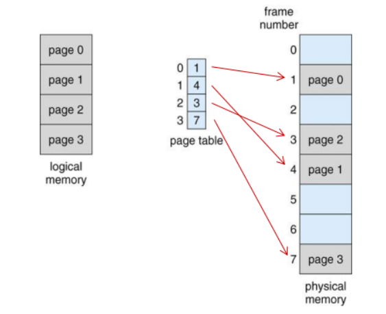

## 페이징 & 세그멘테이션

페이징 기법이란 프로세스의 주소 공간을 동일한 크기의 페이지 단위로 나누어 물리적 메모리의 서로 다른 위치에 분산해 저장하는 방식을 말한다.
페이징기법에서는 물리 메모리를 페이지와 동일한 크기의 프레임으로 나누어 놓고, 프로세스는 페이지가 필요해지면 페이지 테이블에 특정 페이지의 물리 메모리 주소를 요청하여 찾아가는 식으로 동작한다.
  
  
- 페이징 방식에서는 하나의 프로세스를 여러개로 나누어 저장하기 때문에 연속할당 방식에서 발생하던 동적 메모리 할당 문제는 발생하지 않는다.
- 물리 메모리는 모두 같은 단위의 페이징으로 나누어져 있으므로 모든 페이지에는 어떤 프로세스라도 들어갈 수 있다. 즉, 외부 단편화가 발생하지 않는다.
- 하지만 하나의 프로세스를 동일하게 나누면 마지막 페이지는 페이지 크기보다 작은 데이터만 가질 가능성이 있어 내부 단편화는 발생할 수 있다.
  
#### 주소 변환 기법
  
- 논리적 주소는 페이지 번호(p)와 순서를 나타내는 오프셋(d)로 이루어진다.
- 페이지 테이블은 페이지 번호와 매핑되는 인덱스(index)와, 해당 인덱스의 값인 항목(entry)로 이루어진다.
- 논리적 주소 pd 를 페이지 테이블을 거쳐 fd로 변환하고, fd를 조합해 물리적 메모리의 페이지를 찾아간다.
  

#### 페이지 테이블의 구현
CPU는 페이지 테이블에 접근하기 위해 테이블 기준 레지스터(page-table base register)와 테이블 길이 레지스터(page-table length register)를 사용한다.
테이블 기준 레지스터는 페이지 테이블의 시작위치를, 테이블 길이 레지스터는 페이지 테이블의 크기를 보관한다.
페이징 방식에서는 페이지 테이블에 접근하고 또 실제 물리메모리에 접근하기 때문에 물리 메모리 접근시 두번의 접근이 필요하여 오버헤드가 발생한다.
이런 오버헤드를 줄이기 위해 **TLB** 라고 불리는 고속 주소 변환용 하드웨어 캐시가 사용되기도 한다.  
***TLB(Translation Look-aside Buffer)** 
  
- TLB는 가격이 비싸 모든 페이지 테이블 정보를 담을 수 없어 빈번히 사용되는 정보만 담는다.
- TLB에 없는 페이지는 일반적인 페이지 테이블을 참조하는 형식으로 찾아간다.
- TLB는 모든 페이지 정보를 갖고 있지 않아 구조가 페이지 테이블과 달리 페이지 번호 + 프레임 번호의 구성으로 이루어져있다.
- 그래서 인덱스 접근이 가능한 페이지 테이블과 달리 TLB는 전체 탐색이 이루어지기 때문에, 이 속도를 향상시키기위해 병렬 탐색이 가능한 연관 레지스터(associative register)를 사용한다.
  
#### 계층적 페이징
페이지 테이블도 엄연히 데이터를 담고 있는 자료구조이므로 메모리 공간을 필요로하는데, 그 용량이 생각보다 작지가 않다. 
프로세스별로 적재될 가능성이 있는 모든 물리 메모리 위치를 가지는 페이지 테이블이 필요하기 때문인데, 32비트 운영체제에서 페이지 크기를 4Kb(4096byte)로 하였다면, 각 프로세스는 4MB 크기의 페이지 테이블이 필요하게 된다.
하지만 64비트 운영체제가 되면 메모리 용량이 거의 무한히 많아지므로 페이지 테이블 하나만 페타바이트 수준의 크기를 필요하게 된다.  
이런 문제를 해결하기위해 운영체제는 페이징을 여러 단계로 나누어 계층적 페이징을 구성한다.  
  
계층적 페이징이란 페이지 테이블에 대한 페이지 테이블을 두는 것으로, 1단계 페이징에 비해 공간적 이점을 크게 얻을 수 있다. 하지만 여러 단계로 페이지 테이블을 거쳐야 하므로 접근 시간적으로는 오버헤드가 발생한다.  
계층적 페이징에서는 페이지 테이블의 수만큼 페이지 번호를 여러개(p1,p2...) 갖게 된다.  
공간적 이득을 보기위해 페이지 테이블을 늘릴수록 시간적 불이익이 있는데, 이때 TLB를 함께 이용하면 시간적 손실을 상당부분 줄일 수 있게 된다.  

#### 역페이지 테이블
역페이지 테이블역시 페이지 테이블의 공간 차지문제를 해결하기 위한 대안이다. 역페이지 테이블은 논리주소에 대한 페이지를 두는 게 아닌 물리주소에 대한 페이지 테이블을 만드는 것이다.
즉 역페이지 테이블은 모든 프로세스가 공통으로 쓰는 페이지 테이블 하나만을 가진 구조가 된다.  
  
- 역페이지 테이블은 테이블에 프로세스번호(pid)와 페이지 번호(p)를 담고 있다.
- 이 방식에서는 주소 변환 요청이 들어올 시 해당 주소의 페이지가 물리메모리에 있는지 전체탐색을 수행하여 변환속도가 상당히 느리다.
- 그래서 주로 연관 레지스터에 보관해 병렬 탐색이 가능하게 하는 데에 사용을 한다.
  
#### 공유 페이지
공유 페이지란 여러 프로세스가 공통으로 사용할 수 있는 공유 코드를 담고 있는 페이지를 의미한다. 여러 프로세스에서 동일한 프로그램을 실행시킨다면 이는 굳이 프로세스별로 가질 필요가 없기 때문에 이런 공유 코드는 물리 메모리에 하나만 두고 읽기전용으로 관리하여 메모리 사용의 효율성을 높인다.
공유 페이지와 대비되는 개념을 사유 페이지(private page)라고 하는데, 이는 프로세스들이 공유하지 않고 독자적으로 사용하는 페이지를 말한다. 각 프로세스별로 데이터가 저장되는 구조를 보면 아래 그림과 같다.    
  

#### 메모리 보호
페이지 테이블의 각 항목에는 주소 변환 정보 외에도 메모리 보호를 위한 보호비트(protection bit)와 무효비트(valid-invalid bit)를 두고 있다.
- 보호비트 : 각 페이지에 대한 읽기-쓰기 / 읽기전용 등의 접근 권한을 설정하는 데에 사용된다.
- 유효-무효 비트 : '유효'로 설정된 경우 해당 페이지가 물리 메모리에 존재한다는 뜻이며, '무효'일 경우 프로세스가 그 주소를 사용하지 않거나, 백킹 스토어에 존재해 유효한 접근 권한이 없다는 의미이다.
  

### 세그멘테이션(Segmentation)

세그멘테이션기법은 프로세스의 주소공간을 의미단위의 세그먼트로 나누어 물리적 메모리에 올리는 기법을 의미한다.
하나의 프로세스를 구성하는 주소공간은 일반적으로 코드, 데이터, 스택 등의 의미 있는 단위들로 구성되어 있는데, 세그먼트는 이 주소공간을 기능단위 또는 의미 단위로 나눈 것을 뜻한다.
꼭 이런 단위만이 아니라 함수 하나하나를 각각의 세그먼트로 정할수도 있는데, 쟁점은 의미 단위로 나누면 각각의 크기가 균일하지 않다는 것이다. 그래서 물리 메모리를 찾아가는 과정이 페이징과 조금 다른데, 아래 그림을 참고해보자.  
  
- 세그멘테이션에서는 논리주소가 세그먼트 번호(s), 오프셋(d)으로 사용된다.
- 세그먼트 테이블의 각 항목은 기준점(base)과 한계점(limit)을 가지며, 기준점은 물리 메모리내의 세그먼트 시작위치를, 한계점은 세그먼트의 길이를 나타낸다.
- 세그멘테이션 테이블도 페이지 테이블처럼 기준 레지스터와 길이 레지스터를 갖는다.
- 논리 주소를 물리주소로 변환하기 위한 과정에 두가지를 확인한다.
  - 첫번째로는 세그먼트 번호가 세그먼트 테이블 항목의 한계점보다 작은지 확인하여 크다면 트랩을 발생시킨다.
  - 두번째로는 오프셋이 세그먼트 길이보다 작은지 확인하여 더 크다면 트랩을 발생시킨다.
- 페이징과 마찬가지로 보호비트와 유효비트를 두며, 공유 페이지와 같은 공유 세그먼트를 사용해 중복되는 데이터를 효율적으로 사용한다.
- 세그먼트는 의미단위로 나뉘어져 공유와 보안측면에서 페이징보다 훨씬 유리하다.
- 다만 세그먼트 크기가 균일하지 않아 외부 단편화가 발생할 수 있으며, 어디에 배치할 것인가하는 동적 메모리 할당문제와 같은 문제가 존재한다.
  
### 페이지드 세그멘테이션(Paged Segmentation)
페이지드 세그멘테이션은 페이징과 세그멘테이션 기법의 장점을 통합한 기법으로, 1차적으로는 프로그램의 주소공간을 의미단위로 나누지만 정해진 페이징 크기에따라 세그먼트도 페이징 단위에 따라 나뉜다는 특징을 갖는다.  
  
- 각 세그먼트의 크기는 동일한 크기의 페이지들의 집합으로 구성되어있으므로 외부 단편화 문제가 발생하지 않는다.
- 하지만 나누어진 페이지들에도 세그먼트 구분이 존재하여 프로세스간 공유나 접근제어등의 세그멘테이션의 이점을 그대로 사용할 수 있다.
- 계층적 페이징과 비슷하게 세그먼트 테이블, 페이징 테이블 이렇게 두 단계의 테이블을 거친다.
- 논리주소는 세그먼트 번호(s), 오프셋(d)로 구성되며, 먼저 세그먼트 테이블에 접근한다.
- 세그먼트 테이블에는 세그먼트 길이와 페이지 테이블 시작 주소가 있다.
- 오프셋이 세그먼트 길이를 넘어서지 않으면 오프셋을 상위,하위 비트로 나누어 상위비트는 세그먼트 내의 페이지 번호로 사용하고, 하위 비트는 페이지 내의 변위로 사용하게된다.
- 페이지 번호를 얻었으므로 물리 메모리의 페이지 번호와, 하위비트의 거리를 계산하여 페이지 프레임의 위치를 알아낸다.

