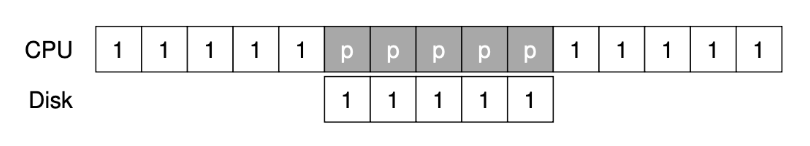
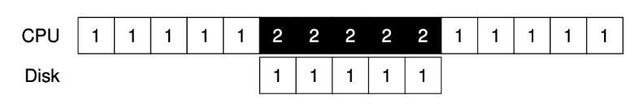
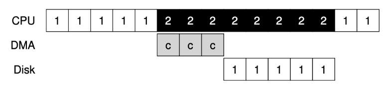
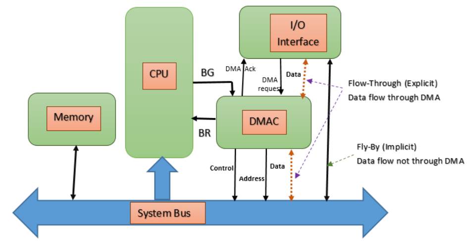

## 폴링(Polling), 인터럽트(Interrupt), DMA(Direct Memory Access)
폴링, 인터럽트, DMA는 모두 CPU가 외부 디바이스와 통신하는 방법과 관련된 기술이다.

### Polling

폴링은 cpu에서 주기적으로 외부 장치에 어떠한 이벤트가 발생했는지 상태를 확인하는 방법이다.
간단하고 예측 가능한 방식으로 구현되어 있지만, 외부장치에 특별한 이벤트가 없을 때에도 계속해서 장치를 체크하여 CPU리소스를 낭비하는 단점이 있다.
또한 일정 주기로 외부 장치의 이벤트에 반응하기 때문에 그만큼 즉각적인 반응은 어렵다는 단점 또한 존재한다.

### Interrupt

인터럽트는 이벤트가 발생한 장비가 cpu에 인터럽트를 발생시켜 즉각적으로 외부 장치에 대한 처리를 수행하도록하는 방식이다.
인터럽트는 정말 필요할 때만 CPU자원을 점유하므로 CPU를 효율적으로 사용할 수 있다는 장점이 있지만, 인터럽트 발생 시마다 컨텍스트 스위칭이 발생하기 때문에 잦은 인터럽트가 발생하는 상황에서는 컨텍스트 스위칭 비용이 커질 수 있다는 단점이 있다.

### DMA(Direct Memory Access)

DMA는 외부 장치와의 통신으로 대량의 데이터를 처리할 때 CPU에 가해지는 부담을 덜기위해 등장한 기술이다. 
본래는 CPU가 외부장치와 메모리 사이에서 데이터를 읽고 쓰는 작업을 수행하여 처리해야하는 데이터가 많다면 그만큼 CPU가 처리해야하는 작업도 많았지만, DMA를 사용하면 외부 장치가 DMA Controller를 통해 메모리에 대한 접근 권한을 얻어 CPU의 도움 없이 데이터를 읽고 쓸 수 있게 된다.
결과적으로 CPU는 대량의 I/O작업 수행시에도 각 작업의 시작과 끝에만 인터럽트가 수행되어 결과만을 처리하면 되므로 CPU의 활용성이 좋아진다고 할 수 있다.
> *DMA는 폴링, 인터럽트와 같은 속성의 개념이 아니므로 DMA를 사용한다고해서 폴링이나 인터럽트를 사용하지 못하는 것이 아니다. 다만 폴링과 DMA가 함께 사용되는 경우는 드물며 대부분 인터럽트 + DMA의 조합으로 사용한다.
> - DMA의 구조
>   