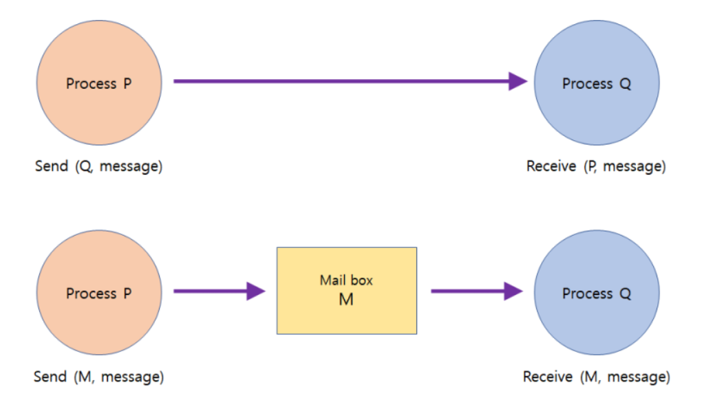

## 프로세스의 생성 & 프로세스의 협력 관계
리눅스 환경에서 프로세스의 생성은 최초 생성시에만 운영체제가 직접 생성하고, 이후에는 프로세스가 fork() 시스템을 통해 자가복제를 하여 추가 프로세스를 생성한다.
이렇게 복제되어 생성된 프로세스를 자식프로세스라고 하고, 원본 프로세스를 부모프로세스라고 한다. 이렇게 프로세스를 생성하고 종료하는 것과 관련된 아래와 같은 시스템 콜 함수들이 존재한다.  

### 프로세스 생성&삭제 함수
  
***프로세스 생성 과정**

#### 1. fork()
fork() 함수는 현재 프로세스를 복제하는 시스템 콜 함수이다. fork()를 통해 복제된 자식 프로세스는 부모프로세스와 code, data, heap, stack 모든 메모리 영역도 그대로 복제되고, PCB역시 복제가 된다.
결국 자식프로세스는 부모프로세스와 프로세스 ID만 다를 뿐 모든 것이 동일한 상태로 생성되는 것이다.
그리고 이렇게 복제된 프로세스를 구분하는 유일한 방법은, fork() 수행시 리턴되는 값이 0인지 1인지를 확인하는 것이다. fork()시 부모프로세스라면 1이, 자식프로세스라면 0이 반환된다.
  
#### 2. exec()
exec() 함수는 현재 프로세스의 메모리 공간을 다른 프로그램의 메모리 공간으로 덮어 씌우는 함수이다. 메모리와 PCB까지 모두 덮어씌워지기 때문에 이 프로세스는 기존의 프로세스와 연관이 없는 완전히 새로운 프로세스가 된다. 리눅스에서는 새로운 프로그램 실행 시 fork(), exec()를 통해 새로운 프로세스를 생성한다.
  
#### 3. wait()
wait()은 함수는 현재 프로세스를 자식프로세스가 종료될 때까지 block시키는 함수이다. wait()을 호출하면 부모 프로세스는 cpu점유 권한을 자식프로세스에게 넘겨주고 자신은 block상태로 돌입하여 자식 프로세스가 종료되기까지 무한정 대기하는 동기식 프로세스가 된다. 리눅스 터미널에서 특정 명령을 실행하면 해당 명령이 완료되기까지 터미널이 사용 불능 상태가 되는 것이 wait() 함수에 의한 것이다.
  
#### 4. exit()
exit() 함수는 현재 프로세스를 정상 종료시키는 함수이다. 일반적으로 main함수에서 모든 코드를 실행한 뒤 호출된다.
  
#### 5. abort()
abort() 함수는 현재 프로세스에서 다른 프로세스를 강제 종료 시키는 함수이다. 보통 부모 프로세스에서 자식 프로세스가 모든 작업을 마쳤는데 종료되지 않는 상태나, 자식 프로세스가 너무 많은 메모리를 점유한 상태, 또는 터미널에서 ctrl+c 등으로 키보드 인터럽트를 발생시킨 상태 등에 호출된다.
  

### 프로세스들간의 협력 관계
일반적으로 프로세스들은 각자만의 주소공간을 가지고 다른 프로세스의 주소공간으로의 접근이 허용되지 않는다. 이는 부모프로세스와 자식프로세스 관계에서도 마찬가지로, wait()을 통해 부모를 블록시키지 않는 이상 부모와 자식프로세스는 CPU자원 점유의 경쟁관계에 있게 된다.
하지만 경우에 따라 각각의 프로세스들끼리도 협력을 할 때 작업의 효율성이 더욱 증대되는 경우도 있어 운영체제는 프로세스들 간의 협력방식또한 제공하고 있다.

#### IPC(Inter Process Communication)
IPC는 프로세스간 통신을 하는 매커니즘으로, 독립적인 프로세스들이 IPC를 통해 서로의 데이터를 공유할 수 있게 된다. IPC의 방식은 다시 메시지 전달 방식과 공유 메모리 방식으로 나누어진다.
  
#### 1. 메시지 전달(Message Passing) 방식  

메시지 전달 방식은 프로세스 끼리 직접적인 통신을 하는 것이 아닌, 프로세스가 커뮤니케이션 링크를 생성하고 다른 프로세스와 공유할 데이터를 커널에 전달하여 커널이 해당 프로세스로 데이터를 전달해주는 식으로 구현된다.
그리고 이 메시지 전달 방식 또한 직접 통신과 간접 통신 방식이 있는데, 두 방식의 차이는 아래와 같다.
- **직접 통신**
  - 직접 통신 방식은 데이터를 전달할 프로세스를 직접 명시하여 전달하는 방식이다. 커뮤니케이션 링크가 전달할 프로세스와 1:1관계를 갖도록 생성되고 커널은 전달할 프로세스를 확인하고 전달해준다.
- **간접 통신**
  - 간접 통신 방식은 전달받을 프로세스로 다이렉트로 보내는 것이 아닌 메일 박스라는 인터페이스로 전달하는 방식이다. 커뮤니케이션 링크는 메일박스와 연결되며, 메일박스는 전달받은 데이터에서 목적지 프로세스를 확인하여 해당 프로세스들과 커뮤니케이션 링크를 생성하여 전달한다. 즉, 1:N관계로 메시지가 전달된다.

#### 2. 공유 메모리(Shared Memory) 방식  

공유메모리 방식은 메모리 공간에서 프로세스들끼리 공유할 메모리를 두어 해당 메모리에서 데이터를 다루는 방식으로 프로세스들 간의 협력을 이루어낸다.
정확히는 각 프로세스별로 별도의 메모리 주소를 갖지만, 메모리 주소 내에 프로세스들끼리 동일한 물리 주소를 갖는 공유 메모리 공간을 추가적으로 두는 것이다.
이 방식은 데이터 공유를 쉽게 할 수 있지만, 프로세스들간의 데이터 일관성 문제가 유발될 수 있으며 이를 커널이 책임지지 않기 때문에 프로세스에서 이 문제의 예방에 대해 책임져야한다.

