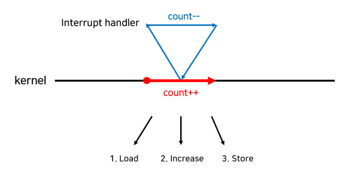
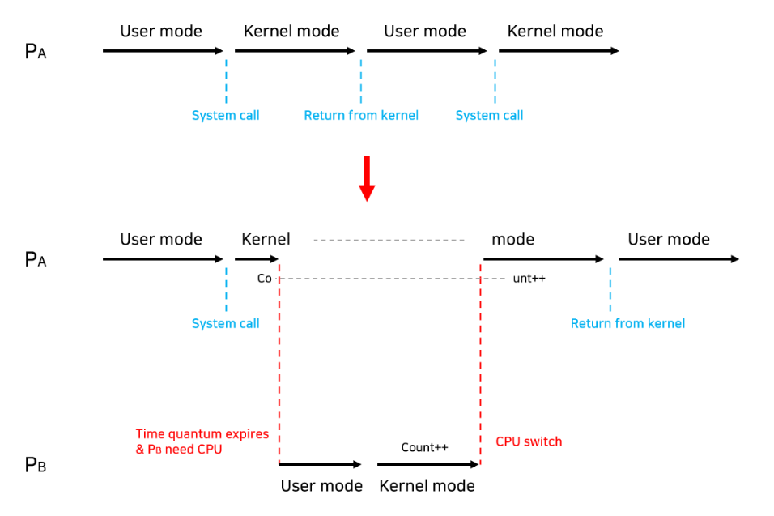
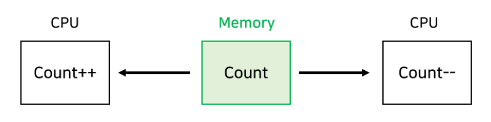
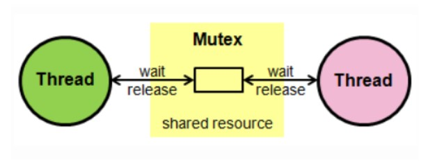
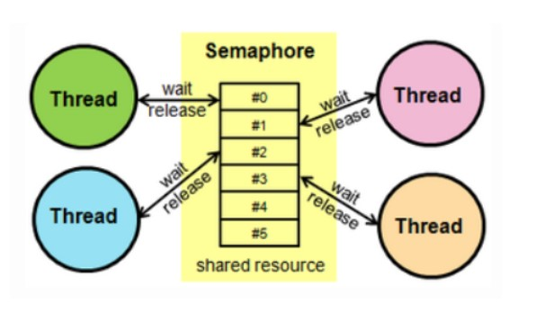
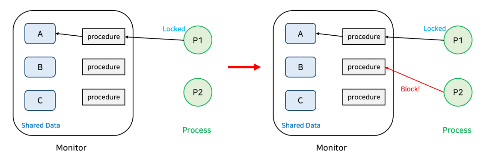
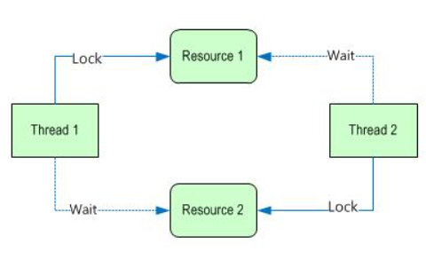
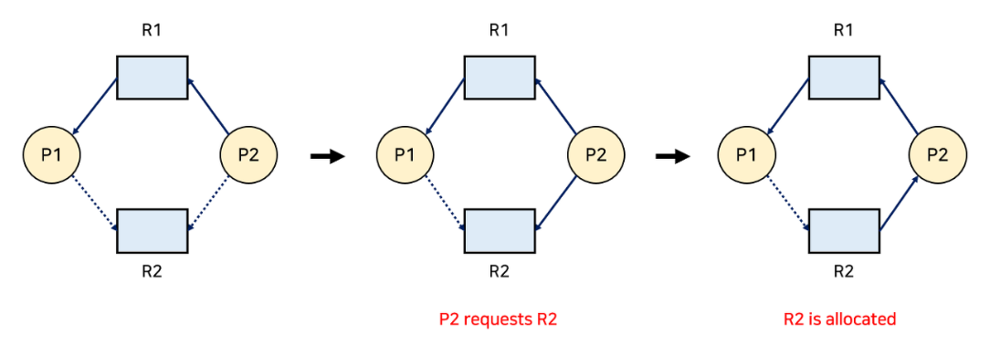

## 프로세스 동기화

프로세스 동기화란 여러 프로세스가 동시에 같은 자원을 공유하며 실행될 때 자원의 일관성을 유지하는 기법을 의미한다.
여러 프로세스가 같은 자원을 공유하면 메모리를 효율적으로 사용할 수 있다는 장점이 있지만, 공유자원에 대한 삽입, 삭제, 수정 등의 작업이 일어나는 경우 각 프로세스들 간에 같은 자원을 서로 다르게 해석하는 문제(Race Condition)가 발생할 수 있으므로 동기화 작업은 필수라고 할 수 있다.
그리고 현대에는 프로세스간의 동기화 보다는 스레드간의 동기화가 더욱 활발하므로 스레드 동기화라고도 부른다.
  
### 경쟁 상태(Race Condition)
경쟁 상태란 여러 프로세스들이 동시에 공유 자원에 접근하는 상황에서, 어떤 순서로 접근하느냐에 따라 결과 값이 달라질 수 있는 상황을 의미한다. 즉, 프로세스들간의 데이터 불일치를 발생시킬 수 있는 상황으로서, 프로세스간의 실행 순서를 정해주는 동기화 매커니즘이 필요하다.  

경쟁 상태는 대표적으로 아래와 같은 세가지 상황에서 발생할 수 있다.  

#### 1. 커널 모드로 수행 중 인터럽트가 발생하는 경우
  
위와 같은 처리 흐름에서, 커널 모드에서의 작업은 count++로 값을 증가시켰다가, 작업이 끝난 후 다시 count--로 값을 감소시키며 초기상태로 되돌려 놓는 작업이지만, 커널 작업이 완료되기 전에 인터럽트가 발생하여 다른 프로세스에서 count에 접근하는 경우, 초기 값이 아닌 count++에 의해 증가된 값을 확인하게 되어 의도한 바와 다르게 데이터를 해석하게 된다.  
이러한 문제는 커널 모드의 수행이 끝나기 전에는 인터럽트를 받지 않도록 하는 방법(disable/enable)으로 문제를 해결할 수 있다.
  
#### 2. 프로세스가 커널 모드에서 작업중인 상태에서 Context Switch가 발생하는 경우
  
Pa 프로세스가 작업 중 시스템 콜을 통해 커널모드로 진입하여 작업을 처리하고 있었는데, 선점형 스케줄러에 의한 컨텍스트 스위치가 발생하여 Pb 프로세스로 CPU 제어 권한이 넘어갔다. 그리고 Pb에서도 시스템콜로 커널모드에 진입하게 되면, 아직 Pa의 작업이 완료되지 않은 상태의 데이터에 접근할 수 있게 된다.  
이는 커널 모드가 수행중일 때는 해당 프로세스가 선점되지 않도록 하고, 유저모드로 되돌아 오면 선점되게 함으로써 해결할 수 있다.
  
#### 3. 멀티 프로세서에서 공유 메모리 내의 커널 데이터에 접근하는 경우
  
멀티 프로세서 환경에서 여러 CPU가 동시에 커널의 자원에 접근하는 경우 발생할 수 있다. 이런 경우 커널자체에 lock을 걸면 처리 성능이 저하되므로, 각 프로세서가 접근 중인 데이터에 대해서만 lock을 거는 방식으로 해결할 수 있다.
  

### 임계 영역(Critical Section)
임계 영역이란 코드 상에서 race condigtion을 유발할 수 있는 부분을 의미한다. 즉, 공유 데이터를 접근하는 부분을 의미하는 것이다.
critical section에서 발생하는 race condtion문제를 예방하기 위해서는 아래와 같은 조건들을 만족해야 한다.
  
#### 1. 상호 배제(Mutual Exclusion)
- 이미 한 프로세스가 critical section에서 작업중이면 다른 프로세스는 critical section에 진입해서는 안 된다.
  
#### 2. 진행(Progress)
- Critical section에서 작업중인 프로세스가 없다면, critical section에 진입하고자 하는 프로세스가 있을 경우 진입할 수 있어야 한다.
  
#### 3. 한정 대기(Bound Waiting)
- 프로세스가 critical section의 진입을 요청한 후 다른 프로세스들이 이 프로세스보다 먼저 cirtical section에 진입하는 횟수의 제한이 있어야 한다. 즉, 프로세스가 critical section에 진입하기 위해 대기를 해선 안 된다는 뜻이다.
  
  
### 임계 영역 문제의 해결
그리고 이런 임계영역 해결 조건을 만족하는 알고리즘으로는, **피터슨 알고리즘**이란 것을 사용한다. 이 알고리즘은 간단히 말해서 선양보 알고리즘이라고 할 수 있다. 임계영역에 진입하고싶은 프로세스는 먼저 임계영역에 진입하고 싶다고 선언을 한 후, 다른 프로세스도 진입하고 싶어하는 프로세스가 있는지 확인을 한다. 만일 그런 프로세스가 존재하면 그 프로세스가 먼저 진입할 수 있도록하고, 서로 양보 중이라면 먼저 선언한 프로세스가 진입하도록 하는 알고리즘이다.
  
```groovy
// Peterson's Algorithm
do { // 프로세스 i의 임계 영역
    
    // 프로세스 i가 임계 영역에 진입하고 싶다고 알리기 위한 플래그
    flag[i] = true;
    
    // 프로세스 j에게 turn(진입 순서)를 양보
    turn = j; // 1
    
    // j의 턴이 끝날때까지 반복문을 수행하며 기다림
    while (flag[j] && turn == j); // 2 busy waiting
    
    // j의 턴이 끝나면 반복문 종료 후 임계영역 진입
    cirtical section
    
    // 임계영역 작업 완료 후 flag를 되돌림
    flag[i]=false;
    
    remainder section

} while (true);
```  
다만 이 알고리즘은 스레드가 자기 차례가 오기까지 지속적으로 반복문을 수행하며 차례를 확인하며 cpu 자원을 소모하는 **busy waiting** 문제가 존재한다.  

#### 커널 영역에서의 critical section 제어 방법

위의 피터슨 알고리즘은 커널상의 사용자 영역, 즉 애플리케이션 코드 레벨에서 임계 영역 진입을 컨트롤하는 방법이다. 이런 사용자 영역 외에 커널 영역에서도 임계 영역에 대한 접근을 컨트롤하는 기법들이 있다.

#### 뮤텍스(Mutex)  
  
뮤텍스는 임계 영역에 하나의 스레드만 접근하게하여 상호 배제를 달성하는 기법이다. 뮤텍스는 key에 해당하는 객체가 있으며, 오직 이 key를 소유한 스레드만이 임계영역에 접근할 수 있다. 일단 key를 소유한 스레드가 임계영역에 접근하면, 해당 스레드는 임계영역에 lock을 걸고 작업을 수행한 후 임계영역에서 빠져나오며 lock을 해제하고 key를 반납하는 식으로 동작한다.  
이 때 key에 해당하는 객체는 두 스레드가 동시에 소유할 수 없다. 그리고 피터슨 알고리즘과 마찬가지로 뮤텍스 역시 busy waiting 문제가 존재한다.


#### 세마포어(Semaphore)  
  
세마포어는 임계영역에 진입할 수 있는 스레드의 수를 설정하고 해당 스레드만큼만 진입을 허용하는 기법이다. 세마포어는 진입 가능한 스레드의 개수에 따라 두가지로 나눌 수 있다.
- **이진 세마포어(Binary Semaphore)**: 정수 값이 0 또는 1이다. 즉, 하나의 스레드만 진입 가능하다. 이는 동작 방식을 제외하면 뮤텍스와 사실상 동일한 효과를 낸다고 할 수 있다.
- **카운팅 세마포어(Counting Semaphore)**: 정수 값의 범위가 0이상으로 제한이 없다. 즉 여러개의 스레드가 임계영역에 진입할 수 있다.
  
또한 세마포어는 자원의 획득과 반납을 수행하는 두가지의 원자적(atomic) 연산으로 수행된다.
- wait(): 자원을 획득하는 연산. count--
- signal(): 자원을 반납하는 연산. count++
  
자원의 잠금과 해제를 오로지 key를 소유한 자신만 할 수 있는 뮤텍스와 달리, 세마포어는 다른 스레드가 다른 스레드의 자원을 해제할 수도 있다.  
세마포어는 뮤텍스에 비해 구현이 좀 더 복잡하고, 자원도 더 사용하지만 여러 프로세스를 동시처리 할 수 있으므로 다중 프로세스 환경에서 더 효과적이다.
반면에 뮤텍스는 비교적 경량이고 lock으로 확실한 상호 배제가 가능하므로 주로 멀티 프로세스보다는 멀티 스레드에서 단일 스레드만 접근 가능하도록 제한하는 데에 사용된다.


#### 모니터(Monitor)
  
모니터는 세마포어의 단점을 보완한 동기화 매커니즘이다. 세마포어는 V(), P()등의 함수를 개발자가 직접 호출하도록 작성해야하고 이로인해 실수가 발생할 가능성이 있으며, 결과적으로 정확성을 입증하기 힘들다는 단점이 있었다.
하지만 모니터는 이런 복잡한 구현 없이 사용할 수 있는 고수준 추상화 모듈로서, 공유 자원에 접근하는 프로시져(procedure)들을 두고 그 프로시져들을 관리하는 모니터를 두어 오직 프로시져를 통해서만 공유자원에 접근이 가능하게하는 방식이다.  
모니터는 구현 수준에 따라 다르긴 하지만 일반적으로 한번에 하나의 프로세스만이 모니터에 접근할 수 있고, 이미 어떤 프로세스가 접근 중이라면 다른 프로세스는 모니터 큐에 대기하게 된다. 그리고 이런 모니터 큐를 관리하기위한 조건 변수를 활용하는데, 이는 세마포어의 wait() signal()과 유사한 동작을 하지만 자체적인 값을 가지진 않고 오직 큐에 대기시키거나 깨우는 역할만을 한다.


### 데드락(Dead lock)
  
데드락이란 두 개 이상의 프로세스나 스레드가 각자 자원을 소유한 채, 다른 쇼유자의 자원을 요청하는 경우 누구도 자원 반납 조건을 충족하지 않아 무한히 대기하는 현상을 의미한다.
  
#### 데드락 발생 조건
데드락은 아래와 같은 조건들이 모두 충족되는 경우 발생할 수 있다. 한 가지 조건이라도 충족하지 않으면 데드락은 발생하지 않는다.
  
1. 상호배제(Mutual Exclusion) : 동일한 자원은 동시에 하나의 프로세스만 사용할 수 있다.
2. 점유와 대기(Hold and wait) : 자원을 가진 프로세스가 다른 자원을 요청할 때, 보유한 자원을 놓지 않고 있다.
3. 비선점(No preemption) : 프로세스는 OS에 의해 강제로 자원을 빼앗기지 않는다.
4. 환형대기(Circular wait) : 자원을 기다리는 프로세스간의 사이클이 형성 되어 있다.
  
#### 데드락 해결 방안
데드락 해결 방안에는 크게 예방 기법, 회피 기법, 복구 기법, 무시가 있다.

#### 1. 예방 기법
데드락의 4가지 발생 조건 중 하나 이상의 조건이 충족되지 않도록하여 데드락을 예방하는 기법이다.

1. Mutual Exclusion : 이 조건은 예방 기법으로 해결할 수 없다. race condition 방지를 위해서는 필수로 충족되어야하는 조건이기 때문이다.
2. Hold and wait : 프로세스를 시작할 때 필요한 모든 자원을 한번에 점유하거나, 자원이 필요한 경우 보유중인 모든 자원을 반납하는 식으로 설계한다.
3. No preemption : 프로세스가 다른 자원을 요청하며 대기상태에 돌입한 경우에는 가지고 있던 자원을 다른 프로세스가 선점할 수 있도록 한다.
4. Circular wait : 자원의 타입에 따라 프로세스마다 할당 순서를 정하여 순서대로 자원을 할당한다.
  
이런 식으로 데드락을 미리 예방할 수 있지만 이런 방법들은 작업의 처리 효율을 감소시키고 기아 현상을 유발할 수도 있다.
  
#### 2. 회피 기법
데드락이 발생할 가능성이 있는 경우에는 아예 자원을 할당하지 않는 방법이다. 일반적으로는 각 자원 별로 최대 사용량을 미리 지정하는 방법이다.  
이 기법은 자원 요청 시 자원 상태를 Safe state / Unsafe state 로 구분하여, unsafe state에는 자원을 할당하지 않느 식으로 구현한다.
Safe state란 Safe Sequence가 존재하는 상태로, 프로세스들의 보유 자원이 공유 자원의 가용자원을 넘지 않는 상태이다.  
그리고 이런 회피 기법을 구현하는 알고리즘으로는 아래와 같은 두가지의 알고리즘이 있다.
  
1. #### 자원 할당 그래프 알고리즘  
    
    각 자원 타입마다 하나의 인스턴스만 존재하는 경우 사용할 수 있는 알고리즘이다.
    - 점선 : 미래에 이 자원을 요청할 수 있음을 의미한다.
    - 실선 : 자원을 요청한 상태 또는 자원을 할당 받은 상태를 의미한다. 방향이 프로세스를 향하면 할당받은 상태이다.
   
    자원을 요청한 상태에서 실제로 할당을 받으면 화살표가 반대방향으로 바뀌게 된다. 이런 점선을 포함한 화살표들이 사이클을 형성하지 않을 때에만 요청된 자원을 할당한다.

2. #### 은행원 알고리즘(Banker's Algorithm)
   각 자원타입에 여러 인스턴스가 존재하는 경우에는 간선만으로는 자원 그래프를 그릴 수 없으므로 이 은행원 알고리즘을 사용해야 한다.  
    이 알고리즘은 최초 설명했던 것처럼 자원의 가용가능한 양을 미리 지정해두고 가용량을 넘어서면 자원을 할당하지 않는다.  
    모든 자원을 할당 받은 경우에는 유한 시간 안에 자원들을 다시 반납한다. 이렇게 할당받고 반납받으며 동적으로 변하는 가용량에 따라 할당 가능한 프로세스들에게 할당해주며 모든 프로세스를 처리한다.


#### 3. 복구 기법
복구기법은 데드락 상태가 발생하면 프로세스의 자원을 해제시키거나 프로세스 자체를 종료시킴으로써 데드락을 해결하는 기법이다.  
이 방법은 어던 프로세스를 희생시켜(victim) 복구를 할지 결정해야하므로 여러가지 판단 기준이 존재한다. 일반적으로는 프로세스의 중요도, 실행 시간, 자원 사용량 등등 여러가지 기준으로 선정하는데, 이 경우 특정 프로세스가 계속해서 낮은 중요도를 획득하여 반복적으로 victim으로 선정되어 기아상태가 발생할 수 있다. 이런 경우 노화 기법과 같이 롤백된 횟수를 저장하여 해당 값만큼 중요도를 높이는 식으로 해결한다.
  
#### 4. 무시
기본적으로 데드락이 발생하지 않는다고 가정하고 아무런 조치도 취하지 않는 방법이다.
데드락 자체가 발생 빈도가 매우 낮기 때문에 데드락 방지를 위해 사용하는 여러 알고리즘의 오버헤드가 더 큰 경우, 이렇게 무시를 하는 게 성능상 이점이 더 큰 경우 사용한다.
이런 경우 발생한 데드락은 사용자가 직접 이상을 탐지하고 프로세스를 직접 종료시키는 식으로 해결해야 한다.  
이는 현대의 많은 OS(Unix, Window 등)에서 채택하고 있는 방식이다.
  

