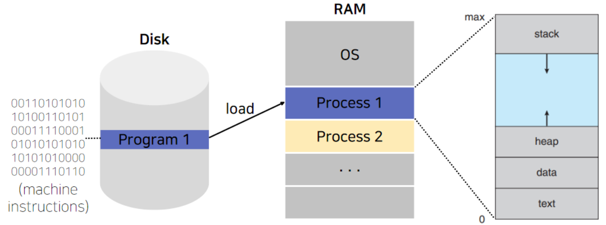
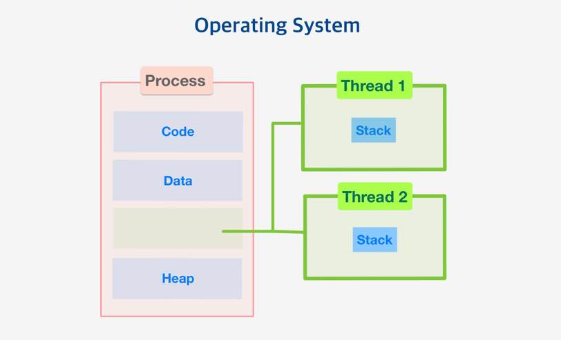
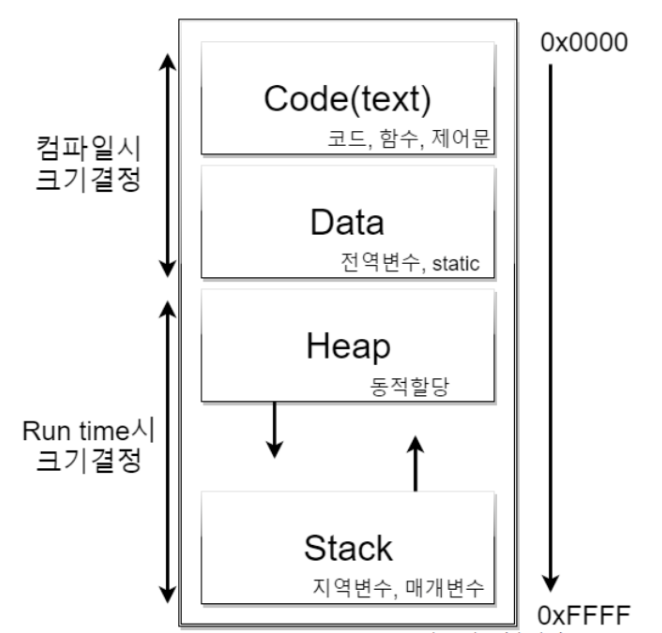

## 프로그램, 프로세스, 스레드

### 1. 프로그램(Program)이란?
프로그램은 어떤 작업을 수행하기 위해 개발자가 프로그래밍 언어를 통해 작성한 코드들의 집합을 실행 가능한 형태로 변환해 디스크에 적재한 정적인 파일이다.
윈도우의 경우 우리가 익히 아는 .exe파일이 대표적이며, 자바의 빌드 파일인 jar나, 배치파일인 bat등도 프로그램으로 볼 수 있다. 또한 우리가 직접 실행하지는 않더라도 운영체제가 스스로 실행하는 여러 시스템 프로그램들도 존재한다.
#### 프로그램의 실행
이런 프로그램을 실행한다는 것은 크게 두가지 의미를 갖는다. 첫째는 디스크에 존재하던 실행파일을 메모리에 적재한다는 의미이고, 둘째는 프로그램이 명령을 수행하기위해 CPU를 할당받는다는 뜻이다. 그리고 이렇게 실행되어 수행중인 단위를 프로세스라고 부른다.

### 2. 프로세스(Process)란?
프로세스는 프로그램을 실행시키면 생성되는 프로그램의 실행의 단위, 프로그램의 인스턴스이다.
프로그램 하나당 반드시 하나의 프로세스가 존재하며, 그 이상이 존재할 수도 있다. 프로그램이 디스크에 존재하는 정적인 코드라면 프로세스는 메모리에 존재하는 동적인 코드라고 볼 수 있다. 

#### 프로세스의 특징
- 프로세스는 각각 code, data, stack, heap 구조로 이루어진 독립된 메모리 영역을 할당받는다.
- 각 프로세스는 별도의 주소공간에서 실행되기 때문에 프로세스끼리 메모리를 공유할 수 없다. 즉, 다른 프로세스의 변수나 자료구조에 접근할 수 없다.
- 다만 IPC(Inter Process Communication)라는 통신 방법을 이용하면 프로세스간의 통신도 가능해진다.
- 프로세스는 최소 하나 이상의 스레드를 갖는다.

***프로그램과 프로세스의 구조**  

### 3. 스레드(Thread)란?
스레드는 프로그램과 프로세스의 관계와 같이 프로세스가 생성되면 동시에 생성되는 프로세스 작업의 단위이다.
프로세스당 최소 하나의 스레드를 가지며, 그 이상 생성될수도 있다.
스레드는 프로세스 작업들의 병렬처리를 위해 존재하는 것으로, 스레드를 활용하면 하나의 프로세스에서 동시에 여러가지의 작업의 동시처리가 가능해진다.
> 프로세스나 스레드나 모두 동시처리가 가능한 것처럼 보이지만 내부 동작으로 보면 병행성과 병렬성이라는 차이가 있다.
> - 병행성 : 여러 작업이 **동시에 처리되는 것 처럼**보이는 특징. 프로세스의 시분할 처리가 대표적이다.
> - 병렬성 : 여러 작업이 **실제로 동시에 처리**되는 것. 단일 코어에서는 불가능하고 멀티코어 시스템에서 구현 가능하다.

#### 스레드의 특징
- 각 스레드는 독자적인 stack을 갖고, data, heap, code 영역은 프로세스와 공유한다.
- 프로세스의 메모리를 이용하기 때문에 각각의 스레드간의 자원 공유에 제약이 없다.
- 다만 자원을 공유함으로 인해 동기화, 데드락 문제가 발생할 수 있다.
- 스레드는 무수히 많이 생성할 수 있지만, cpu 코어 개수 이상의 스레드는 병렬처리가 불가능하다.

***프로세스와 스레드의 구조**  

### 4. 프로세스와 스레드의 메모리 공간

#### 프로세스의 메모리 영역
프로세스의 메모리 공간은 위의 그림과 같이 4개의 영역으로 나뉜다. 각각의 영역은 아래와 같은 데이터를 저장한다.
- **Code(text)** : 코드 영역은 프로그래머가 작성한 프로그램 함수들의 코드가 CPU가 해석 가능한 기계어 형태로 저장된 영역이다.
- **Data** : 코드가 실행되면서 사용하는 전역변수나 각종 데이터들이 모여있다. 데이터 영역은 .data, .rodata, .BSS로 세분화 된다.
  - .data : 전역 변수 또는 static 변수 등 프로그램이 사용하는 데이터를 저장
  - .BSS : 초기값 없는 전역 변수와 static 변수가 저장
  - .rodata : const, final과 같은 상수 키워드가 선언된 변수 및 String literal등이 저장
- **Heap** : 객체, 생성자와 같이 동적으로 할당되는 데이터들이 저장되는 공간이다. 사용자에 의해 메모리 공간이 동적으로 할당되고 해제된다.
- **Stack** : 함수의 호출과 함께 발생하며, 함수 내에서 사용되는 지역변수와 같은 데이터가 저장되는 독립적인 공간이다. 무한 루프에 의한 Stack overflow 에러가 이곳에서 발생하는 에러이다.

#### 각 메모리 영역의 크기 결정
- Code영역과 Data영역은 크기가 프로그램 컴파일시에 결정되고 이후에는 변경될 수 없다.  
- Heap영역은 크기가 런타임에 결정되는데, 정확히는 프로그램 실행시에 결정되고 이후에는 Heap의 크기도 변경이 불가능하다. JVM옵션의 -Xms -Xmx 등이 Heap의 크기를 설정하는 옵션이다.  
- Stack영역은 반면에 런타임중에 동적으로 크기가 늘었다 줄어들 수 있다. 스레드별로 소유한 여역이기에 스레드가 생성되고 소멸됨에 따라 스택영역의 크기도 동적으로 변화하는 것이다.

#### 스레드의 메모리 영역
스레드는 프로세스 영역의 메모리중 스택만을 각각의 스레드가 갖고, 스택의 코드를 실행시키고 저장시킬 Register와 PC(Program Counter)도 갖는다. 

