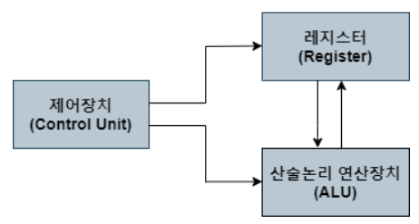

## 레지스터
   
### 레지스터(Register)란?
- CPU내부에서 명령어 또는 연산을 처리하면서 발생하는 데이터를 일시적으로 기억하는 장치
- 주 기억장치(RAM) 보다 용량이 적지만 처리 속도가 가장 빠르다.
- 휘발성 메모리이며, 읽고 쓰기가 가능하다.

### CPU 구성요소

- 컴퓨터에서 데이터 처리를 수행하는 부분을 CPU라 함
- CPU는 크게 아래와 같은 세가지 구성요소로 이루어져있다.
  1. #### 레지스터 세트
     - 명령을 실행하는데 필요한 데이터를 보관하는 역할
  2. #### 산술 논리 장치(ALU)
     - 명령을 수행하기위한 마이크로 연산을 수행하는 역할
  3. #### 제어 장치(Control Unit)
     - 레지스터 세트간의 정보 전송을 감시하는 역할
     - ALU에게 수행할 동작을 지시하는 역할

### 명령어 실행에 필요한 내부 레지스터들
    1. 프로그램 카운터(PC, Program Counter)
        - 다음에 인출할 명령어의 주소를 가지고 있는 레지스터
        - 각 명령어 인출 이후, 자동적으로 일정 크기만큼 증가
        - 분기(Brunch) 명령어가 실행되는 경우 목적지 주소로 갱신
    2. 누산기(AC, Accumulator)
        - 데이터를 일시적으로 저장하는 레지스터(tmp 변수를 담는 버퍼 역할)
        - 레지스터의 길이는 CPU가 한번에 처리할 수 있는 데이터 비트수(단어 길이)와 동일
    3. 명령어 레지스터(IR, Instruction Register)
        - 가장 최근에 인출된 명령어가 저장되어 있는 레지스터
    4. 기억장치 주소 레지스터(MAR, Memory Address Register)
        - PC에 저장된 명령어 주소가 시스템 주소 버스로 출력되기 전에 일시적으로 저장되는 주소 레지스터 
    5. 기억장치 버퍼 레지스터(MBR, Memory Buffer Register)
        - 기억장치에 쓰여질 데이터, 혹은 읽혀진 데이터를 일시적으로 저장하는 레지스터

    