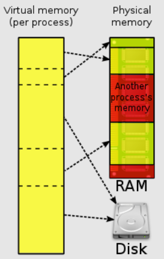
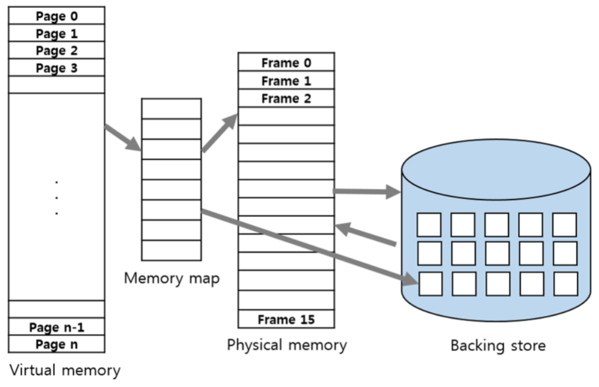
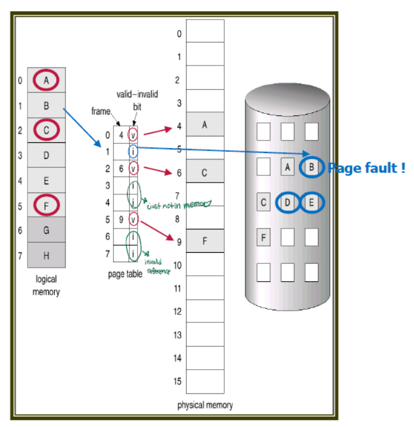
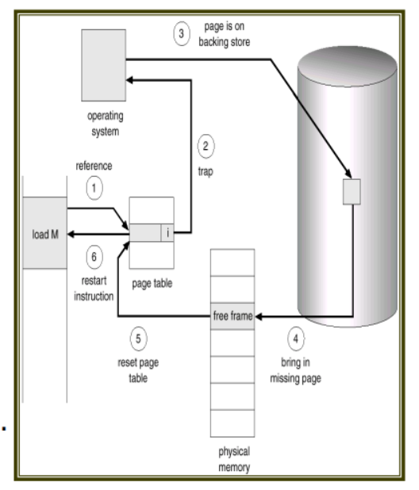

## 가상 메모리와 페이지 교체 알고리즘
- - -
### 가상메모리(Virtual Memory)

가상메모리란 메인 메모리(RAM)의 한정된 공간의 문제를 해결하기 위한 메모리로, 
프로세스에 이용되는 메모리를 추상화하여 효율적으로 메모리를 사용하게하는 기술이다.
가령 30Mb의 메모리를 사용하는 프로세스를 구동시킨다면, 모든 순간에 항상 30bM의 데이터가 필요하지는 않을 것이므로
가장 중요하고 빈번하게 사용되는 10M의 데이터만을 메인 메모리에 로드 시킨뒤, 나머지 20M의 데이터는
추상화하여 가상메모리에 물리 주소만을 남겨두는 방식으로 동작한다.

- #### 요구페이징(Demand Paging)
  
  
  
  위 설명에서 말했듯 프로그램 실행에 모든 메모리가 필요한 것은 아니기에, 프로그램 실행에 필요한 부분과 필요하지 않은 부분을 
  페이지로 나누어 필요한 페이지만 메모리에 적재하는 기술이 요구 페이징이다. 당장 필요 없는 페이지들은 Backing Store에 저장해뒀다가
  해당 페이지가 필요해지면 메모리에 올리게 된다.
  
  프로그램 실행시 필요할 것 같은 페이지를 미리 메모리에 올려놓는 방식을 pre-paging이라고 하고, 필요해지기 전까지는
  어떠한 페이지도 메모리에 올리지 않고 실행하는 것을 Pure demand paging이라 한다.

- #### Valid-Invalid Bit
  
  요구 페이징 기법을 사용하면, 페이지 테이블의 데이터는 메모리 또는 Backing Store에 존재하게 된다.
  Backing Store에 존재한다면 물리 메모리에 적재하는 과정을 거쳐야하므로, 현재 페이지가 어떤 상태인지 판단할 flag값이 필요한데,
  이를 valid-invalid bit라고 하며, 페이지 테이블에는 기본적으로 페이지와 이 v/i bit가 존재하게 된다.
  valid(1) invalid(0) 상태로 구분하며, 페이지 테이블 접근시 만일 invalid 상태라면 페이지 부재(Page Fault)가 발생하게 된다.   

- #### Page Fault
  
  1. MMU(Memory Management Unit)가 Page Fault를 발생시키면, OS는 backing store에서 해당 페이지를 찾는다
  2. 만일 이 과정에서 페이지가 존재하지 않는다면 부적절한 참조(Invalid Reference)로 판단하고 프로세스를 중지한다.
  3. backing store에 존재한다면 물리 메모리의 프레임(frame)에 페이지를 읽어오는데, 
     만일 빈 프레임이 없다면 페이지교체 알고리즘에 따라 기존 페이지를 교체한다
  4. 위 작업이 끝나면 페이지 테이블을 리셋하여 valid-invalid 상태를 업데이트 한다
  5. 프로세스를 다시 실행한다.

### 페이지 교체 알고리즘
https://code-lab1.tistory.com/60
    

