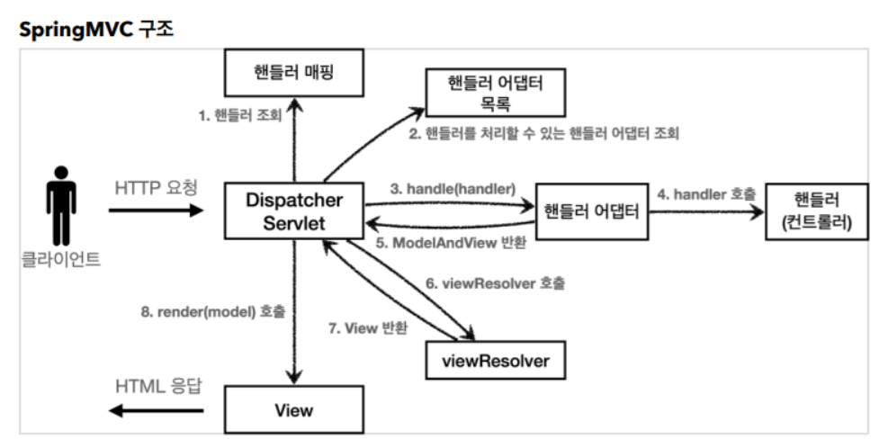
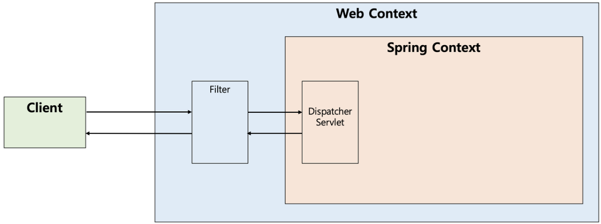
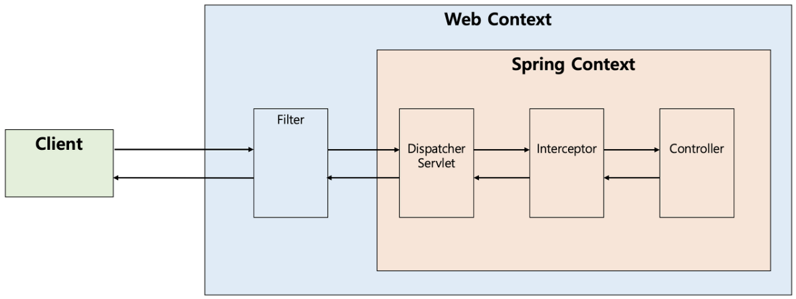
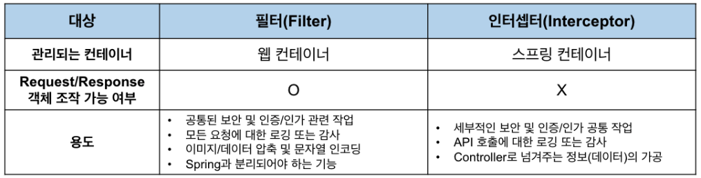

## Spring

- ### Spring MVC

  

    - Dispatcher Servlet이 프론트 컨트롤러 역할을 하며 스프링 mvc의 핵심을 담당한다.
    - ServletMVC보다 좀 더 세분화된 모습을 보이는데, 적합한 컨트롤러와 뷰페이지를 찾는 과정이 추가됐다.
    - 개발을 하다보면 다양한 http 요청에 따라 컨트롤러의 파라미터나 리턴타입 등을 다르게 해야할 경우가 생긴다. 그럴 때마다 해당하는 컨트롤러를 만드는 것은 상당히 번거로운 작업인데, SpringMVC를 이용하면 핸들러 매핑과 핸들러 어댑터가 자동으로 필요한 컨트롤러를 찾아 제공해주므로 개발 편의성이 상당히 향상된다.
    - **Spring MVC 진행 과정**
        1. 핸들러 조회: 핸들러 매핑을 통해 요청 URL에 매핑된 핸들러(컨트롤러)를 조회한다.
        2. 핸들러 어댑터 조회: 핸들러를 실행할 수 있는 핸들러 어댑터를 조회한다.
        3. 핸들러 어댑터 실행: 핸들러 어댑터를 실행한다.
        4. 핸들러 실행: 핸들러 어댑터가 실제 핸들러를 실행한다.
        5. ModelAndView 반환: 핸들러 어댑터는 핸들러가 반환하는 정보를 ModelAndView로 변환해서
           반환한다.
        6. viewResolver 호출: 뷰 리졸버를 찾고 실행한다.
           JSP의 경우: InternalResourceViewResolver 가 자동 등록되고, 사용된다.
        7. View 반환: 뷰 리졸버는 뷰의 논리 이름을 물리 이름으로 바꾸고, 렌더링 역할을 담당하는 뷰 객체를
           반환한다.
           JSP의 경우 InternalResourceView(JstlView) 를 반환하는데, 내부에 forward() 로직이 있다.
        8. 뷰 렌더링: 뷰를 통해서 뷰를 렌더링 한다
- ### 스프링 컨테이너
    - 스프링의 핵심기능을 담당하는 컨테이너로, 빈 생성 및 DI, IoC를 구현하는 주체이다
    - ApplicationContext를 스프링 컨테이너라 한다. BeanFactory도 스프링 컨테이너이나, ApplicationContext가 BeanFactory를 포함한 여러 인터페이스를 상속받기 때문에 일반적으로 ApplicationContext를 스프링 컨테이너라 함.
    - 과거에는 xml파일에 스프링 빈 생성을 직접 해줬으나, 컴포넌트 스캔이 등장하면서부터는 클래스에서 어노테이션을 선언하여 빈을 생성한다.
    - 자바에서 빈을 직접 생성할 수도 있다. 클래스 상단에 @Configuration을 선언하고, 내부 메서드 상단에 @Bean을 선언하면 해당 메서드가 리턴하는 객체가 빈으로 등록된다.
- ### IoC(제어역전: Inversion of control)

  기존 프로그램은 구현 객체가 스스로 필요한 리소스를 생성하고(ex > new 생성자로 repository 생성) 연결하여 실행하였다. 즉 제어의 주체가 구현객체 자신에게 있었다. 그러나 스프링에서는 구현객체는 실사용 리소스에 대해서 인터페이스만 정의해두고 있을 뿐, 실질적으로 객체를 생성하고 해당 인터페이스에 연결시키는 역할은 IoC컨테이너(ApplicationContext)가 수행하여 제어의 주체가 구현객체가 아닌 스프링 컨테이너에 있어 이런 특성을 제어의 역전, IoC라고 한다.

- ### DI(의존관계주입: Dependency Injection)

  의존관계라는 것은 정적인 의존관계와 동적인 의존관계로 나눌 수 있는데, 정적인 의존관계는 import문을 보고 판단이 가능하기에 프로그램을 실행하지 않아도 분석 가능하다. 하지만 스프링에서 구현객체의 사용 리소스는 인터페이스 선언만 되어 있기 때문에 구현객체만으로는 실제 어떤 리소스가 사용될지 판단할 수 없는데, 이부분을 DI컨테이너가 생성하고 연결해주므로 DI컨테이너를 확인하여 알 수 있다. 즉, DI컨테이너가 설정에 따라 구현객체에 필요한 리소스를 생성하고 연결시켜주는 기술을 DI, 의존관계주입이라고 한다.

- ### AOP(관점지향프로그래밍: Aspect Oriented Programming)
    - OOP로 분리하기 어려운 부가기능을 모듈화하는 기법
    - 핵심 비즈니스 로직은 아니지만 많은 로직에 부가적으로 들어가는 기능(로그, 트랜잭션 등)이 주 적용대상
    - AOP기능을 이용하면 내부적으로는 프록시패턴으로 로직에 적용이 됨
    - #### AOP의 주요 구성요소
      - Aspect(관점) : 공통 관심사를 정의하는 모듈. Advice, Pointcut, Introduction의 세가지 요소를 포함하는 것으로, 언제 어디서 무엇을 할지가 모두 정의되어있다.
      - Advice(조언) : 실제 수행될 부가기능을 구현하는 부분. 적용 시점에 따라 5가지의 유형으로 나뉜다.
        - Before Advice: 타겟 메서드가 호출되기 전에 실행됩니다.
        - After Advice: 타겟 메서드가 실행된 후에 실행됩니다.
        - After Returning Advice: 타겟 메서드가 정상적으로 실행된 후에 실행됩니다.
        - After Throwing Advice: 타겟 메서드 실행 중 예외가 발생하면 실행됩니다.
        - Around Advice: 타겟 메서드의 실행 전후 또는 예외 발생 시점을 포함하여 실행됩니다.
      - Pointcut(포인트컷) : Advice가 적용될 타겟 메서드를 지정하는 표현식. 패키지, 클래스, 메서드이름, 파라미터 등으로 포인트컷을 정의할 수 있다.
      - Join Point(조인 포인트) : Advice가 적용될 수 있는 시점. 메서드 실행 시점 또는 객체 생성 시점
      - Weaving(위빙) : Aspect를 코드에 적용하는 시점. 컴파일 타임, 클래스 로딩 시점, 런타임 등에 위빙을 수행할 수 있다.
      

- ### DI의 세가지 방법
    - **필드 주입**

        ```java
        @Controller
        public class TestController {
        
            @Autowired
            TestService testService;
            
        }
        ```

        - 가장 단순하고 과거에 많이 사용했던 방식이지만, 최근에는 권장되지 않는 방법이다.
        - 프레임워크에 의존적이기에 테스트 코드 작성이 어렵고, final 선언이 불가능해 객체가 변경될 수 있다.
        - 순환참조가 존재하는 경우, 컨테이너 생성(컴파일) 시점에 탐지되지 않고 런타임에 발견되어 에러가 발생한다.
    - **수정자 주입**

        ```java
        @Controller
        public class TestController {
        
            private TestService testService;
        
            @Autowired
            public void setTestService(TestService testService) {
                this.testService = testService;
            }
            
        }
        ```

        - 사용자에 의해 변경 가능성이 있으므로 선택적 의존성, 즉 변경 가능성이 있는 객체에만 사용이 권장된다.
    - **생성자 주입**

        ```java
        @Controller
        public class TestController {
        
            private final TestService testService;
        
            @Autowired // 생성자가 1개만 있을 경우 생략 가능
            public TestController(TestService testService) {
                this.testService = testService;
            }
            
        }
        ```

        - 현재 가장 권장되는 DI방식이다.
        - 프레임워크에 의존적이지 않기 때문에 테스트 코드를 작성하기가 용이하다.
        - final 선언이 가능하여 객체의 불변성을 확보할 수 있다.
        - 순환참조 존재 시 컴파일 시점에 바로 검출이 가능하다.
        - Lombok의 @RequiredArgsConstructor로 생성자 메서드를 생략하여 간결한 코드 작성이 가능하다.
    

- ### 스프링 빈 생명주기
    - **Bean Lifecycle**
        1. 스프링 컨테이너 생성
        2. 빈 생성
        3. 의존관계 주입
        4. 초기화 콜백
        5. 사용
        6. 소멸 전 콜백
        7. 스프링 종료
    - SRP를 준수하기 위해서 객체의 생성과 초기화를 분리해야한다.
    - 이 분리작업을 위해 스프링에서 초기화 콜백 기능을 제공하는 것
    - 초기화 콜백의 세가지 방법
        1. IntitializingBean, DisposableBean 인터페이스 상속
            - afterPropertiesSet() 메서드와 destory()메서드를 오버라이드하여 초기화 및 소멸 콜백 코드 작성
            - 메서드 이름을 변경할 수 없고, 외부 라이브러리에는 적용할 수 없다.
            - 이 방법은 생성할 빈이 스프링에 의존해버리기 때문에 권장되지 않는다.
        2. 설정정보 사용
            - @Bean(initMethod=”init”, destroyMethod=”close”)와 같이 Bean어노테이션에 직접 초기화 소멸 메서드를 지정해줌
            - 메서드 이름 변경 가능
            - 스프링 빈이 스프링에 의존하지 않음
            - 외부 라이브러리에도 초기화, 종료 메서드를 적용할 수 있다.
            - 종료메서드 추론 기능 제공
                - destroyMethod 속성의 기본값이 (inferred)로 되어있음. 이것은 빈의 close 혹은 shutdown으로 되어있는 메서드를 스스로 찾아 호출해주는 기능.
                - 속성값을 입력하면 해당메서드 탐색, 값을 공백으로 넣으면 추론기능을 사용하지 않음.
        3. 빈 내부 어노테이션 사용
            - @PreConstruct, @PreDestroy 어노테이션을 빈 내부 초기화, 소멸 메서드에 선언하여 사용한다. 현재 가장 권장되는 방법.
            - 해당 어노테이션은 스프링이 아닌 자바표준(javax)패키지 어노테이션이므로 빈이 스프링에 의존하지 않는다.
            - 직접 빈 생성 설정을 하지 않아도 되어 @ComponentScan과 잘 어울린다
            - 다만 외부라이브러리에는 적용할 수 없어 외부라이브러리는 설정정보방식을 사용해야한다.
    

- ### 필터, 인터셉터
    - **Filter**

      

        - J2EE 표준스펙 기능으로, 디스패처 서블릿에 요청이 전달되기 전후로 URL패턴에 맞는 모든 요청에 대해 부가 작업을 처리할 수 있는 기능을 제공한다.
        - 스프링 컨테이너가 아닌 웹 컨테이너에서 관리가 되는 기능이다.
    - **Interceptor**

      

        - Spring이 제공하는 기술로서, 디스패처 서블릿이 컨트롤러를 호출하기 전과 후에 요청과 응답을 참조하거나 가공할 수 있는 기능을 제공함
        - 스프링 컨테이너에서 동작
    - **Filter vs Interceptor**

      

        - 필터는 웹컨테이너의 기능이지만 스프링 빈으로도 등록이 가능하다.


- ### 스프링 시큐리티
    - 스프링 시큐리티는 어플리케이션의 보안(인증,인가,권한 등)에 관련된 기능을 담당하는 스프링의 하위 프레임워크
    - 인증과 권한에 대한 부분을 스프링 필터의 filter chain에 따라 처리
    - 보안 관련 많은 옵션을 제공해주기 때문에 개발자가 직접 보안관련 코드를 작성하지 않아도 되는 장점


- ### 어노테이션
    - 어노테이션은 **metadata**, 코드를 설명하기 위한 데이터라고 할 수 있다.
    - @를 이용해 자바 코드에 주석을 달아 특별한 의미를 부여한 것이다.
    - 컴파일러가 특정 오류를 억제하는 것과 같이 프로그램 코드의 일부가 아닌 다른 프로그램에 관한 코드를 제공하여 해당 코드에 정보를 추가하는 정형화된 방법이다.
    - @Override 어노테이션 처럼 컴파일러를 위한 정보를 제공하기 위한 용도이다.
    - 스프링의 @Controller 어노테이션 처럼 런타임에 리플렉션 기능을 추가하기 위한 용도이기도 하다.


- ### @RequestBody, @ModelAttribute
    - RequestBody
        - json 타입(application/json)으로 넘어온 데이터를 java 객체로 변환시켜준다.
    - ModelAttribute
        - form 형태(multipart/form-data)로 넘어온 데이터를 java 객체에 생성자나 setter를 통해 바인딩 시켜준다.

참고 : https://steady-coding.tistory.com/600