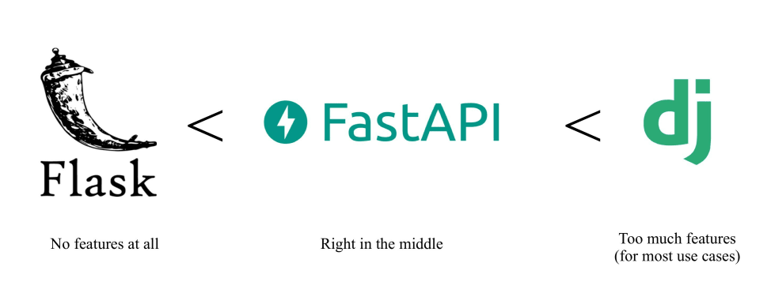
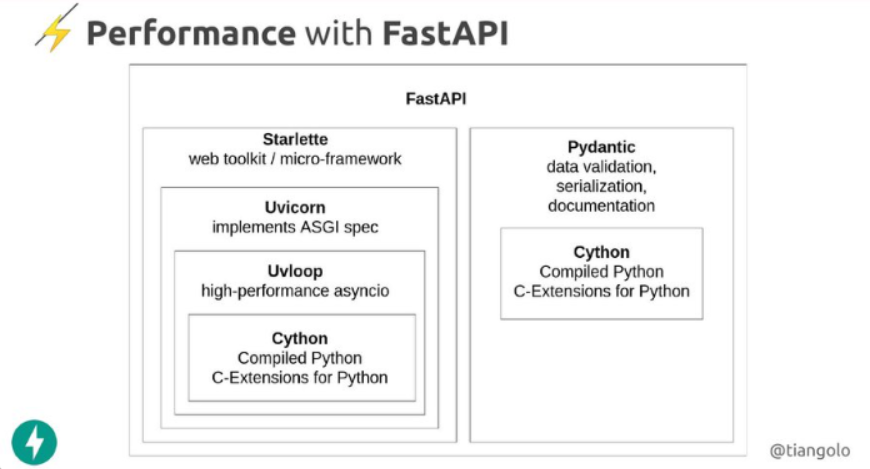

## FastAPI

### 특징

FastAPI는 파이썬의 웹프레임워크로서, 그 이름과 같이 API를 만드는 데에 특화된 프레임워크이다. 파이썬의 유명한 프레임워크인 Django, Flask는 웹서비스를 개발하기 위한 프레임워크인 반면, FastAPI는 웹서비스 중 딱 API라는 좀 더 작은 부분에 집중한 프레임 워크라고 구분하여 생각하면 된다.

### 빠른 속도
FastAPI는 현재까지 나온 파이썬 프레임워크중 속도가 가장 빠르다고 알려져있다. 웹개발 언어 중 빠르다고 알려진 nodeJS나 Go와 대등한 수준으로 빠르다고 한다. 파이썬에서 이게 가능한 이유는 FastAPI가 아래와 같은 형태로 구현되어 있기 때문이다.  

***FastAPI의 빠른 성능의 비결**
  

FastAPI는 내부적으로 Starlette > Uvicorn > Uvloop 구조로 계층을 형성하며 구현되어 있는데, 최하단에서는 파이썬에서 C의 성능을 낼 수 있는 Cython을 사용하여 처리 성능의 향상을 이끌어 냈다. 또한 ASGI 구현체인 Uvicorn을 기반으로 효과적인 비동기 처리를 수행하기 때문에, 그냥 현 시점 최고 성능이라는 기술들을 다 집약해서 만든 프레임워크라고 보면 되므로 빠를 수 밖에 없다.
  

### 빠른 구현 & 쉬운 사용
FastAPI는 사용하기 간편하다고 널리 알려진 Flask와 비슷한 수준의 간결한 문법을 제공한다. 특히 Pydantic을 통해 API 데이터 검증을 자동화하고, API 문서화 또한 제공한다.

### 테스트 가능한 문서
FastAPI는 Swagger와 같이 API문서를위한 코드를 따로 작성할 필요가 없다. Pybo라는 API문서 프레임워크를 통해 자동으로 문서를 생성해주는데, Swagger와 같이 API를 테스트해볼 수 있는 기능 또한 갖추고 있다.

### ORM
FastAPI는 Django처럼 자체 ORM을 제공하지는 않지만, SQLAlchemy를 통해 ORM을 사용할 수 있다.

