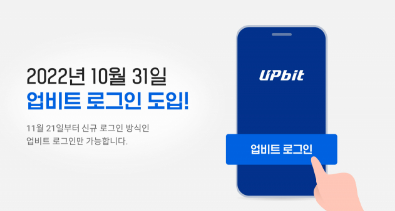
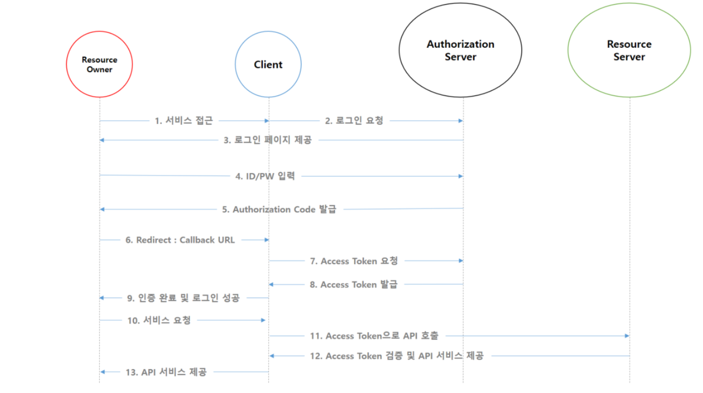

## OAuth2.0
- 인증을 위한 표준 프로토콜
- 서비스를 제공하는 애플리케이션 서버에서 사용자에 대한 인증을 직접하는 것이 아닌, 신뢰할 수 있는 규모의 **타 서비스 서버에 인증을 위임하는 기술**
- 로그인만이 아닌 해당 위임 서버에서 제공하는 사용자와 관련한 여러 API를 사용할 수 있게 해줌

#### OAuth2의 이점
- 사용자 입장에서는 신뢰성이 낮은 사이트에 자신의 개인정보를 맡기지 않고도 회원가입이 가능해져 안심할 수 있으며, 가입 절차 또한 간단해진다.
- 서비스 제공자 입장에서는 회원 개인 정보 보안 관리에 신경을 많이 쓰지 않아도 돼서 관리가 편해지며, 회원 가입 구현도 훨씬 간단해진다.

#### OAuth2의 단점
일반적으로는 OAuth2가 제공해주는 장점이 단점보다 훨씬 크다고 할 수 있지만, 한가지 아쉬운 점은 기능 의존성이라고 할 수 있다.
아무래도 인증과 관련된 모든 기능을 타 서비스에 의존하다보니, 확률은 낮을지라도 해당 서비스에 장애가 있을 경우 우리 서비스에도 장애가 전파된다는 점이다.
이 문제에 대해 기존까지는 큰 문제점을 못 느꼈지만, 22년 카카오 데이터센터 화재 사건 당시 카카오 OAuth2를 이용하고 있던 모든 서비스들에도 장애가 전파되어 많은 사람들이 불편을 겪고나서 이런 문제점이 부각되었다.
특히 업비트의 경우 OAuth2를 오직 카카오와의 연동으로만 사용하고 있었어서 해당 사건당시 장애가 그대로 전파되어 업비트 서비스또한 이용이 불가능해지게 됐고, 업비트와 사용자들은 막대한 손실을 입고 업비트는 해당 사건 이후 OAuth2 방식에서 자체 인증방식으로 전환하게 되기도 했다.  
  
그래서 서비스 규모나 특성에 따라 위험성을 고려하여 자체 인증을 구현하거나, OAuth2를 여러 인증 서버에 교차인증하는 방식으로 구현하거나 하는 등등 추가적인 조치를 고려하는 것이 좋다고 할 수 있다. 

***JWT 동작 흐름**

- **Resource owner(자원 소유자)**
    - Resource server(구글, 페이스북, 카카오 등)의 계정을 소유하고 있는 사용자를 의미합니다.
- **Client**
    - 구글, 페이스북, 카카오 등의 API 서비스를 이용하는 제 3의 서비스
- **Authorization Server(권한 서버)**
    - 권한을 관리해 주는 서버, Access Token, Refresh Token을 발급, 재발급 해주는 역할을 합니다.
- **Resource Server**
    - OAuth2 서비스를 제공하고, 자원을 관리하는 서버입니다.
- **Access Token**
    - **Authorization Server**로 부터 발급 받은 인증 토큰, Resource Server에 전달하여 서비스를 제공 받을 수 있습니다.